# RememberStack

[](https://github.com/writeitai/remember-stack/actions/workflows/ci.yml)
[](https://remember.dev/docs)
[](https://pypi.org/project/remember/)
[](LICENSE)

**Give your agents a past.**

RememberStack is open-source memory for AI agents. You give it the documents
your work already produces: email, chat, specs, meeting notes, tickets,
agent transcripts. It reads them, keeps what matters, and answers your
agent's questions with facts it can trace back to the source. It knows what
is true now, what was true a month ago, and who said so.

**[Read the docs](https://remember.dev/docs)** ·
**[Quickstart](https://remember.dev/docs/start/quickstart)** ·
**[What is a memory system?](https://remember.dev/docs/start/what-is-a-memory-system)**

---

## Why you should care

Every AI session starts from zero. The agent does not know which decision
still holds, which file said it, or what changed overnight. You paste the
same notes in again, or the model fills the gap with something plausible.

Most "memory" for agents is a vector search over text: it finds passages that
sound like the question. It cannot tell you which of them is still current,
which one a later document corrected, whether two of them contradict each
other, or when anything was true. And it always returns something, even when
nothing relevant exists.

RememberStack keeps four things a context window loses:

- **What each source said.** Every statement worth keeping is stored as a
  claim, with the exact passage it came from and the date it was said.
  Claims are never edited.
- **What is true now.** From those claims it maintains facts about the
  people, systems and decisions in your work. When a newer source changes a
  fact, the fact changes and the old one stays on record. When two sources
  disagree, you see both, marked as a contradiction.
- **When it was true.** Facts carry the period in which they held. Ask what
  is true today, what held last March, or how something changed.
- **Where it came from.** Every fact links to its claims, every claim to the
  characters in the source. Your agent can quote and cite; you can check.

<p align="center">
  
</p>

## What your agent gets back

Not the passages most similar to the question, but the facts that answer
it, each with its time window, the evidence behind it and any
contradiction, in one typed result that is ready to put into a prompt.

- **Honest negatives.** If memory has nothing on the subject, the result says
  so. If a name could mean two different people, it says that too. An agent
  that is told "unknown" stops inventing.
- **No model writes the answer.** The only model on the read path embeds your
  question for search. The same question against the same memory returns the
  same result, and you can see why each item is there.
- **Search nominates, the database confirms.** Vector, keyword, graph and time
  signals propose candidates; every one is checked against what is currently
  held before it is returned.

| Where typical agent memory goes wrong | What RememberStack does instead |
|---|---|
| Source text is treated as the truth | What a source said (a claim) is kept apart from what is held true now (a fact) |
| A correction overwrites what came before | The old fact's time window is closed, not erased |
| Contradictions are averaged away | Both sides come back, marked as a contradiction |
| Re-sending a file makes it look more certain | Support counts distinct documents, not repetitions |
| "No results" could mean anything | The result says whether the entity is unknown or known with nothing matching |

<p align="center">
  
</p>

## Built for agents

- **MCP.** `remember mcp` gives Claude Code, Cursor, Codex, Claude Desktop and
  other MCP clients the memory tools; `remember setup` configures them in one
  command. [Connect your agent →](https://remember.dev/docs/start/connect-your-agent)
- **Python SDK and CLI.** `pip install remember`.
  [SDK →](https://remember.dev/docs/reference/python-sdk) ·
  [CLI →](https://remember.dev/docs/reference/cli)
- **HTTP API.** The same operations over plain HTTP.
  [API →](https://remember.dev/docs/reference/http-api)
- **Your files.** Markdown, text, HTML, Word, PowerPoint and Excel convert out
  of the box; PDFs and images with an OCR converter.
  [File types →](https://remember.dev/docs/guides/file-types)

## Quickstart

You need Docker (Engine 28 or later for the tokenless local setup) and an
[OpenRouter](https://openrouter.ai) API key.

```bash
git clone https://github.com/writeitai/remember-stack && cd remember-stack
cp .env.example .env
printf 'REMEMBERSTACK_POSTGRES_PASSWORD=%s\nREMEMBERSTACK_MINIO_ACCESS_KEY=%s\nREMEMBERSTACK_MINIO_SECRET_KEY=%s\nREMEMBERSTACK_SELFHOST_DEPLOYMENT_ID=%s\n' \
  "$(openssl rand -hex 32)" "$(openssl rand -hex 12)" "$(openssl rand -hex 32)" \
  "$(openssl rand -hex 16 | sed -E 's/^(.{8})(.{4}).(.{3}).(.{3})(.{12})$/\1-\2-4\3-8\4-\5/')" >> .env
# edit .env: set REMEMBERSTACK_OPENROUTER_API_KEY
docker compose up -d

uvx remember setup --self-hosted   # connect your coding agent
```

Then send a document and ask your first question:
**[Quickstart →](https://remember.dev/docs/start/quickstart)** ·
**[Self-hosting →](https://remember.dev/docs/self-hosting/install)**

## Open source, all of it

Apache-2.0. Everything that decides what your memory holds (extraction,
entity resolution, supersession, provenance, forgetting) is in this
repository. Nothing that affects correctness is held back.

- Docs: [remember.dev/docs](https://remember.dev/docs)
- Current release: [v0.17.3](https://github.com/writeitai/remember-stack/releases/tag/v0.17.3) ·
  [PyPI](https://pypi.org/project/remember/) ·
  [container](https://github.com/writeitai/remember-stack/pkgs/container/remember-stack)
- How it works inside: [architecture](https://remember.dev/docs/concepts/architecture) ·
  [design corpus](plan/README.md) · [decision log](decisions.md)

## Contributing

See [CONTRIBUTING.md](CONTRIBUTING.md) and [CLA.md](CLA.md). Pull requests need
the contributor-agreement checkbox in the PR template.
