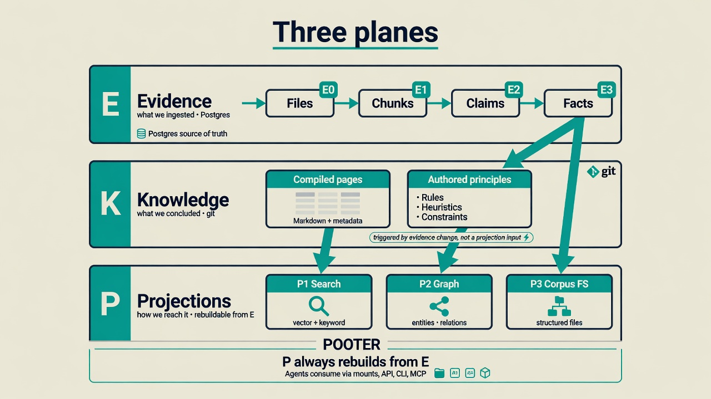
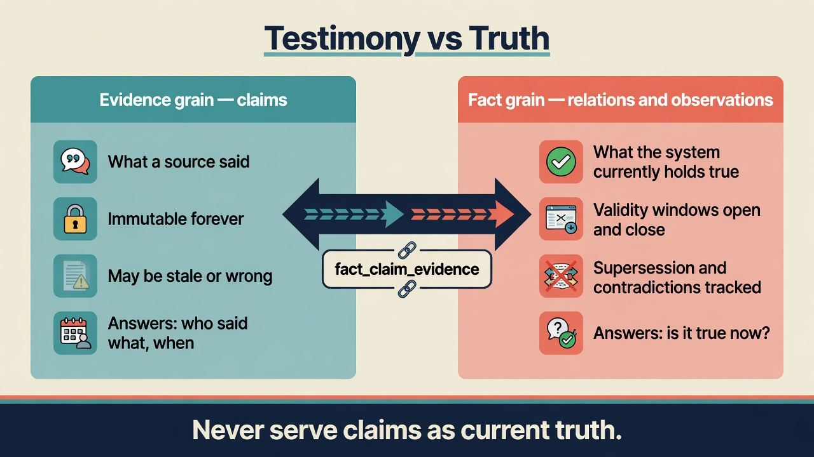
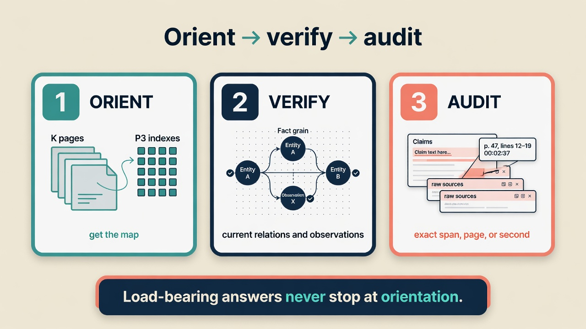
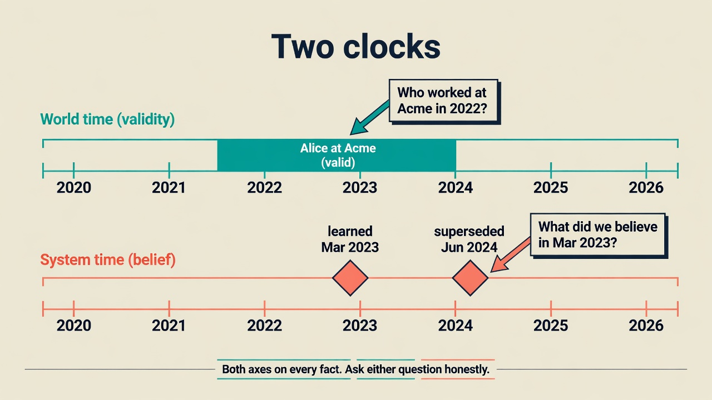
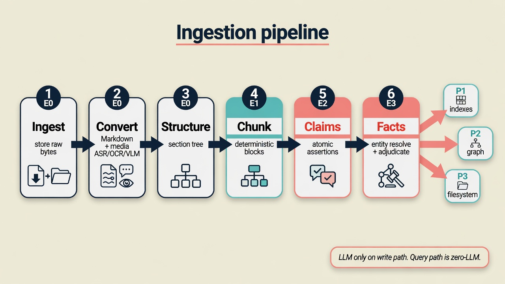
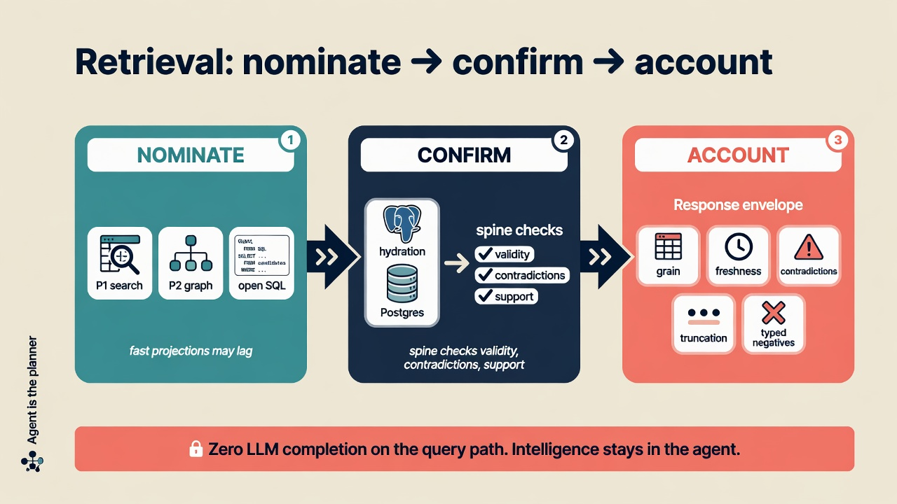

# RememberStack

[](https://github.com/writeitai/remember-stack/actions/workflows/ci.yml)
[](https://github.com/writeitai/remember-stack/tree/python-coverage-comment-action-data)
[](https://remember.dev/docs)
[](https://pypi.org/project/remember/)

**Memory for AI agents that have to act — not just chat about a corpus.**

Pour documents into it. Get back **what sources said**, **what the system currently holds true**, and a full audit trail to the exact span, page, or second of audio. Built to stay useful at **a million documents**.

**Docs:** [remember.dev/docs](https://remember.dev/docs) · **Product:** [remember.dev](https://remember.dev)

---

## Why this exists

Most “memory” stacks answer: *where did I read something like this?*

Agents that take real actions need a harder question:

> **What do we actually know — and what changed our mind?**

| Typical RAG / note memory | RememberStack |
| --- | --- |
| Source text treated as truth | **Claims** (testimony) stay separate from **facts** (current belief) |
| Edits overwrite history | Supersession **closes a window** — history stays queryable |
| Contradictions hidden or averaged | Contradictions **return together** |
| Re-ingest inflates “confidence” | Support counts **independent document lineages** |
| Vector index is the authority | Indexes **nominate**; Postgres **confirms** |
| LLM on every query | **No chat-completion on the query path** — the agent plans |
| Vague empty results | Typed negatives: unknown entity / known empty / boundary |

If your agent spends money, changes state, or briefs a human, those distinctions are load-bearing.

---

## TL;DR

1. **Ingest** heterogeneous inputs into an evidence spine (files → chunks → claims → facts).
2. **Separate** *what a source said* from *what is true now*.
3. **Project** search, graph, and a browsable filesystem — rebuildable anytime.
4. **Serve agents** first: mounts, MCP, CLI, API — with honest, grain-typed answers.

```text
E  what we ingested     (ground truth)
K  what we concluded    (compiled + authored knowledge)
P  how we reach it      (search · graph · corpus FS)  ← always rebuildable from E
```

<p align="center">
  
</p>

---

## Testimony is not truth

<p align="center">
  
</p>

| Grain | Answers | Rule for agents |
| --- | --- | --- |
| **Evidence** (claims) | Who said what, when | Never “is it true *now*?” |
| **Fact** (relations & observations) | What we currently hold true | Default for present-tense belief |
| **Compiled** (knowledge pages) | Orientation with citations | Verify before load-bearing action |

Default reading motion:

<p align="center">
  
</p>

**Orient** on knowledge pages and the corpus tree → **verify** on facts → **audit** claims and raw sources when stakes demand it.

---

## Two clocks

Every fact carries **world time** (when it held in the world) and **system time** (when this deployment learned it).

<p align="center">
  
</p>

Ask both honestly:

- “Who worked at Acme in 2022?”
- “What did we believe last March?”

---

## Write path: ingestion

<p align="center">
  
</p>

- Immutable **claims**, grounded to source spans  
- Entity resolution into a canonical registry  
- Adjudicated **relations** and **observations** with supersession + contradictions  
- Document versions and watched sources — reprocess cost proportional to the *edit*  
- Support that cannot be gamed by re-extracting the same file  

Deep dive: [Ingestion](https://remember.dev/docs/ingestion)

---

## Read path: retrieval

<p align="center">
  
</p>

**Projections nominate. The spine confirms. The envelope accounts.**

Exactly **four** top-level assured operations (API / CLI / MCP):

| Operation | Use for |
| --- | --- |
| `resolve_entity` | Name → ranked entity candidates |
| `testimony_context` | High-recall **evidence** for a question |
| `fact_context` | **Current or historical fact** context with live testimony |
| `answer_context` | Both complete authority views in `ContextBundle/v1` |

Plus open SQL, typed live-graph helpers, saved examples, and schema discovery.

Every assured answer self-accounts: grain, freshness, contradictions, truncation, typed “no”s.

Deep dive: [Retrieval](https://remember.dev/docs/retrieval)

---

## Built for agents

| Surface | Job |
| --- | --- |
| **Filesystem mounts** | `ls` / read / `grep` the corpus and knowledge like a codebase |
| **MCP · CLI · API** | Semantic search, graph, time-travel, open query — one operation set |
| **Skill bundle** | Dynamic prompt for agents to self-learn Remember |

---

## Quick start

```bash
# 1. Run the self-hosted engine (Postgres 19 + MinIO + workers)
cp .env.example .env
docker compose up -d

# 2. Configure your AI agent in one command
uvx remember setup
```

Verify everything is running:

```bash
curl --fail http://localhost:8000/healthz
curl --fail http://localhost:8000/operations
```

Ingest Markdown, wait for readiness, then call the assured ops — full walkthrough:

**→ [Getting started](https://remember.dev/docs/getting-started)**
**→ [Self-host deployment](https://remember.dev/docs/deployment)**

Client package:

```bash
pip install remember
# Run the full server engine via Docker: ghcr.io/writeitai/remember-stack
```

---

## Open source = full engine

Apache-2.0. **If it affects correctness, it is here** — extraction, resolution, supersession, provenance, budgets, DLQ, hard-forget. Never paywalled.

The managed cloud runs **this same engine**. Cloud adds operations and product chrome, not a secret core.

| | |
| --- | --- |
| Docs | [remember.dev/docs](https://remember.dev/docs) |
| Managed product | [remember.dev](https://remember.dev) |
| Release | [v0.17.0](https://github.com/writeitai/remember-stack/releases/tag/v0.17.0) |

---

## Contributing

Architecture and delivery authority: [planning corpus](plan/README.md) and
[decision log](decisions.md).

See [CONTRIBUTING.md](CONTRIBUTING.md) and [CLA.md](CLA.md). Pull requests need the contributor-agreement checkbox in the PR template.

---

<p align="center"><b>Stop retrieving passages. Start knowing what is true.</b><br/>
<a href="https://remember.dev/docs">Read the docs</a> · <a href="https://remember.dev/docs/getting-started">Run it</a></p>
