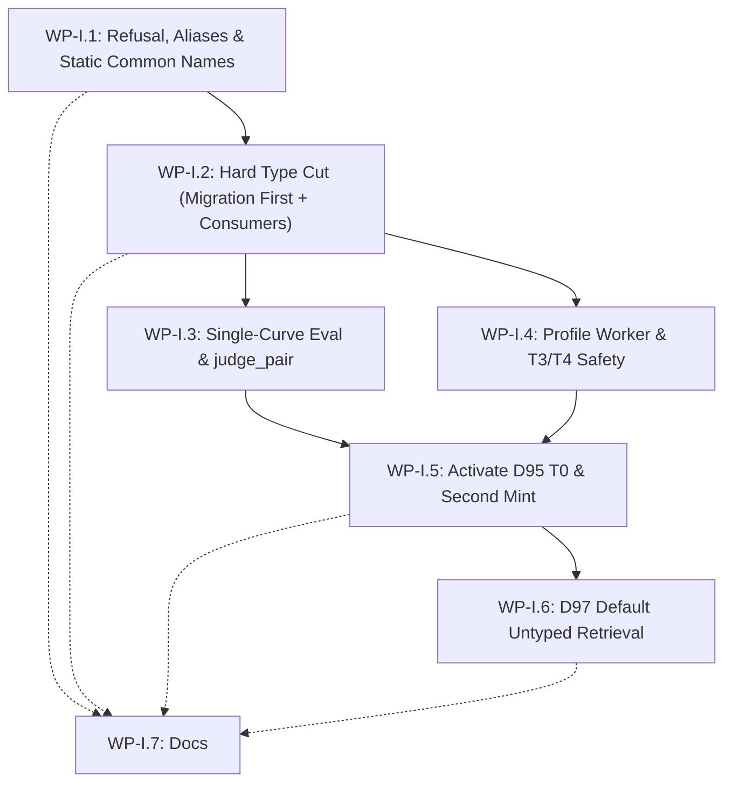

# Adversarial Implementation Plan Review (Round 2): Entity Identity and Retrieval (D95–D97)

**Reviewer identity:** Antigravity (`agy`)  
**Date:** 2026-08-26  
**Branch reviewed:** `feat/d95-entity-identity-retrieval`  
**PR:** [writeitai/remember-stack#304](https://github.com/writeitai/remember-stack/pull/304)  
**Review target:** [`plan/plans/entity_identity_and_retrieval.md`](file:///Users/jpuc/code/moje/remember-stack/plan/plans/entity_identity_and_retrieval.md) (WP-I.1 … WP-I.7 hard-cut revision)  
**Binding design:** [`plan/designs/entity_identity_and_retrieval_design.md`](file:///Users/jpuc/code/moje/remember-stack/plan/designs/entity_identity_and_retrieval_design.md)  
**Decisions log:** `decisions.md` (D95, D96, D97 frozen; D17, D18, D21, D74, D86, D87 context)  
**Output path:** `/Users/jpuc/code/moje/remember-stack/design/reviews/REVIEW_agy_entity_identity_retrieval_plan_r2_2026-08-26.md`  
**Verdict:** **Approve with nits**

---

## Executive Summary & Verdict

The revised implementation plan in [`plan/plans/entity_identity_and_retrieval.md`](file:///Users/jpuc/code/moje/remember-stack/plan/plans/entity_identity_and_retrieval.md) successfully resolves the primary architectural deadlocks identified during Round 1. Under the operator's frozen **no backward compatibility** posture (hard cut, stores wipeable, no dual-generation drains, no dual readers/writers):

1. **Schema Deadlock Eliminated:** Merging the old schema migration (old WP-I.6) into **WP-I.2** alongside the name-only `EntityRef` and minting writer changes—with the explicit deploy rule "migration first in that PR"—safely eliminates the circular dependency where a name-only writer would fail against `entities.type NOT NULL`.
2. **Correctness Gates Re-ordered:** Re-sequencing the evaluation harness / `judge_pair` reform (**WP-I.3**) and the profile refresher worker / T3 name+profile vector embeddings (**WP-I.4**) as mandatory gates *before* activating D95 T0 candidate logic (**WP-I.5**) prevents the homonym false-merge trap from silently shifting from T0 to T3.
3. **No Remaining P0 Blockers:** Database constraints on `aliases` (`UNIQUE (deployment_id, entity_id, normalized_lemma, provenance)`) and `resolution_exclusions` already permit multiple distinct `entity_id` rows for the same normalized lemma.

**Verdict: Approve with nits.** The dependency graph and package sequencing are unblocked. The remaining items are specific blast-radius omissions in WP-I.2 (naming P3 CorpusFS, P1 index, knowledge scope interests, legacy entity registry, and migration test suite), defining the empty-profile fail-safe contract in T4, and regenerating the `memory_v1` query-space manifest.

---

## Detailed Answers to the Six Mandatory Questions

### 1. Did merging old I.2 + I.6 into WP-I.2 actually remove the schema deadlock?

**Observed:**
In r1, old WP-I.2 modified [`EntityRef`](file:///Users/jpuc/code/moje/remember-stack/src/rememberstack/model/relations.py#L13-L20) and [`CascadeResolver._mint`](file:///Users/jpuc/code/moje/remember-stack/src/rememberstack/spine/resolver.py#L431-L472) to omit `type`, but the Alembic migration dropping `entities.type NOT NULL` was deferred to old WP-I.6 (sequenced after WP-I.2–I.5). In [`p0_02_0003_entities_evaluation_e0_e1.py`](file:///Users/jpuc/code/moje/remember-stack/src/rememberstack/spine/migrations/versions/p0_02_0003_entities_evaluation_e0_e1.py#L21), `entities.type` is `text NOT NULL` with a composite FK to `entity_types`.

In the revised plan, WP-I.2 is defined as a single hard-cut package:
> *"Hard type cut (same PR, migration first): drop `entities.type` NOT NULL/FK/column (or stop using it); drop signatures / D86 type path; name-only `EntityRef` and mint; bump `E3_NORMALIZER_VERSION`; rewrite type consumers... Rebuild P2. Abandon old normalize generation."* (Plan lines 65, 77–79).

**Inference:**
Because the operator explicitly waived backward compatibility (no rolling mixed-version cluster support, stores may be wiped, single-step deployment), combining the schema drop and writer updates into a single PR with the explicit constraint *"Alembic upgrade runs before app code that omits `type`"* completely eliminates the inter-package deadlock. When this PR merges and deploys, the migration executes first against PostgreSQL, removing the `NOT NULL` / FK constraints before any name-only `INSERT INTO entities` executes.

**Verdict:** **Yes.** The schema deadlock is resolved.

---

### 2. Is common-name list in I.1 + T0 activation in I.5 enough for the John cold-start trap?

**Observed:**
- In [`resolver.py`](file:///Users/jpuc/code/moje/remember-stack/src/rememberstack/spine/resolver.py#L688-L699), `_T0_EXACT` currently has `LIMIT 1` and matches any exact lemma unconditionally at confidence 1.0.
- In [`resolver.py`](file:///Users/jpuc/code/moje/remember-stack/src/rememberstack/spine/resolver.py#L483-L496), `_mint` stamps `entities.embedding` with `reference.name` (a name-only vector).
- In [`model/resolution.py`](file:///Users/jpuc/code/moje/remember-stack/src/rememberstack/model/resolution.py#L47-L62), `ResolverConfig` has no common-name list.
- In [`p0_02_0003`](file:///Users/jpuc/code/moje/remember-stack/src/rememberstack/spine/migrations/versions/p0_02_0003_entities_evaluation_e0_e1.py#L79-L87), `generic_identifier_guard` tracks lemmas with `distinct_entity_count >= 2`, but is empty on cold start.

**Inference & Mechanics:**
Consider two distinct people named "John":
1. **Cold Start (John 1 arrives):** John 1 is novel. `_mint` creates Entity 1. John 1 has no observations yet (`profile_summary = NULL`).
2. **Cold Start Second Mention (John 2 arrives):**
   - **At T0:** In WP-I.1, `ResolverConfig` defines static `common_name_lemmas` (e.g. `{"john", "jan", "alice", ...}` plus tokens < 3 characters). In WP-I.5, T0 evaluates Design §3.1: even though exactly 1 active hit exists and `generic_identifier_guard` has not triggered yet, `"john"` is present in `common_name_lemmas`. **T0 refuses to auto-accept and escalates.**
   - **At T3:** In WP-I.4, T3 compares against profile vectors (`name + profile_summary + salient_facts`), *not* name-only vectors. For John 1 (empty profile), `embedding IS NULL` (or missing profile vector). In [`resolver.py`](file:///Users/jpuc/code/moje/remember-stack/src/rememberstack/spine/resolver.py#L363-L364), a missing profile vector is treated as **ambiguity**, returning `score = None` and escalating to T4. John 2 does not falsely merge at T3.
   - **At T4:** T4 receives `_T4_PROMPT` with John 2's claim context and John 1's candidate data (`(none)` profile, `(none)` facts). Under the fail-safe rule (WP-I.4 acceptance), absence of distinguishing evidence on a common name does not yield a match. T4 returns `no_match`.
   - **Second Mint & Guard Population:** Resolver mints John 2 as Entity 2. `_mint` inserts an exclusion into `resolution_exclusions (entity_1, entity_2)`. `generic_identifier_guard` is updated with `distinct_entity_count = 2, is_downweighted = true`.

**Gap / Nit:**
The chain is structurally sufficient **only if** WP-I.4 explicitly stops `_mint` from embedding name-only vectors (`entities.embedding` must remain NULL until a profile exists, or profile vectors must incorporate profile prose) and the T4 prompt instructs the model that missing profile evidence on common names is insufficient for a match. The revised plan explicitly includes both requirements in WP-I.4 and WP-I.5 acceptance.

**Verdict:** **Yes**, the combination of static `common_name_lemmas` in I.1, T3 profile embedding safety in I.4, and T0 activation in I.5 fully resolves the John cold-start trap.

---

### 3. Is I.3 + I.4 before I.5 the right eval/profile gate?

**Observed:**
- In [`resolver.py`](file:///Users/jpuc/code/moje/remember-stack/src/rememberstack/spine/resolver.py#L201-L203), `judge_pair` executes:
  ```python
  if lemma_a == lemma_b:
      return True, "T0"
  ```
- In [`eval/resolution.py`](file:///Users/jpuc/code/moje/remember-stack/src/rememberstack/eval/resolution.py#L137-L177), `run_resolution_suite` groups results by `pair["entity_type"]` and enforces `PRECISION_FLOOR` and `RECALL_FLOOR` per type.
- There is currently no profile worker handling `PipelineStage.REFRESH_PROFILE` ([`model/queue.py`](file:///Users/jpuc/code/moje/remember-stack/src/rememberstack/model/queue.py#L36)).

**Inference:**
1. **Eval gate (WP-I.3 before WP-I.5):** If WP-I.5 activated D95 T0 without WP-I.3, `judge_pair` would continue returning `(True, "T0")` for identical lemmas. The eval suite would be blind to homonym false merges and would crash as soon as untyped golden pairs were fed into it. Updating `judge_pair` and collapsing the eval suite to a single global curve in WP-I.3 ensures that the test harness can measure false merges *before* the new resolver logic lands.
2. **Profile gate (WP-I.4 before WP-I.5):** If WP-I.5 activated T0 escalation without WP-I.4, T0 would correctly escalate "John", but T3 would immediately auto-merge "John" based on the legacy name-only vector. Profile generation and T3 profile embeddings must be active before T0 starts escalating common names.
3. **Parallelism:** WP-I.3 (eval harness) and WP-I.4 (profile worker) are decoupled from each other and depend only on the untyped data structures from WP-I.2. They can be developed concurrently in separate branches and merged before WP-I.5.

**Verdict:** **Yes.** Sequencing I.3 and I.4 as prerequisite merge gates before I.5 is the exact correct dependency architecture.

---

### 4. Any remaining P0 (hard cut still broken)? Unique aliases vs two entity_ids same lemma?

**Observed in Code & Schema:**
1. **`aliases` unique constraint:** In [`p0_02_0003`](file:///Users/jpuc/code/moje/remember-stack/src/rememberstack/spine/migrations/versions/p0_02_0003_entities_evaluation_e0_e1.py#L61):
   ```sql
   UNIQUE (deployment_id, entity_id, normalized_lemma, provenance)
   ```
   The unique key includes `entity_id`. Therefore:
   - Row 1: `(deployment_1, entity_uuid_1, 'john', 'llm_canonical')`
   - Row 2: `(deployment_1, entity_uuid_2, 'john', 'llm_canonical')`
   Both rows can coexist simultaneously in PostgreSQL without constraint violation.
2. **`ix_aliases_lemma_exact` index:** In [`p0_02_0003`](file:///Users/jpuc/code/moje/remember-stack/src/rememberstack/spine/migrations/versions/p0_02_0003_entities_evaluation_e0_e1.py#L71):
   ```sql
   CREATE INDEX ix_aliases_lemma_exact ON aliases (deployment_id, normalized_lemma);
   ```
   This is a standard non-unique btree index.
3. **`resolution_exclusions` constraint:** In [`p0_02_0003`](file:///Users/jpuc/code/moje/remember-stack/src/rememberstack/spine/migrations/versions/p0_02_0003_entities_evaluation_e0_e1.py#L96-L100):
   ```sql
   PRIMARY KEY (deployment_id, entity_id_low, entity_id_high)
   ```
   Inserting `entity_id_low = min(a, b)` and `entity_id_high = max(a, b)` is fully supported.
4. **Lemma advisory locking:** [`_LOCK_LEMMA`](file:///Users/jpuc/code/moje/remember-stack/src/rememberstack/spine/resolver.py#L673-L678) executes `SELECT pg_advisory_xact_lock(hashtextextended(:key, 0))` on `f"{deployment_id}:lemma:{lemma}"`. This serializes concurrent resolution transactions for the same name, preventing race-condition double mints while allowing two distinct IDs to be minted sequentially.

**Inference:**
There are no schema blockers or constraint violations when two distinct `entity_id`s share the same normalized lemma. The only requirement in WP-I.5 is that `_T0_EXACT` must query `SELECT DISTINCT entity_id` without `LIMIT 1`, counting distinct matching active entities rather than raw alias rows.

**Verdict:** **No P0 blockers remain.** The schema and locking mechanics fully support same-lemma multi-entity minting.

---

### 5. WP-I.2 blast radius: is “rewrite type consumers” specific enough, or still missing named files?

**Observed in WP-I.2 Text:**
Plan line 65 specifies:
> *"rewrite type consumers (P2 DDL/Parquet/export, `GraphNode`, `memory_v1.entities_current`, `resolve(type?)`, `typed_absence`, bootstrap type seed as unused, tests). Rebuild P2. Abandon old normalize generation."*

**Gap / As-Built Blast-Radius Audit:**
While the parenthetical list captures the high-level subsystems, an executing engineer following this list literally will miss several critical type consumers in the codebase:

1. **P3 Corpus Filesystem (`src/rememberstack/workers/p3.py` & `src/tests/workers/test_p3_corpusfs.py`):**
   - In [`workers/p3.py`](file:///Users/jpuc/code/moje/remember-stack/src/rememberstack/workers/p3.py#L211-L213), `_entity_path(*, entity_id: UUID, entity_type: str)` formats canonical Tier-1 paths as `entities/{_slug(entity_type)}/{entity_id}`.
   - In [`workers/p3.py`](file:///Users/jpuc/code/moje/remember-stack/src/rememberstack/workers/p3.py#L165), the builder reads `entity["type"]` directly from [`ProjectionCatalog.entities`](file:///Users/jpuc/code/moje/remember-stack/src/rememberstack/spine/projection.py#L451).
   - Dropping `e.type` from `_EXPORT_SQL["Entity"]` without updating P3 causes immediate `KeyError: 'type'` during P3 snapshot builds. P3 canonical entity paths must become `entities/{entity_id}` and `P3_BUILDER_VERSION` must be bumped.
2. **P1 Entity Search Port & Postgres Adapter (`src/rememberstack/ports/p1_index.py` & `src/rememberstack/adapters/postgres_p1.py`):**
   - [`P1EntityRow.type`](file:///Users/jpuc/code/moje/remember-stack/src/rememberstack/ports/p1_index.py#L28) is a required string.
   - [`P1IndexPort.search_entities_scored`](file:///Users/jpuc/code/moje/remember-stack/src/rememberstack/ports/p1_index.py#L76) accepts `entity_type: str | None = None`.
   - [`PostgresP1Index.search_entities_scored`](file:///Users/jpuc/code/moje/remember-stack/src/rememberstack/adapters/postgres_p1.py#L182) filters on `e.type = :entity_type`.
3. **Knowledge Scope Interests (`src/rememberstack/spine/knowledge.py` & `src/rememberstack/model/knowledge.py`):**
   - In [`knowledge.py`](file:///Users/jpuc/code/moje/remember-stack/src/rememberstack/spine/knowledge.py#L2969-L2977), `_scope_interest_keys` executes `_SELECT_ENTITIES_OF_TYPE` (`SELECT entity_id FROM entities WHERE type = :entity_type`).
   - [`scope_interest_kind`](file:///Users/jpuc/code/moje/remember-stack/src/rememberstack/spine/migrations/versions/p0_02_0001_extensions_enums.py#L41) enum includes `'entity_type'`.
4. **Legacy `EntityRegistry` (`src/rememberstack/spine/entity_registry.py`):**
   - [`EntityRegistry.resolve_t0`](file:///Users/jpuc/code/moje/remember-stack/src/rememberstack/spine/entity_registry.py#L42-L75) contains the legacy walking skeleton that inserts `reference.type` into `entities`. Constructed in [`profiles/selfhost.py`](file:///Users/jpuc/code/moje/remember-stack/src/rememberstack/profiles/selfhost.py#L776) and [`workers/e3.py`](file:///Users/jpuc/code/moje/remember-stack/src/rememberstack/workers/e3.py#L118).
5. **Assured Operation Registry & Execution (`src/rememberstack/spine/assured_operations.py` & `src/rememberstack/surfaces/operation_executor.py`):**
   - `CANONICAL_OPERATIONS["resolve_entity"]` publishes `entity_type` in its JSON schema.
   - [`OperationExecutor.execute`](file:///Users/jpuc/code/moje/remember-stack/src/rememberstack/surfaces/operation_executor.py#L63) maps `parameters.get("entity_type")`.
6. **Query Space Manifest (`src/rememberstack/spine/query_space/memory_v1_manifest.json`):**
   - View `memory_v1.entities_current` schema definition and AST golden vectors must be regenerated to prevent schema hash mismatch failures.
7. **Migration Test Revision Chain (`src/tests/spine/test_migrations.py`):**
   - The hardcoded revision list in `test_migrations.py` (line 115) must append the new head migration `p9_14_0035`.

**Verdict:** The broad statement in WP-I.2 is conceptually right, but **missing named files**. The review specifies these 7 concrete additions below as an execution checklist (P1.1).

---

### 6. What r1 items correctly drop under no-BC vs what r1 items still apply?

#### Correctly DROPPED under the No-BC Cutover Posture:
1. **Expand/Contract Multi-Stage Migrations:** Dropped. No intermediate state where `entities.type` is nullable while keeping the FK/table for legacy binaries. Schema drop and code deploy occur in one PR.
2. **Old E3 Normalizer Generation Drain:** Dropped. No requirement to drain pending/queued `unknown-type-gate-1` jobs. Old generations fail closed or are wiped.
3. **Dual Readers / Mixed-Binary Support:** Dropped. No dual-version decoding in P2, graph queries, or query engine.
4. **Backward-Compatible `resolve(type?)` API / SDK Parameter:** Dropped. `entity_type` is removed directly from HTTP `/resolve`, SDK `resolve()`, and `QueryEngine.resolve()`.
5. **Migrating Old Type Values into Hats/Tags:** Dropped. Old `entities.type` values are discarded. Factual statements ("is a bank") reside in `observations`.
6. **Reversible Schema Downgrade Inventing Types:** Dropped. Migration downgrade on populated data is not required to re-synthesize arbitrary types.

#### STILL APPLIES (Correctness & Invariant Requirements):
1. **Migration-First Deploy Order inside WP-I.2 (P0):** The Alembic migration dropping `entities.type NOT NULL` must run before app startup in the hard-cut deployment.
2. **Static `common_name_lemmas` in WP-I.1 before T0 (P1):** Cold-start protection for the first homonym split before `generic_identifier_guard` has Multi-ID history.
3. **Single-Curve Eval & `judge_pair` Reform in WP-I.3 before WP-I.5 (P1):** Removing `if lemma_a == lemma_b: return True` and collapsing per-type curves to deployment-wide P/R.
4. **Profile Refresher Worker (`ProfileRefresherHandler`) & T3 Name+Profile Safety in WP-I.4 (P1):** Creating the worker for `PipelineStage.REFRESH_PROFILE` and embedding `name + profile + salient_facts` so T3 does not falsely merge identical names.
5. **D74 Hard Forget Scrubbing of Profiles & Embeddings (P1):** Ensuring `spine/forget.py` clears profile summaries and vectors on shared surviving entities.
6. **Alias Disambiguation & Canonical Exclusions in WP-I.5 (P1):** Evaluating `DISTINCT aliases.entity_id` and writing ordered pairs `(min(a, b), max(a, b))` to `resolution_exclusions`.

---

## Findings by Severity (P0 / P1 / P2)

### P0 Findings: None (Release-blocking deadlocks resolved)

The revised plan contains **0** P0 sequencing deadlocks. The dependency graph `WP-I.1 → WP-I.2 → (WP-I.3 // WP-I.4) → WP-I.5 → WP-I.6 → WP-I.7` is mathematically executable and safe under the frozen no-BC posture.

---

### P1 Findings: Execution Completeness & Specificity Gaps

#### Finding P1.1: WP-I.2 Blast Radius File Checklist Missing P3, P1, and Knowledge Scope
- **Observed:** WP-I.2 describes the type cut with a summary list `(P2 DDL/Parquet/export, GraphNode, memory_v1.entities_current, resolve(type?), typed_absence, bootstrap type seed as unused, tests)`.
- **Inference:** The codebase contains 5 additional type-bearing modules that will fail compile/test suites if not modified in WP-I.2:
  1. [`workers/p3.py`](file:///Users/jpuc/code/moje/remember-stack/src/rememberstack/workers/p3.py#L165,L213): Canonical entity path `entities/<type>/<id>` and `entity["type"]` extraction.
  2. [`ports/p1_index.py`](file:///Users/jpuc/code/moje/remember-stack/src/rememberstack/ports/p1_index.py#L28) & [`adapters/postgres_p1.py`](file:///Users/jpuc/code/moje/remember-stack/src/rememberstack/adapters/postgres_p1.py#L182): `P1EntityRow.type` and `search_entities_scored(entity_type=...)`.
  3. [`spine/knowledge.py`](file:///Users/jpuc/code/moje/remember-stack/src/rememberstack/spine/knowledge.py#L2969): `_scope_interest_keys` handling of `interest_type == "entity_type"`.
  4. [`spine/entity_registry.py`](file:///Users/jpuc/code/moje/remember-stack/src/rememberstack/spine/entity_registry.py#L42): Legacy `resolve_t0` writer.
  5. [`spine/assured_operations.py`](file:///Users/jpuc/code/moje/remember-stack/src/rememberstack/spine/assured_operations.py) & [`model/envelope.py`](file:///Users/jpuc/code/moje/remember-stack/src/rememberstack/model/envelope.py#L210): `EntityCandidate.type` and `resolve_entity` operation schemas.
- **Required Action:** Incorporate these specific files into the WP-I.2 implementation checklist.

#### Finding P1.2: Empty-Profile Cold-Start Fail-Safe Contract in T4 & T3
- **Observed:** In [`resolver.py`](file:///Users/jpuc/code/moje/remember-stack/src/rememberstack/spine/resolver.py#L483-L496), `_mint` currently generates an embedding from `reference.name` alone. In [`resolver.py`](file:///Users/jpuc/code/moje/remember-stack/src/rememberstack/spine/resolver.py#L320-L332), T4 prompt passes claim context and candidate profile.
- **Inference:** When a common name ("John") is minted on cold start with 0 observations, if `_mint` stamps `entities.embedding = embed("John")`, any subsequent "John" mention will match at T3 with cosine similarity 1.00. Furthermore, if T4 is invoked with `CANDIDATE PROFILE: (none)` and `CANDIDATE FACTS: (none)`, an unconstrained LLM prompt may default to matching on name identity.
- **Required Action:** 
  1. In WP-I.4, `_mint` must leave `entities.embedding` as `NULL` (or store an unindexed placeholder) until observations exist and the profile refresher computes a genuine profile embedding (`name + profile_summary + salient_facts`).
  2. In `_T4_PROMPT`, include explicit instructions: *"If the candidate has no profile or facts, and the name is a common given name or ambiguous noun, do NOT assume a match without specific corroborating context."*

#### Finding P1.3: D74 Hard Forget Profile & Embedding Invalidation on Shared Survivors
- **Observed:** In [`spine/forget.py`](file:///Users/jpuc/code/moje/remember-stack/src/rememberstack/spine/forget.py#L1298,L1339), hard forget cleans entities that have 0 remaining mentions. Shared surviving entities (entities touched by the forgotten document but retaining other mentions) have their observations removed, but their cached `entities.profile_summary` and `entities.embedding` are not synchronously invalidated.
- **Inference:** If a shared entity's profile summary was built from a forgotten document's observation, the cached prose might retain forgotten facts after document deletion, violating D74.
- **Required Action:** In WP-I.4, ensure the hard forget barrier in [`spine/forget.py`](file:///Users/jpuc/code/moje/remember-stack/src/rememberstack/spine/forget.py) enqueues a profile refresh (or clears `profile_summary` and `embedding`) for all `resolved_entity_ids` touched by the forgotten document.

---

### P2 Findings: Versioning, Manifests & Minor Invariants

#### Finding P2.1: Query Space Manifest & AST Golden Vectors Regeneration in WP-I.2
- **Observed:** Migration [`p9_01_0022_memory_v1_query_space.py`](file:///Users/jpuc/code/moje/remember-stack/src/rememberstack/spine/migrations/versions/p9_01_0022_memory_v1_query_space.py#L695-L722) defines `memory_v1.entities_current.entity_type`. [`spine/query_space/memory_v1_manifest.json`](file:///Users/jpuc/code/moje/remember-stack/src/rememberstack/spine/query_space/memory_v1_manifest.json) pins this schema.
- **Required Action:** When WP-I.2 updates the `memory_v1.entities_current` view, run `rememberstack query-space generate-manifest` to update `memory_v1_manifest.json` and AST golden fixtures.

#### Finding P2.2: Hardcoded Alembic Revision Chain in Migration Test Suite
- **Observed:** [`src/tests/spine/test_migrations.py`](file:///Users/jpuc/code/moje/remember-stack/src/tests/spine/test_migrations.py#L115,L644) asserts that the migration chain reaches exactly `p9_13_0034`.
- **Required Action:** Update `_ORDERED_REVISIONS` in `test_migrations.py` to include the new WP-I.2 head migration (e.g. `p9_14_0035_drop_entity_types`).

#### Finding P2.3: `core_manifest.py` & `deployment_bootstrap.py` Outcome Dataclass
- **Observed:** [`BootstrapDeploymentOutcome`](file:///Users/jpuc/code/moje/remember-stack/src/rememberstack/spine/deployment_bootstrap.py#L63) exposes `entity_types_count: int` and `predicate_signatures_count: int`.
- **Required Action:** In WP-I.2, deprecate or zero out these count fields and remove the 8 entity types and 116 predicate signatures from [`core/core_manifest.py`](file:///Users/jpuc/code/moje/remember-stack/src/rememberstack/core/core_manifest.py).

---

## Work Package by Work Package Breakdown



### WP-I.1: Bare-noun refusal, aliases & static common-name list
- **Goal:** Refuse bare head nouns (`game`, `app`, `the system`) in E3; idempotent upsert of source and canonical aliases; configure `common_name_lemmas` and min-length in `ResolverConfig`.
- **Dependencies:** None.
- **Deliverables:** E3 prompt update; alias upsert in `CascadeResolver._record` and `_mint`; `ResolverConfig.common_name_lemmas` seed list.
- **Acceptance:** `game` is not minted; `FIFA 23` is allowed; `App` and `Application` share an id on replay; T0 never auto-accepts configured common names even with 1 hit.
- **Evaluation:** **Approve.** Correctly positioned as the foundation.

---

### WP-I.2: Hard type cut (same PR, migration first)
- **Goal:** Drop `entities.type` NOT NULL/FK/column; drop signatures and D86 retry loop; name-only `EntityRef` and mint; bump `E3_NORMALIZER_VERSION`; rewrite all type consumers (P2 DDL/Parquet, P3 CorpusFS, P1 search, `GraphNode`, `memory_v1.entities_current`, `resolve`, `typed_absence`, bootstrap cleanup). Rebuild P2.
- **Dependencies:** WP-I.1.
- **Deliverables:** Alembic migration `p9_14_0035`; `model/relations.py`; `workers/e3.py`; `spine/resolver.py`; `workers/p2.py`; `workers/p3.py`; `ports/p1_index.py`; `adapters/postgres_p1.py`; `spine/projection.py`; `spine/knowledge.py`; `spine/entity_registry.py`; `surfaces/query_engine.py`; `surfaces/http_api.py`; `surfaces/sdk.py`; `core_manifest.py`; `deployment_bootstrap.py`.
- **Acceptance:** Mint succeeds without type; `works_for(Alice, Me)` persists without types; P2 and P3 snapshots build without `type`; `resolve` has no type argument; tests in `test_migrations.py` pass.
- **Evaluation:** **Approve with nits (P1.1 checklist addition).**

---

### WP-I.3: Eval harness reform, single global curve & §8 fixtures
- **Goal:** Remove lemma equality auto-match in `judge_pair`; migrate golden schema away from `entity_type`; compute single deployment-wide P/R curve; land Design §8 test fixtures (including homonym non-matches).
- **Dependencies:** WP-I.2.
- **Deliverables:** `eval/resolution.py`; `CascadeResolver.judge_pair`; `SYNTHETIC_GOLDEN_PAIRS` expansion.
- **Acceptance:** Same-lemma non-matches (Father/Son Jan Novák, Java language vs island) appear as visible errors when regressed; eval suite executes without `entity_type` strata; single P/R curve reported.
- **Evaluation:** **Approve.**

---

### WP-I.4: Profile refresher worker, T4 salient facts & T3 profile embeddings
- **Goal:** Create `ProfileRefresherHandler` for `PipelineStage.REFRESH_PROFILE`; populate `_T4_PROMPT` with blurb + top salient observations (`evidence_count DESC`); T3 embeds `name + profile_summary + salient_facts`; debounce on evidence change; D74 forget clears profiles and embeddings on shared survivors.
- **Dependencies:** WP-I.2 (can develop in parallel with WP-I.3).
- **Deliverables:** `src/rememberstack/workers/profile.py`; worker registration; `_T4_PROMPT` in `resolver.py`; `_t3_scores` profile embedding update; `spine/forget.py` invalidation tests.
- **Acceptance:** "is a bank" and "lives in Prague" appear in T4 context; two same-name vectors differ once profiles differ; missing profile is fail-safe; D74 forget purges cleanly.
- **Evaluation:** **Approve with nits (P1.2/P1.3 fail-safe & forget clarifications).**

---

### WP-I.5: Activate D95 T0, second mint & resolution exclusions
- **Goal:** Auto-accept T0 only under Design §3.1 (distinctive, 1 hit, not common-name, not guarded, profile unopposed); allow second mint of same lemma on T4 `no_match`; write `resolution_exclusions (entity_low, entity_high)`; populate `generic_identifier_guard` on multi-ID lemmas; enforce lemma advisory lock.
- **Dependencies:** WP-I.1, WP-I.3, WP-I.4.
- **Deliverables:** `spine/resolver.py` (`_T0_EXACT`, `_decide`, `_mint`, `resolution_exclusions` insert, `generic_identifier_guard` upsert).
- **Acceptance:** Father/son resolves to two distinct entity IDs; SAP shorthand resolves to one ID; empty-profile "John" does not auto-merge the second "John"; lemma lock prevents concurrent duplicate mints.
- **Evaluation:** **Approve.**

---

### WP-I.6: D97 default untyped retrieval & fact-text search
- **Goal:** Default retrieval flow: `resolve` names to IDs → `lookup` observations and relations → `neighborhood(predicates=())` with empty predicates → fact-text search over observation statements and relation labels; optional dynamic predicate filter.
- **Dependencies:** WP-I.2, WP-I.5.
- **Deliverables:** `surfaces/query_engine.py`; `surfaces/graph_queries.py`; assured operation recipes.
- **Acceptance:** Neighborhood hop returns `other:*` edges; observations load via direct lookup (not graph nodes); "list banks" matches observation/profile prose; no LLM added to query hot path.
- **Evaluation:** **Approve.**

---

### WP-I.7: User-visible documentation (D66)
- **Goal:** Update website documentation across `website/src/app/docs/**` in the same PR as each user-visible change.
- **Dependencies:** Delivered incrementally alongside WP-I.1, WP-I.2, WP-I.5, WP-I.6.
- **Deliverables:** Documentation pages for extract eligibility, name-only resolution, profile concepts, and untyped retrieval.
- **Acceptance:** Docs describe shipped behavior accurately with zero references to entity types or required predicates.
- **Evaluation:** **Approve.**

---

## Execution Checklist for Executing Engineers

To prevent missing unlisted blast-radius consumers during WP-I.2 and WP-I.4 implementation:

- [ ] **Alembic Migration (`WP-I.2`):** Create new head migration `p9_14_0035_drop_entity_types.py` after `p9_13_0034`. Alter `entities.type DROP NOT NULL`, drop FK constraint `entities_deployment_id_type_fkey`, drop table `predicate_signatures`, alter `mentions.emitted_type DROP NOT NULL`, alter `golden_pairs.entity_type DROP NOT NULL`, and recreate `memory_v1.entities_current` view without `entity_type`.
- [ ] **Migration Test Suite (`WP-I.2`):** Update `_ORDERED_REVISIONS` in [`src/tests/spine/test_migrations.py`](file:///Users/jpuc/code/moje/remember-stack/src/tests/spine/test_migrations.py#L115).
- [ ] **P3 CorpusFS (`WP-I.2`):** Update [`src/rememberstack/workers/p3.py`](file:///Users/jpuc/code/moje/remember-stack/src/rememberstack/workers/p3.py) to format canonical entity paths as `entities/{entity_id}` without `entity_type`, update `_tier_one_entities_index`, and bump `P3_BUILDER_VERSION`.
- [ ] **P1 Search (`WP-I.2`):** Update [`ports/p1_index.py`](file:///Users/jpuc/code/moje/remember-stack/src/rememberstack/ports/p1_index.py) and [`adapters/postgres_p1.py`](file:///Users/jpuc/code/moje/remember-stack/src/rememberstack/adapters/postgres_p1.py) to remove `entity_type` parameters and `P1EntityRow.type`.
- [ ] **Knowledge Scope Interests (`WP-I.2`):** Remove `interest_type == "entity_type"` branch in [`spine/knowledge.py`](file:///Users/jpuc/code/moje/remember-stack/src/rememberstack/spine/knowledge.py#L2969).
- [ ] **Legacy EntityRegistry (`WP-I.2`):** Clean up `resolve_t0` in [`spine/entity_registry.py`](file:///Users/jpuc/code/moje/remember-stack/src/rememberstack/spine/entity_registry.py) to prevent typeful insertion.
- [ ] **Query Space Manifest (`WP-I.2`):** Run `rememberstack query-space generate-manifest` to update [`spine/query_space/memory_v1_manifest.json`](file:///Users/jpuc/code/moje/remember-stack/src/rememberstack/spine/query_space/memory_v1_manifest.json).
- [ ] **Cold-Start Embedding Safety (`WP-I.4`):** Ensure `_mint` leaves `entities.embedding` NULL until profile observations exist, avoiding name-only T3 false merges.
- [ ] **D74 Profile Scrubbing (`WP-I.4`):** Ensure [`spine/forget.py`](file:///Users/jpuc/code/moje/remember-stack/src/rememberstack/spine/forget.py) clears `profile_summary` and `embedding` on shared surviving entities touched by forgotten documents.
- [ ] **T0 Distinct Entity Query (`WP-I.5`):** Update `_T0_EXACT` in [`spine/resolver.py`](file:///Users/jpuc/code/moje/remember-stack/src/rememberstack/spine/resolver.py#L688) to `SELECT DISTINCT aliases.entity_id` and remove `LIMIT 1`.
