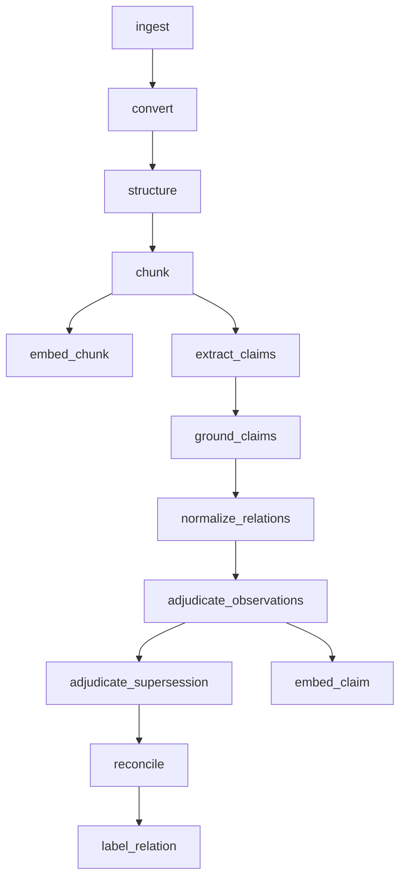

# The pipeline and readiness

RememberStack does its thinking when you write, not when you ask. Reading a
document, splitting it into claims, resolving who is who and deciding what is
true all happen once, in the background, after ingest. That is why a query
can answer from settled facts without calling a language model, and why the
same question gets the same answer twice.

The cost is that knowledge is not queryable the instant you send it.
Processing a document takes minutes, not milliseconds. This page explains
what happens in those minutes and how to know when it is done.

## The stages


`POST /ingest` (or `memory.ingest`) returns as soon as the bytes are stored
and a version is recorded. Everything after that runs in workers, one stage
at a time, with some stages running in parallel:



| Stage | What it does | Uses a model |
|---|---|---|
| `ingest` | Stores the bytes once per content hash and records a new version, or returns the existing one if the bytes are unchanged. Runs inside the API call. | No |
| `convert` | Turns the file into Markdown text (`document.md`) and a grid of blocks. Text and office formats convert without a model; images are read with OCR and described by a vision model. | For images, and for OCR routes you configure |
| `structure` | Finds the document's sections from its headings, gives each a role, and writes short section summaries used only for orientation. | Yes (roles and summaries) |
| `chunk` | Cuts the text into chunks: non-overlapping runs of whole blocks. | No |
| `embed_chunk` | Computes a vector for each chunk for semantic search. | Embedding model |
| `extract_claims` | **Selection**, per chunk: decides which statements to keep and which to drop, with a reason. | Yes |
| `ground_claims` | **Claimify** plus the grounding gate, per chunk, once every chunk has been through Selection: writes standalone claims and checks every one against the source. | Yes |
| `normalize_relations` | Per claim: turns it into relations and observations, and resolves their entities. | Yes |
| `adjudicate_observations` | Per entity: decides how each new assertion changes the facts (add, confirm, adjust, supersede, contradict). | Yes, when the entity already has facts |
| `adjudicate_supersession` | Refreshes the profiles of entities whose facts changed, and re-examines their identity. | Yes (profiles) |
| `embed_claim` | Computes a vector for each claim for semantic search. | Embedding model |
| `reconcile` | Updates which claims are current testimony, recounts every affected fact's evidence, and retracts or flags facts that lost all support. | No |
| `label_relation` | Writes each fact's readable label and computes its vector. | Embedding model |

The details of each step are in [Claims](claims.md), [Facts](facts.md),
[Entities](entities.md) and [Updating a source](updating-sources.md).

When a new version of a document arrives, unchanged passages reuse their
earlier work: their conversion, their claims and their vectors. Only what
changed is processed again.

## How long it takes

Expect minutes per document, and longer for large ones. Every model-backed
stage waits on a provider, and some stages cannot start until every chunk or
every claim of the version has finished the one before. The structure stage
alone has been measured at about 11 minutes on a 2.5 KB file.

Plan for this. An agent that ingests a note and immediately asks about it
will not find it. Write first, then wait for readiness before relying on the
content.

## No model on the read path

Once processing is done, reading is cheap and repeatable. The
[assured operations](retrieval.md) and retrieval primitives run on
PostgreSQL and embedding search only. The one outside call a query may make
is to embed the query text for semantic search. No language model rewrites,
ranks or summarises your answer at read time.

## Stage statuses

For each version and stage, readiness reports one status:

| Status | Meaning |
|---|---|
| `missing` | No work for this stage exists yet, usually because an earlier stage has not finished. |
| `pending` | Queued, waiting for a worker (or waiting to retry after a failure). |
| `running` | A worker is on it. |
| `succeeded` | Done. |
| `skipped` | Nothing to do for this version. Counts as done. |
| `failed` | The last attempt failed; it will be retried. |
| `dead_letter` | It will not be retried automatically. |

Stages that fan out (per chunk, per claim, per entity) report one combined
status for the whole version, so a version is never shown as done while
part of it is still running.

### Dead letters

A unit of work is **dead-lettered** when it has used up its attempts (three
by default) or fails with an error that retrying cannot fix. It stops there,
and so does everything after it for that version. Readiness shows the stage
as `dead_letter`.

A dead letter does not fix itself. When you see one, stop waiting and look
at why. On a self-hosted deployment, see
[Operating the pipeline](../self-hosting/operating.md) for how to inspect and
replay it.

A file whose type has no configured converter is not dead-lettered. The
original is stored and its conversion waits, reported as `pending`, until a
route for that type exists.

## Readiness

**Readiness** answers one question: can I recall this yet? You ask it for
one or more `version_id`s (up to 1,000 per call) and name which
capabilities you need. It reports each capability separately and a single
`ready` that is `true` only when every capability you required is ready.

| Capability | Ready when | What it makes possible |
|---|---|---|
| `pipeline` | Every stage above has succeeded (or been skipped) for every version you asked about. | Claims and facts from those versions exist. |
| `p1` | The deployment's search indexes are built for all seven channels: semantic search over chunks, claims, relations, observations and entities, and BM25 keyword search over chunks and claims. | Search-backed operations can find them. This is deployment-wide, not per version. |
| `live_graph` | The deployment's PostgreSQL graph passes its health checks. | Graph traversal and the neighbourhood expansion in `facts_context`. Deployment-wide. |
| `p3` | A filesystem snapshot of the corpus has been published after your versions finished. | The read-only filesystem views. Self-hosted only; see [Filesystem views](../self-hosting/filesystem-views.md). |

For ordinary recall, require `pipeline`, `p1` and `live_graph`, and leave
`p3` off unless you read the filesystem views.

```python
import remember

with remember.Client() as memory:
    version = memory.ingest(
        "notes/2026-04-28-standup.md",
        source_kind="notes",
        source_ref="notes/2026-04-28-standup.md",
    )
    report = memory.wait_for_readiness(
        [version.version_id], timeout=1800, poll_interval=30
    )
    print(report.ready)
```

`wait_for_readiness` requires `pipeline`, `p1` and `live_graph` (add
`require_p3=True` for `p3`) and raises `TimeoutError` when the time runs out.
Its default timeout is 30 seconds, which is too short for real documents;
set it explicitly as above. It keeps polling through a `dead_letter`, so for
long waits, inspect `report.versions[*].stages` yourself and stop on
`dead_letter`. See [Wait until a document is queryable](../guides/wait-for-readiness.md).

The report also carries `build_revision` and `model_bindings`: which engine
build and which models are processing your documents.

!!! note
    A document's status (`ready` in `GET /documents`) is not readiness. A
    document is `ready` once it is converted and structured; its claims and
    facts come later. Use readiness to decide when to query.

## Where to go next

- [Wait until a document is queryable](../guides/wait-for-readiness.md)
- [Ingest, readiness, documents](../reference/http-api/ingest.md):
  `POST /readiness`.
- [Operating the pipeline](../self-hosting/operating.md) (self-hosted).
