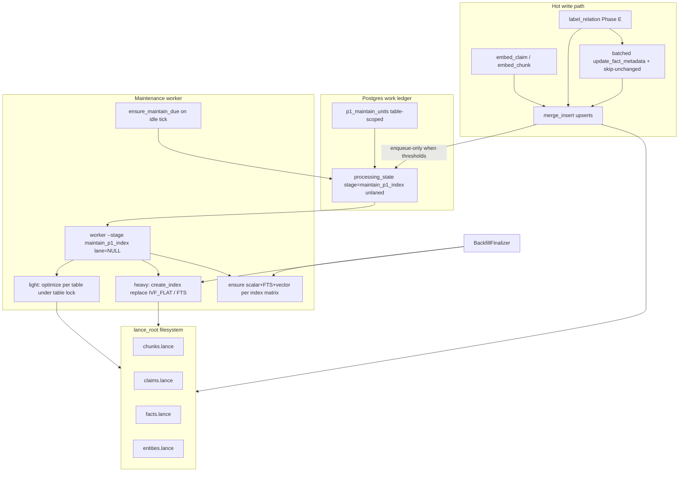

# Design: P1 Lance bulk writes and two-layer maintenance

**Status:** binding (D91 entered; trigger/change-mass amendment 2026-08-13)  
**Date:** 2026-08-13  
**Decision log:** [D91](../../decisions.md#d91--p1-lance-bulk-writes-and-two-layer-index-maintenance)  
**Analysis:** [p1_lance_maintenance_analysis.md](../analysis/p1_lance_maintenance_analysis.md)  
**Companion rulebook (non-binding):** [lance_indexing_maintenance.md](../analysis/lance_indexing_maintenance.md)  
**Reviews absorbed (r1):**
- [REVIEW_claude-opus_p1_lance_maintenance_design_2026-08-13.md](../../design/reviews/REVIEW_claude-opus_p1_lance_maintenance_design_2026-08-13.md)
- [REVIEW_codex-sol_p1_lance_maintenance_design_2026-08-13.md](../../design/reviews/REVIEW_codex-sol_p1_lance_maintenance_design_2026-08-13.md)  
**Reviews absorbed (r2):**
- [REVIEW_claude-opus_p1_lance_maintenance_design_r2_2026-08-13.md](../../design/reviews/REVIEW_claude-opus_p1_lance_maintenance_design_r2_2026-08-13.md)
- [REVIEW_codex-sol_p1_lance_maintenance_design_r2_2026-08-13.md](../../design/reviews/REVIEW_codex-sol_p1_lance_maintenance_design_r2_2026-08-13.md)  
**Reviews absorbed (r3):**
- [REVIEW_claude-opus_p1_lance_maintenance_design_r3_2026-08-13.md](../../design/reviews/REVIEW_claude-opus_p1_lance_maintenance_design_r3_2026-08-13.md)
- [REVIEW_codex-sol_p1_lance_maintenance_design_r3_2026-08-13.md](../../design/reviews/REVIEW_codex-sol_p1_lance_maintenance_design_r3_2026-08-13.md)  
**Reviews absorbed (r4 — dual APPROVE_WITH_NITS):**
- [REVIEW_claude-opus_p1_lance_maintenance_design_r4_2026-08-13.md](../../design/reviews/REVIEW_claude-opus_p1_lance_maintenance_design_r4_2026-08-13.md)
- [REVIEW_codex-sol_p1_lance_maintenance_design_r4_2026-08-13.md](../../design/reviews/REVIEW_codex-sol_p1_lance_maintenance_design_r4_2026-08-13.md)  

**Amends:** P1 write/maintenance contracts implied by D8 inline projection;
clarifies light vs heavy index work relative to `BackfillFinalizer` and
`workers.md` §6.3  
**Preserves:** D8 rebuildability from Postgres; D9 nomination-not-truth; D67
ledger as work truth; D87 eligibility scalars; IVF_FLAT + scalar/FTS index
choices already in `lance.py`  
**Pattern:** OSS-baked maintenance as a first-class worker (not Enterprise
auto-index); bulk Lance writes aligned with public LanceDB guidance

## 1. Decision

1. **Bulk metadata writes.** `FactIndexPort.update_fact_metadata` must not loop
   per-row `table.update`. It batches into `merge_insert` on the facts join key
   `["deployment_id", "kind", "fact_id"]` with **matched-only** column updates
   for eligibility scalars (status + time micros). Prefer also carrying those
   scalars on Phase E `upsert_facts` so a separate metadata pass is rare when
   the embed row is already current.
2. **Metadata skip-unchanged is binding.** Before merge, drop rows whose
   Postgres eligibility scalars already equal the Lance row (or skip the whole
   pass when the candidate set is empty after comparison). Merge updates are
   delete-and-reinsert; skipping is load-bearing for unindexed-tail growth, not
   polish.
3. **Two-layer maintenance is binding:**
   - **Light / frequent:** `table.optimize()` — compact fragments, prune old
     versions, **incrementally** fold unindexed tails into existing vector,
     scalar, and FTS indexes. On pinned `lancedb==0.34.0`,
     `optimize(retrain=True)` is a **deprecated no-op**; light **cannot**
     retrain IVF.
   - **Heavy / periodic:** full vector index rebuild via
     `create_index(..., replace=True)` / IVF_FLAT retrain
     (`num_partitions` from row count / `LANCE_TARGET_PARTITION_ROWS`), plus
     optional FTS rebuild when policy thresholds fire.
   - Light is **not** a substitute for heavy. Heavy is **not** run on the
     interactive read path or under `label_lock`.
4. **Physical grain is the Lance table under one `lance_root`.** Maintenance
   units, durable stats, advisory locks, and coalesce keys are **table-scoped**
   (identity: `(lance_root identity, table_name, mode)`). `deployment_id` on
   ledger rows is for routing and ops attribution only. Self-host is
   **single-deployment by construction** for continuous maintain. Multi-deployment
   cloud sharing one `lance_root` is an explicit **non-goal** of this design
   (future cloud layout: one root per deployment, or a separate multi-tenant
   maintain design).
5. **Dedicated ledger-backed maintenance work.** Stage `maintain_p1_index`
   (Postgres `pipeline_stage` + `PipelineStage` enum). **Unlaned** (add to
   `UNLANED_STAGES`; `lane IS NULL`). **`lane=backfill` is forbidden** for this
   stage (would deadlock `BackfillFinalizer` drain). One stage; mode in payload
   (`light` | `heavy` | `ensure_indexes`). Splitting into separate stages later
   is a documented alternative if ops want separate autoscaling — not required
   here.
6. **Unify maintenance API.** Expand `P1IndexMaintenancePort` beyond
   `build_search_indexes()` to expose light optimize, heavy rebuild, ensure
   indexes (with the **binding per-table index matrix** in §5.3), and stats.
   `BackfillFinalizer.build_search_indexes` becomes a caller of the same port
   (ensure + heavy), not a second private path. The port stays
   **deployment-free**; callers remain deployment-scoped for barriers only.
7. **Write-path is enqueue-only for maintain.** After bulk writes, writers may
   evaluate cheap stats and **enqueue** light maintain. They must **not** call
   synchronous `optimize()` under `label_lock` / embed lease. There is no
   enforceable wall-clock budget on uninterruptible Lance calls.
8. **Distinguish three job families** (do not collapse):
   - light maintain (this design),
   - heavy reindex (this design),
   - content rebuild / embedding migration (`p1_batch_rebuild` family from
     `workers.md` §6.3 — re-project from Postgres; out of band of optimize).
9. **Physical port stays `lance_root`.** Default self-host is local filesystem
   under `/var/lib/rememberstack/lance` via compose volume `app-state`. Object
   storage for Lance is a non-goal here.
10. **Observability, enable gates, and failure contracts** in §5.5, §8–§9 are
    required for ship. Continuous auto-worker defaults **off** until soak
    (`maintenance_enabled` / `heavy_enabled`).
11. **Heavy IVF under sustained high write rate is best-effort** (§5.7 rule 3):
    defer heavy when write / maintain-enqueue rate is high; on
    `create_index` commit conflict after a full train, fail retryable with a
    long `not_before` (one ledger attempt) — never re-train 8× with
    sub-second pauses inside one claim. Continuous writers above the defer
    threshold do **not** guarantee eventual heavy success without operator
    action; after a defined defer/conflict budget the unit enters durable
    **`awaiting_operator`** (visible, not silent thrash). Operator may force
    a quiet window or accept stale IVF until natural quiet.
12. **Reclaim uses `WorkLedger.fail` + liveness + attempt fence** (§5.5.2): no
    hand-rolled `status='failed'` UPDATE that violates CHECK constraints;
    side-thread heartbeat during long Lance ops so a live heavy is never
    reclaimed; every ownership-changing and liveness write is
    compare-and-transition on `ClaimedWork.attempt`.
13. **Maintain completion is atomic with `rerun_requested`** (§5.5.3): one
    ledger transaction marks success and creates the successor unit when the
    flag is set — never a post-complete best-effort enqueue. Completion,
    fail/defer, reclaim, and heartbeat all require
    `expected_attempt = ClaimedWork.attempt`.
14. **Heavy fires on durable amount of change, not calendar-only** (§5.4.1):
    writers increment table-scoped `changed_rows_since_heavy` and
    `change_mass_since_heavy` only when a **vector is actually rewritten**.
    Eligibility-only / skip-unchanged metadata must not increment heavy mass.
    Chunks are more sensitive than short-text tables (lower mass/row
    thresholds). The 24h floor is an anti-thrash cap, not the discovery
    signal.

## 2. Problem (why this exists)

BEAM-scale self-host (2026-08-13): after Phase E embeds finish quickly,
`LabelFactsHandler` refreshes fact eligibility via **thousands of per-row**
Lance `update` calls (~7.9k facts → thousands of ~19 KB fragments, multi-hour
wall clock, `facts.lance` multi-GB). Inline `_maintain_indexed_tail` only runs
`optimize()` after process-local 20 mutations / 100k unindexed rows and never
schedules full IVF retrain. Official LanceDB OSS docs: `optimize` = compaction +
prune + **incremental** index update — **not** full ANN retrain. Compose has no
maintenance worker; `workers.md` §6.3 named compaction/rebuild but it never
became a continuous stage.

A related ops hang (`embed_claim` mid-lease after hundreds of claims) is the
same *class* of long lease without durable sub-progress; **primary scope here
is Lance write/maintenance correctness**, not claim grain fan-out.

## 3. Rationale

- Public LanceDB performance guidance: each call commits a version/fragment;
  batch writes; use `merge_insert` for upserts with scalar indexes on join keys;
  run `optimize` after large writes
  ([performance](https://docs.lancedb.com/performance), retrieved 2026-08-13).
- `update` is correct for filter-based scalar edits but moves rows out of
  indexes; large update batches should trigger reindex hygiene
  ([tables/update](https://docs.lancedb.com/tables/update), retrieved
  2026-08-13). **Matched merge updates are also delete-and-reinsert** on the
  pinned engine (rows leave existing indexes and join the unindexed tail) —
  batching alone does not bound tail growth; skip-unchanged does.
- OSS does not auto-maintain indexes; `optimize` updates existing indexes
  incrementally; full retrain is a separate operation operators must schedule
  ([reindexing](https://docs.lancedb.com/indexing/reindexing), retrieved
  2026-08-13).
- P1 is a rebuildable projection (D8). Spending multi-hour work on the label
  lock for N single-row commits is pure waste; Postgres remains authority.
- In-process mutation counters cannot implement deployment policy across
  compose replicas and restarts.
- Physical maintain work is table-global under one `lance_root` (row counts,
  fragments, `create_index`, `optimize`). Ledger grain must match that, or
  growth policy and locks double-fire or under-serialize.

## 4. Goals and non-goals

### 4.1 Goals

- O(batches) Lance commits for metadata refresh at 10k–100k fact scale.
- Bound unindexed-tail growth by skipping unchanged eligibility scalars.
- Bounded fragment growth and unindexed tails under continuous ingest.
- Explicit heavy reindex when **durable change-mass / changed-row fraction**
  (and leftover unindexed ratio after light) require it, without thrashing
  multi-hour retrains under continuous writers; honest **best-effort** heavy
  progress under sustained high write rate (terminal `awaiting_operator`, not
  fake eventual-success while writers never quiet).
- Ledger-visible maintenance progress and failures with stage-scoped reclaim
  that cannot steal a live op, violate `processing_state` CHECKs, or complete/
  fail a **replacement attempt** on the same `processing_id`.
- Atomic maintain completion that never drops a `rerun_requested` successor.
- Safe concurrent writers via existing commit-conflict retries + **table-scoped
  exclusive maintain lock** for light+heavy (one named owner for all callers).
- Cold-reader contracts for storage location, backup, compose wiring, readiness
  exclusion, and lane.

### 4.2 Non-goals

- Claim-level or relation-level fan-out for `embed_claim` / `label_relation`
  (separate track; hang detection may share lease patterns later).
- LanceDB Enterprise / Geneva auto-index features.
- Moving default self-host Lance to object storage (S3/MinIO).
- Changing ANN type away from IVF_FLAT unless a later performance design
  revisits WP-5.6 choices.
- Making P1 authoritative or bypassing Postgres hydration.
- Multi-deployment continuous maintain against a **shared** `lance_root`
  (cloud multi-tenant layout is future work; self-host is one deployment per
  root by construction).
- Shared estate-wide processing_state reaper for all long stages (this design
  ships **stage-scoped** reclaim for `maintain_p1_index` only; generalizing
  later is fine).
- Expanding `label_lock` to wait on maintain workers (hot-path quiesce that
  blocks labeling). **Supported ops path** is a separate bounded
  `maintenance_writer_gate=hold` (or compose scale-down of label/embed for the
  deployment) that pauses **new** Lance-mutating batches for a table without
  holding `label_lock` across multi-hour `create_index` — see §5.7 rule 3.

## 5. Proposed design

### 5.1 Architecture



### 5.2 Writer path — bulk APIs

#### 5.2.1 `update_fact_metadata` (binding rewrite)

**Today (forbidden after this design lands):**

```text
for row in rows:
  table.update(where=..., values=...)
```

**Required:**

```text
update_fact_metadata(rows):
  if empty: return
  ensure_search_indexes for facts join keys if missing  # §15 PR1
  dedupe rows on (deployment_id, kind, fact_id)
    # last-write-wins within the caller's batch order
  filter skip-unchanged (§5.2.2): drop rows whose Lance scalars already match
  if empty after filter: return (metric metadata_skipped_unchanged)
  chunk rows into batches of META_BATCH_SIZE (default 500; settings knob)
  for each batch:
    payload = [{deployment_id, kind, fact_id, status, valid_*_us, ...}, ...]
    merge_insert(["deployment_id", "kind", "fact_id"])
      .when_matched_update_all()   # only keys present in payload columns
      # DO NOT when_not_matched_insert_all — unmatched would insert null vectors
      .execute(payload)
    metadata_miss += batch_len - MergeResult.num_updated_rows
    bounded commit-conflict retry (existing _LANCE_COMMIT_RETRIES pattern)
  record mutation stats; enqueue light maintain if thresholds trip (§5.4)
  # never call optimize() here
```

**Join keys:** must match `upsert_facts` key
`["deployment_id", "kind", "fact_id"]` so re-runs are idempotent.

**Matched-only rule (Option A only):** metadata batches must not insert skeleton
rows without vectors/labels. Use `when_matched_update_all()` only — no insert
clause. On pinned `lancedb==0.34.0`, a partial matched payload updates only the
supplied columns and **preserves `label` and `vector`**. An unmatched key is a
silent no-op (`num_updated_rows` does not count it); derive `metadata_miss`
from merge result counts, not a second id-lookup pass.

**Delete-and-reinsert property:** a matched merge update deletes the old row
and reinserts it with new values. Updated rows leave existing indexes and join
the unindexed tail until light `optimize()` folds them. This is why
skip-unchanged (§5.2.2) is mandatory.

**Duplicate join keys:** the engine rejects ambiguous merges (multiple source
rows matching one target) with a hard error for the whole batch. Batches **must
be deduplicated** on `(deployment_id, kind, fact_id)` before merge; tie-break is
last row in the input sequence wins.

**Scalar indexes before large merges (binding):** ensure BTREE/BITMAP on join
and filter columns **before** large merges (matrix §5.3). `fact_id` is
mandatory for this path. PR1 ensures join-key indexes then merges (§15) so
merge never falls back to a full-column scan at BEAM scale.

#### 5.2.2 Fold eligibility into Phase E upserts + skip-unchanged (binding)

`LabelFactsHandler` already builds `P1FactRow` with status/times before embed.
**Require** those fields remain on the merge payload (they already are in
`upsert_facts`). After this design:

1. Phase E upsert writes vector **and** eligibility scalars together.
2. Post-pass `update_fact_metadata` runs for facts whose Postgres eligibility
   may have changed without a re-embed in this job (supersession / invalidate /
   validity reconcile), **after** filtering:
   - Load current Lance scalars for candidate keys (bounded projection of join
     keys + mutable columns), or compare against values just written in this
     job's Phase E upsert set.
   - **Skip** any row where
     `(status, valid_from_us, valid_until_us, ingested_at_us, invalidated_at_us)`
     already equals Postgres intent.
   - If every candidate is skipped, do not open a merge at all.
3. Churn budget: only facts whose eligibility actually changed re-enter the
   unindexed tail. Thresholds in §5.4 assume that steady-state input, not
   "every fact of every document on every label job."

#### 5.2.3 Other writers

`upsert_chunks` / `upsert_claims` / `upsert_entities` already use `_upsert` →
`merge_insert`. Changes required:

- **Remove** synchronous write-path `optimize()` from
  `_maintain_indexed_tail` (or reduce it to optional cheap pre-check that only
  **enqueues**). Prefer one `table.stats()` call over per-index
  `list_indices` + `index_stats` loops when deciding whether to enqueue.
- Enqueue light maintain when batch sizes or fragment/unindexed stats warrant
  (§5.4), if `maintenance_enabled`.
- `upsert_entities` must call the same ensure-scalar path and enqueue maintain
  as other writers (today it ensures nothing and never maintains — fixed by
  §5.3 matrix + writer hygiene).

Do not introduce per-row `update` anywhere else in the adapter.

**Standing invariant:** fact writers for a deployment are serialized by
`label_lock` today; concurrent partial merges on the same fact from two label
workers are out of scope while that lock holds. Maintain runs outside
`label_lock`.

### 5.3 Two-layer maintenance contracts and index matrix

| Layer | API (port) | Lance operations | Cadence |
| --- | --- | --- | --- |
| Light | `optimize_tables(tables, cleanup_older_than=…)` | `table.optimize(...)` under table lock | Frequent; dual trigger on unindexed rows **or** small-fragment pressure **or** enqueue from writers |
| Heavy | `rebuild_vector_indexes(tables)` / `rebuild_text_indexes(tables)` | `create_index(..., replace=True)` IVF_FLAT (+ FTS) under table lock | Periodic / admin / growth policy; subject to write-rate defer (§5.7) |
| Ensure | `ensure_search_indexes()` | scalar + FTS + vector per matrix if missing; min-row gate re-eval | Deploy, backfill end, maintain tick, **and before large metadata merges** |
| Stats | `table_maintenance_stats(table) -> …` | `count_rows`, `list_indices`, `index_stats`, **`table.stats()`** fragment_stats | Every maintain claim; metrics export |

**Binding semantics of light:**

- Compacts small fragments.
- Prunes versions older than retention (`cleanup_older_than`; default keep
  LanceDB’s ~7d unless settings override).
- Incrementally updates existing indexes so `num_unindexed_rows` trends toward 0.
- Does **not** retrain IVF (`retrain` on optimize is a deprecated no-op on
  0.34.0).
- May retry commit conflicts with existing short `_LANCE_COMMIT_RETRIES`
  backoff (§5.7 rule 6).

**Binding semantics of heavy:**

- Retrains IVF_FLAT with
  `num_partitions = max(1, ceil(rows / LANCE_TARGET_PARTITION_ROWS))` and
  `target_partition_size = LANCE_TARGET_PARTITION_ROWS` (preserve
  `LANCE_NPROBES` query contract).
- Uses `create_index(..., replace=True)` so retrain replaces the existing
  vector index idempotently.
- Skips vector build when `rows < _MIN_VECTOR_INDEX_ROWS` (256 today); record
  skip reason in `MaintainReport`.
- May rebuild FTS when policy says (e.g. after massive text updates or admin)
  with replace semantics.
- **Does not** run inside `LabelFactsHandler` or search methods.
- Runs under the **same table-scoped exclusive maintain lock** as light
  (§5.7), so light and heavy never rewrite one table concurrently.
- **Does not** use short in-process commit retries for full retrain after
  conflict; see §5.7 rule 3 (defer / long `not_before`).

**Ensure vs replace:**

| Operation | Semantics |
| --- | --- |
| Ensure scalar/FTS/vector | List indices first; create only if missing (or wrong type for known misbuilds); **no** destructive replace of a healthy index |
| Heavy vector/FTS rebuild | `create_index(..., replace=True)` after ensure of scalar prerequisites |

`build_search_indexes()` remains a convenience that = ensure + heavy for **all
four** present tables (backfill/finalizer compatibility). Extending ensure/heavy
to `entities` is an intentional behaviour change at the backfill barrier
(entity ANN search stops being exhaustive once a vector index exists and the
min-row gate is met) — reviewed here, not discovered in implementation.

**As-built bug closed:** today `build_search_indexes()` is **not** re-runnable —
a second `create_index` without `replace=True` raises
`LanceError(Index): Index name '…' already exists`. Ensure(list-first) +
heavy(`replace=True`) makes a second call a no-op ensure then a clean retrain
(§16).

#### 5.3.1 Binding per-table index matrix

Aligned with companion rulebook R1/R2/R6, current filter/join usage in
`lance.py`, and **prefilter columns** from
`surfaces/query_sandbox/nomination.py` `LANCE_FILTER_COLUMNS` (equality filters
applied with `prefilter=True` before top-k). Types: BTREE high-cardinality;
BITMAP low-cardinality.

| Table | Column | Index | Role |
| --- | --- | --- | --- |
| **chunks** | `vector` | IVF_FLAT (L2, partitions from row count) | ANN |
| | `text` | FTS (`_TEXT_INDEX` defaults) | BM25 |
| | `deployment_id` | BTREE | tenant filter |
| | `chunk_id` | BTREE | merge key member |
| | `policy_generation` | BTREE | D80 generation filter + merge key |
| | `embedder_generation` | BTREE | D80 generation filter + merge key |
| | `doc_id` | BTREE | nominator prefilter (`LANCE_FILTER_COLUMNS`) |
| | `source_kind` | BITMAP | nominator prefilter (low-cardinality categorical) |
| | `source_shape` | BITMAP | nominator prefilter (projection-only filter) |
| | `section_role` | BITMAP | nominator prefilter |
| **claims** | `vector` | IVF_FLAT | ANN |
| | `text` | FTS | BM25 |
| | `deployment_id` | BTREE | tenant filter |
| | `claim_id` | BTREE | merge key / id lookup |
| | `doc_id` | BTREE | nominator prefilter (`LANCE_FILTER_COLUMNS`) |
| | `is_current_testimony` | BITMAP | default channel filter |
| **facts** | `vector` | IVF_FLAT | ANN on labels |
| | `deployment_id` | BTREE | tenant filter + merge key |
| | `kind` | BITMAP | filter + merge key (low cardinality) |
| | `fact_id` | BTREE | **merge join key** (required before large metadata merges) |
| | `status` | BITMAP | eligibility filter |
| | `valid_from_us` | BTREE | time membership |
| | `valid_until_us` | BTREE | time membership |
| | `ingested_at_us` | BTREE | time membership |
| | `invalidated_at_us` | BTREE | time membership |
| **entities** | `vector` | IVF_FLAT | ANN (today missing on ensure/build path — fix) |
| | `deployment_id` | BTREE | tenant filter |
| | `entity_id` | BTREE | merge key / id lookup |
| | `type` | BITMAP | `search_entities_scored` filter |

**As-built gaps this matrix closes:**

- `facts.fact_id` has no index today (merge join key and membership/purge
  filters).
- **Prefilter columns missing indexes today:** `chunks.doc_id`,
  `chunks.source_kind`, `chunks.source_shape`, `chunks.section_role`,
  `claims.doc_id` (used with `prefilter=True` in nominator search; unindexed
  prefilters force full scans before top-k).
- `entities`: write-path `upsert_entities` ensures nothing; `build_search_indexes`
  skips the table. (`search_entities_scored` may ensure `deployment_id` on the
  **read** path today — that becomes an upgraded-store fallback once
  `ensure_search_indexes()` owns the matrix, not the primary ensure path.)
- `facts.kind` is created as BTree on write-path ensure and Bitmap on
  `build_search_indexes`; **BITMAP is binding** (R2). Ensure must prefer Bitmap
  and not leave call-order-dependent types.

**Out of matrix (not Lance prefilter columns today):** claims `source_kind` /
entity id / asserted range filters that nomination confirms only in Postgres
after nomination (`FILTER_ALLOWLISTS` is wider than `LANCE_FILTER_COLUMNS`).
Only columns in `LANCE_FILTER_COLUMNS` + join/filter usage in `lance.py` are
binding here.

**Min-row gates:** vector IVF only when `count_rows() >= _MIN_VECTOR_INDEX_ROWS`
(256). Ensure re-evaluates the gate on every maintain tick (rulebook R5 /
archetype E). Scalar and FTS have no min-row gate.

**Fragment stats source:** public `Table.stats()` on 0.34.0 returns
`fragment_stats.num_fragments` / `num_small_fragments` — use these for metrics
and light triggers; prefer **`num_small_fragments`** for the fragment-pressure
trigger (rulebook R4).

### 5.4 Policy knobs (settings)

New settings group (implementation chooses one namespace under
`REMEMBERSTACK_…`, documents it in compose env and docs site):

| Knob | Starting point (measure; not sacred) | Role |
| --- | --- | --- |
| `metadata_merge_batch_size` | `500` | Rows per `merge_insert` in `update_fact_metadata` |
| `optimize_unindexed_rows` | `100_000` | Light maintain when any index reports ≥ this unindexed (**vendor rule of thumb** from LanceDB optimize guidance, same source as today's adapter constants — remeasure on BEAM) |
| `optimize_small_fragments` | `2_000` | Light maintain when `num_small_fragments` ≥ this |
| `heavy_rebuild_row_growth_pct` | `25` (facts/entities default; **chunks 5**, claims 15 — §5.4.1) | Heavy if `count_rows` grew ≥ this % since `last_heavy_row_count` (append proxy; not sufficient alone) |
| `heavy_changed_row_frac` | facts/entities `0.25`; claims `0.15`; **chunks `0.05`** | Heavy if `changed_rows_since_heavy / last_heavy_row_count` ≥ this (updates with **flat** row count) |
| `heavy_change_mass` | starting: chunks `2e6`; claims `5e6`; facts `8e6`; entities `2e6` (measure) | Heavy if durable `change_mass_since_heavy` ≥ this (char-capped mass of **vector rewrites only**) |
| `change_mass_char_cap` | chunks `4096`; claims `512`; facts `256`; entities `1024` | `change_mass += min(len(embedded_text), cap[table])` per **vector rewrite** |
| `heavy_rebuild_min_hours` | `24` | Anti-thrash **cap**: do not heavy more often than this unless admin / force. **Not** the discovery signal. |
| `heavy_rebuild_unindexed_ratio` | `0.15` | Heavy candidate if unindexed/total ≥ 15% **after** a successful light pass still leaves high ratio (train quality proxy — **not** raw fragment debt) |
| `heavy_defer_write_rate` | measure; start e.g. `N` merges/min or recent maintain-enqueue count | Defer heavy while write / maintain-enqueue rate exceeds this (§5.7 rule 3) |
| `heavy_conflict_not_before_s` | `900`–`3600` (15–60 min) | After `create_index` commit conflict: ledger fail retryable with this `not_before` floor (one attempt) |
| `heavy_rate_defer_escalate_n` | `12` | Consecutive pure rate-defers (no train) before unit enters `awaiting_operator` |
| `heavy_conflict_defer_escalate_m` | `3` | Consecutive post-train conflict_defers before `awaiting_operator` |
| `heavy_defer_age_escalate_h` | `24` | Wall-clock age of continuous heavy deferring (rate or conflict) before `awaiting_operator` if N/M not hit first |
| `maintenance_writer_gate` | `open` (default) \| `hold` | Ops quiet-window gate: when `hold`, P1 writers **enqueue but do not start new Lance-mutating batches** for the gated table/deployment for a bounded period (§5.7 rule 3). Does **not** expand `label_lock` |
| `maintain_poll_hours` | `1` | Self-seed light check cadence when idle |
| `maintain_probe_min_s` | `60` | Floor between Lance stats probes inside `ensure_maintain_due` (durable stats first) |
| `maintain_reclaim_min_s` | `60` | Floor between reclaim scans on the maintain tick |
| `maintain_running_stale_s` | light default `7200` (2h); **heavy must exceed measured p99 rebuild** (or use heartbeat) | Wall-clock floor when no fresh heartbeat (§5.5.2) |
| `maintain_heartbeat_s` | `60` | Side-thread liveness write interval during long Lance ops |
| `maintain_heartbeat_stale_mult` | `3` | Stale if last heartbeat older than `mult × maintain_heartbeat_s` |
| `maintain_max_attempts` | ledger default | Standard D67 attempts (conflict_defer / hard failures only — **not** pure rate-defer) |
| `cleanup_older_than_hours` | `168` (7d) | Passed to light optimize prune |
| `maintenance_enabled` | **`false`** | Master gate: worker self-seed + writer enqueue of maintain units |
| `heavy_enabled` | **`false`** | Gate heavy policy evaluation and continuous heavy enqueue; light may run when `maintenance_enabled`. **Does not** gate `BackfillFinalizer` / admin force / offline port tools (barrier exists to build indexes) |

**Removed / rejected knobs:**

- `write_path_optimize_max_s` — unenforceable on synchronous `optimize()`;
  write path is enqueue-only.
- Process-local `optimize_mutations=20` as policy — vendor thumb only; do not
  drive ledger policy. Optional process-local enqueue hint may remain but is not
  the control plane.

**Rules:**

- Never heavy-rebuild on read path.
- Never hold `label_lock` across light or heavy Lance maintenance.
- Never call synchronous `optimize()` / `create_index` from writers under lease.
- Admin/ops may enqueue `mode=heavy` regardless of hours floor when
  `heavy_enabled` (or via an explicit force path that bypasses the floor but
  still respects table lock). Force still respects write-rate defer unless
  ops has established a quiet window (`maintenance_writer_gate=hold` or
  compose scale-down) or explicitly accepts conflict risk with
  `force=true` after acknowledging possible `conflict_defer`.
- Threshold evaluation uses **durable table-scoped stats** (§5.6).
- **Baseline init:** if `last_heavy_row_count` is null and a vector index
  already exists, set baseline to current `count_rows()` **without** rebuilding
  (record-current). If no vector index and rows ≥ min gate, heavy/ensure builds
  now. If null and below min gate, wait.
- **Stale cutoff vs heavy duration:** operators set
  `maintain_running_stale_s` from `p1_lance_rebuild_duration_ms` p99 (must
  exceed expected heavy duration when not using heartbeat). With heartbeat
  enabled (binding for heavy, §5.5.2), reclaim uses heartbeat freshness and
  the wall-clock floor is a secondary safety net only.
- **`awaiting_operator`:** while set for a `(root, table, mode=heavy)`,
  continuous `ensure_maintain_due` must **not** auto-enqueue another heavy for
  that table (no silent thrash). Only admin clear / force-after-quiet / accept-
  stale clears the flag (§5.7 rule 3).

### 5.4.1 How each mode is discovered (binding)

There is no Lance callback. Three observers decide to enqueue; the worker
only **runs** claimed units.

| Observer | What it sees | What it may enqueue |
| --- | --- | --- |
| **P1 writer** (embed_chunk / embed_claim / label_relation / entity profile) | The batch it just committed: table name, whether each row **rewrote a vector**, `len(embedded_text)` | Bump durable counters; **enqueue `light` only** when light dirt thresholds trip. Never enqueue `heavy`. Never call `optimize` / `create_index` under the lease. |
| **Maintain idle tick** (`ensure_maintain_due` before `claim_one`) | `p1_lance_table_stats` first; if stale, probe Lance (`unindexed_rows`, `num_small_fragments`, `count_rows`) | Enqueue `light` if dirt/poll due. Enqueue `heavy` if `heavy_enabled` and change-mass / changed-row / growth / leftover-unindexed policy trips and write-rate does not defer. |
| **Backfill finalizer / admin / CLI** | Drain barrier, missing indexes, operator intent | `ensure_indexes` and/or force `heavy`. Finalizer is **not** gated by `heavy_enabled`. |

#### Mode trigger table

| Mode | Fires when | How the system finds out |
| --- | --- | --- |
| **`ensure_indexes`** | A contracted index is missing, or vector IVF min-row gate (256) is newly crossed and no vector index exists | Finalizer after backfill drain; idle probe of `list_indices`; admin. **Not** on a clock. |
| **`light`** | `num_unindexed_rows` ≥ `optimize_unindexed_rows` **or** `num_small_fragments` ≥ `optimize_small_fragments` **or** last light older than `maintain_poll_hours` while the table is still dirty | Writer enqueue after a dirtied merge; idle tick safety poll. |
| **`heavy`** | Durable **amount of change** since last successful train (below) **and** `heavy_enabled` **and** not `awaiting_operator` **and** write-rate defer does not apply **and** `heavy_rebuild_min_hours` has elapsed (unless force) | Idle tick / post-light completion path reads table stats. Writers never enqueue heavy. |

#### Heavy = change-mass (binding)

Calendar (`heavy_rebuild_min_hours`) is an **anti-thrash cap**, not discovery.
Row-count growth alone misses **updates that keep `count_rows` flat**.

On `p1_lance_table_stats` (table-scoped, survive successor units):

- `changed_rows_since_heavy` — count of rows whose **vector** was rewritten
  since the last successful heavy (or since baseline init).
- `change_mass_since_heavy` — `sum(min(len(embedded_text), cap[table]))` for
  those same vector rewrites only.

**Increment only when the Lance vector column is written.** Forbidden to
increment for:

- skip-unchanged eligibility rows (Postgres scalars already match Lance);
- matched-only metadata merge that does **not** rewrite `vector` / `label`;
- no-op upserts.

Reset both counters **only** after a successful heavy for that table.

**Heavy if any (per table, after min-hours / enable / not-awaiting / not-rate-deferred):**

1. `changed_rows_since_heavy / max(last_heavy_row_count, 1) ≥ heavy_changed_row_frac[table]`, or
2. `change_mass_since_heavy ≥ heavy_change_mass[table]`, or
3. `count_rows` grew ≥ `heavy_rebuild_row_growth_pct[table]` vs `last_heavy_row_count`, or
4. after a **successful light**, `unindexed/total ≥ heavy_rebuild_unindexed_ratio`.

#### Per-table sensitivity (chunks more often than short text)

| Table | `change_mass_char_cap` | `heavy_changed_row_frac` | `heavy_change_mass` (start) | Why |
| --- | --- | --- | --- | --- |
| **chunks** | 4096 | **0.05** | **2e6** | Long embedding text; primary semantic mass; each rewrite moves more of the IVF |
| claims | 512 | 0.15 | 5e6 | Medium needles; many rows |
| facts | 256 | 0.25 | 8e6 | Short labels; eligibility churn must not look like retrain |
| entities | 1024 | 0.25 | 2e6 | Few rows; profile text |

Starting numbers are **to be measured** on BEAM; the **ordering** (chunks
strictest) is binding.

Writer hook (same batch that upserts):

```text
if vector_rewritten:
  stats.changed_rows_since_heavy += 1
  stats.change_mass_since_heavy += min(len(embedded_text), cap[table])
if light_dirt_thresholds:
  enqueue_p1_maintain(table, mode=light)
```

### 5.5 Worker / stage: `maintain_p1_index`

#### 5.5.1 Ledger identity (one protocol)

| Field | Binding value |
| --- | --- |
| `stage` | `maintain_p1_index` (new `pipeline_stage` enum value + Python `PipelineStage`) |
| `target_kind` | `p1_maintain_unit` (new `processing_target` enum value + `ProcessingTarget`) |
| `target_id` | `unit_id` (UUID PK of `p1_maintain_units`) |
| `component_version` | fixed string e.g. `p1-lance-maintain-2026.08` (logical only; **not** registered in `_expected_components`; no new `pipeline_component` enum value required — D1 component registry is for per-version readiness generations) |
| `content_hash` | stable per-unit diagnostic string (e.g. `p1-maintain:{root_key}:{table}:{mode}:{unit_id}`); required by `processing_state.content_hash NOT NULL` — for diagnostics/replay, **not** uniqueness |
| `lane` | **`NULL` (unlaned)** always |
| `deployment_id` | sole self-host deployment (routing / attribution) |
| `payload` | see below |

Payload:

```json
{
  "mode": "light" | "heavy" | "ensure_indexes",
  "table": "chunks" | "claims" | "facts" | "entities",
  "force": false,
  "reason": "threshold|schedule|admin|post_write|backfill|reclaim|deferred_heavy|conflict_defer|heavy_needs_quiet_window"
}
```

**One physical maintain unit = one table × one mode.** Multi-table admin work
enqueues one unit per table (or the handler fans out under one claimed unit by
processing tables sequentially under per-table locks — prefer **one unit per
table** for reclaim granularity and coalesce clarity).

**Table `p1_maintain_units`:**

| Column | Role |
| --- | --- |
| `unit_id` | PK; ledger `target_id` |
| `deployment_id` | routing / attribution (self-host single deployment) |
| `lance_root_key` | stable string identity of the root (e.g. canonical path); default single root |
| `table_name` | `chunks` \| `claims` \| `facts` \| `entities` |
| `mode` | `light` \| `heavy` \| `ensure_indexes` |
| `reason` | text |
| `requested_at` | timestamptz (bumped on coalesce) |
| `rerun_requested` | boolean — set when enqueue races a live run (§5.5.3) |
| `last_heartbeat_at` | timestamptz nullable — side-thread liveness (§5.5.2) |
| `claimed_attempt` | int nullable — last claim's `ClaimedWork.attempt` stamped at claim start; heartbeat and ownership writes compare against it |
| `operator_state` | text nullable — denormalized copy of table-stats terminal for the unit row; **authoritative** escalation state lives on `p1_lance_table_stats` (§5.6) |
| `result` | optional jsonb after completion |

**Escalation counters are table-scoped, not unit-local:** `rate_defer_count`,
`conflict_defer_count`, `first_defer_at`, and `operator_state` for heavy
best-effort live on **`p1_lance_table_stats`** (keyed by
`(lance_root_key, table_name)`). Successor units must **not** reset these to
zero on insert — they read/update the stats row. Unit rows may mirror
`operator_state` for display only.

**Unique open-unit constraint (coalesce) — binding implementation:**

At most one **open** unit per `(lance_root_key, table_name, mode)`, where open
means a linked ledger row in `pending` or `failed` (retryable), **or**
`running` with a fresh heartbeat / not past reclaim criteria.

**Do not** implement open-ness via a PostgreSQL partial unique index on
`p1_maintain_units` filtered by `processing_state.status` — a partial-index
predicate may only reference columns of the indexed table
([PostgreSQL partial indexes](https://www.postgresql.org/docs/current/indexes-partial.html)).
Status lives on `processing_state`, so that alternative is **not expressible**.

**Binding:** `enqueue_p1_maintain` takes an enqueue advisory xact lock for
`(lance_root_key, table_name, mode)`, then `SELECT … FOR UPDATE` the control
row / existing open unit and inserts only when none is open. Optional later:
add unit-local `open boolean` maintained in the same transaction as ledger
transitions if a real partial unique index is desired — not required to ship.

**Ledger unique key** remains
`(deployment_id, target_kind, target_id, stage, component_version)`. Fresh
units get new `unit_id`s; coalesce **does not** insert a second open unit for
the same `(root, table, mode)`.

#### 5.5.2 Coalesce, idempotency, reclaim, and liveness

**Coalesce only on `pending` (and retryable `failed`), not on unbounded
`running`.**

```text
enqueue_p1_maintain(root, table, mode, reason, *, not_before=None):
  if not maintenance_enabled and reason != admin_force: return
  if mode == heavy and not heavy_enabled and not force: return
  BEGIN
    take enqueue xact lock for (root, table, mode)
    if open pending/failed unit exists:
      bump requested_at; OR reason into unit; optionally lower not_before; return
    if running unit exists for same (root, table, mode) and not reclaimable:
      set rerun_requested = true on that unit; return
    else insert unit + ledger pending row (lane NULL, content_hash set)
  COMMIT
```

**Idempotency of Lance ops (makes double-run safe):**

- `table.optimize()` is safe to re-run.
- `create_index(..., replace=True)` for heavy is safe to re-run.
- Ensure is list-then-create-if-missing.

Therefore a duplicate maintain after reclaim is correct, not harmful.

---

##### Stage-scoped reclaim (binding, ships with D91 — not deferred)

There is **no** estate-wide processing_state reaper today. This design adds a
**minimal maintain-only** reclaim.

**Forbidden:** hand-rolled SQL of the form
`UPDATE processing_state SET status='failed' …` that omits
`defer_reason` / `not_before` or ignores attempt exhaustion. Live CHECKs
(`p0_02_0002_infrastructure_registries.py`):

```sql
CHECK (status <> 'failed' OR attempts < max_attempts),
CHECK (
  (status = 'failed'  AND defer_reason = 'retry_backoff') OR
  (status = 'pending' AND (defer_reason IS NULL OR defer_reason IN ('scheduled','budget'))) OR
  (status NOT IN ('pending','failed') AND defer_reason IS NULL)
)
```

A bare `status='failed'` from `running` violates both arms when
`defer_reason` stays null or `attempts >= max_attempts`.

**Binding reclaim path:**

```text
reclaim_stale_maintain(deployment_id):
  # rate-floor: skip if last reclaim scan < maintain_reclaim_min_s ago
  select processing_state rows (join p1_maintain_units) where:
    stage = 'maintain_p1_index'
    AND status = 'running'
    AND is_reclaimable(row)   # see liveness below
  # SELECT must project the observed attempt: processing_state.attempts AS observed_attempt
  for each row:
    try:
      scheduled = WorkLedger.fail(          # maintain path — see attempt fence
        processing_id=row.processing_id,
        error='stale maintain running reclaimed',
        retryable=True,
        expected_attempt=row.observed_attempt,  # binding: carry scan attempt into locked fail
      )
    except WorkNotRunningError:
      # select→fail race: owner completed (or was already failed) between scan
      # and lock; skip this row (do not abort the reclaim loop)
      continue
    # fail() already (when attempt matches):
    #   - asserts status == 'running' AND attempts == expected_attempt
    #   - if attempts < max_attempts: status=failed, defer_reason=retry_backoff,
    #     not_before = now() + backoff; returns scheduled time
    #   - else: status=dead_letter; returns None
    # fail() when attempt mismatches or status not running:
    #   - raise WorkNotRunningError (same as generic fail on non-running)
    if scheduled is not None:
      queue.announce(
        processing_id=row.processing_id,
        route_snapshot=QueueRoute(
          deployment_id=deployment_id,
          stage=PipelineStage.MAINTAIN_P1_INDEX,
          lane=None,  # unlaned
        ),
        not_before_snapshot=scheduled,
      )  # matches TaskQueuePort.announce (ports/queue.py)
      metric p1_lance_maintain_reclaimed{outcome=retry}
    else:
      metric p1_lance_maintain_reclaimed{outcome=dead_letter}
      # dead_letter is NOT open (§5.5.1). For light / hard-fail exhaustion,
      # next ensure_maintain_due may enqueue a fresh unit. For heavy that
      # escalated to operator_state=awaiting_operator (§5.7 rule 3), ensure
      # must NOT auto-enqueue another heavy until ops clears the flag.
```

**Scope of candidates:** only `stage=maintain_p1_index`. Prefer also join to
`p1_maintain_units` so reclaim reasoning is table/mode-aware (heavy vs light
liveness) and so `observed_attempt` can cross-check `unit.claimed_attempt`
when set.

**Attempt fence (binding — closes Codex P1.4):** "running" alone is **not** an
ownership fence. `ClaimedWork.attempt` (integer returned on claim; column
`processing_state.attempts` after `_CLAIM_START`) is bound through **every**
maintain ownership-changing and liveness write:

| Write | Fence predicate |
| --- | --- |
| `complete_maintain_p1` | `WHERE processing_id=:id AND status='running' AND attempts=:expected_attempt` |
| fail / reclaim / conflict_defer | same compare-and-transition on fail path (`expected_attempt` required for maintain) |
| heartbeat UPDATE | update `last_heartbeat_at` only if unit still linked to a `running` processing row at that attempt (`claimed_attempt` / `attempts` match) |

Extend `WorkLedger.fail` (or a maintain-specific wrapper used by reclaim and
the handler runner) to accept `expected_attempt: int | None = None`. When
supplied (maintain path always supplies it), the locked UPDATE is:

```sql
UPDATE processing_state
SET status = 'failed', defer_reason = 'retry_backoff', ...
WHERE processing_id = :id AND status = 'running' AND attempts = :expected_attempt
```

(and the dead-letter arm likewise). Zero rows → `WorkNotRunningError` (stale
attempt A cannot fail replacement attempt B). After a successful reclaim
`fail`, a new claim (if retryable) increments `attempts` via normal
`_CLAIM_START`; the old process retains only its original
`claimed.attempt` and cannot complete/fail/heartbeat the new attempt.

---

##### Liveness (binding for heavy; recommended for light)

`_LANCE_COMMIT_RETRIES` and wall-clock alone cannot prove death of a multi-hour
`create_index`. Binding policy:

1. **Preferred — side-thread heartbeat** while a maintain claim holds a long
   Lance call:
   - On claim start, stamp `p1_maintain_units.claimed_attempt = claimed.attempt`
     and spawn a daemon/side thread that every `maintain_heartbeat_s` (default
     **60s**) writes `last_heartbeat_at = now()` using a short Postgres
     connection **outside** the Lance call thread, with:
     ```sql
     UPDATE p1_maintain_units u
     SET last_heartbeat_at = now()
     FROM processing_state ps
     WHERE u.unit_id = :unit_id
       AND ps.target_id = u.unit_id
       AND ps.stage = 'maintain_p1_index'
       AND ps.status = 'running'
       AND ps.attempts = :expected_attempt
     ```
     Zero rows ⇒ stop the heartbeat thread (unit reclaimed / replaced; old
     thread must not refresh a replacement).
   - **Reclaim stale iff** `last_heartbeat_at` is older than
     `maintain_heartbeat_stale_mult × maintain_heartbeat_s` (default **3×** →
     180s without a beat). A live process with a fresh heartbeat is **never**
     reclaimed.
   - On process death the side thread dies; heartbeat freezes; reclaim fires
     after the gap.
2. **Fallback / secondary safety net** when heartbeat is missing (legacy row
   or light op that chose not to start a thread):
   - `started_at` older than `maintain_running_stale_s`, **and** for heavy the
     cutoff **must exceed** expected heavy duration (set from
     `p1_lance_rebuild_duration_ms` p99 after soak — do not ship a 2h default
     as sufficient for multi-GB IVF if measured rebuild is longer).
   - **Binding defense-in-depth for wall-clock fallback:** only reclaim if
     `pg_try_advisory_lock(table_maintain_key)` succeeds (lock free ⇒ no live
     maintain owner holding it). If the try-lock fails, a peer still holds the
     table lock — do not reclaim. Always unlock the try immediately if taken
     solely for the probe. (Under the preferred heartbeat path the candidate
     is already dead; the probe is required only on the wall-clock arm so a
     live owner whose heartbeat *thread* died but still holds the table lock
     is not reclaimed.)

**Fence summary:** a live process with a fresh heartbeat is never reclaimed.
Ownership of the processing row is the **attempt number**, not merely
`status='running'`. Stale attempt A cannot complete, fail, or heartbeat
attempt B on the same `processing_id`. Residual if both heartbeat *and*
table-lock probe were skipped: attribution/queue-health only — Lance safety
still holds via the table lock + idempotent ops; this design does **not**
skip the probe on the wall-clock arm.

#### 5.5.3 Handler and atomic completion

```text
MaintainP1IndexHandler.handle(work: ClaimedWork) -> MaintainCompleteOutcome:
  # work.attempt is the sole ownership token for this claim (Codex P1.4)
  load unit by target_id; stamp unit.claimed_attempt = work.attempt
  open Lance adapter at lance_root  # class name LanceChunkIndex is historical
  acquire table maintain advisory lock (root, table_name) via Postgres engine  # §5.7
  start heartbeat side-thread(expected_attempt=work.attempt)  # heavy required; light recommended
  try:
    if mode == ensure_indexes: ensure_search_indexes(tables=(table,))
    if mode == light: optimize_tables(tables=(table,), cleanup_older_than=…)
    if mode == heavy:
      if stats.operator_state == 'awaiting_operator' and not unit.force:
        stop heartbeat; release lock
        return MaintainCompleteOutcome(skipped_awaiting_operator=True)
      if not heavy_enabled and not unit.force: mark skipped in unit.result
      elif should_defer_heavy(table):  # §5.7 rule 3 pure rate-defer
        stop heartbeat; release lock
        return MaintainCompleteOutcome(
          defer_heavy=True,             # pure rate-defer — MUST NOT fail-retryable
          not_before=now()+rate_backoff,
          expected_attempt=work.attempt,
        )
        # runner (binding R12): NEVER WorkLedger.fail for pure rate-defer
        # (fail burns toward max_attempts on the next claim path shape).
        # Instead:
        #   1) bump stats.rate_defer_count / first_defer_at
        #   2) if escalate (N / age): set operator_state=awaiting_operator,
        #      complete_maintain_p1(…, expected_attempt, skip_successor=True)
        #      with result.reason=heavy_needs_quiet_window; metric + alert
        #   3) else: complete_maintain_p1 as skipped-deferred (succeed)
        #      and insert successor unit + ledger pending with not_before
        #      in the same TX (or ensure_maintain_due re-enqueues with
        #      not_before without claiming). Metric: deferred_heavy.
        #   Do not create_index.
      else:
        ensure_search_indexes(tables=(table,))
        try:
          rebuild_vector_indexes(tables=(table,))  # one create_index; no short multi-retry train loop
          maybe rebuild_text_indexes per policy
          # on train success: clear stats.rate_defer_count, conflict_defer_count, first_defer_at
        except CommitConflict:
          # do NOT re-train 8× with sub-second pauses in this claim
          stop heartbeat; release lock
          return MaintainCompleteOutcome(
            conflict_defer=True,
            not_before=now()+heavy_conflict_not_before_s,
            expected_attempt=work.attempt,
          )
          # runner: WorkLedger.fail(
          #   retryable=True, expected_attempt=work.attempt, …)
          # once; fail() sets defer_reason=retry_backoff; override/extend
          # not_before to the long floor if settings backoff is shorter.
          # Bump conflict_defer_count; if escalate (M / age) →
          # awaiting_operator instead of another retryable fail.
    write p1_lance_table_stats + metrics
    write unit.result
  finally:
    stop heartbeat
    release table lock
  return MaintainCompleteOutcome(success=True, expected_attempt=work.attempt)
  # DO NOT succeed ledger here; DO NOT enqueue successor here
```

**Atomic completion (binding — closes Codex P1.2 + P1.4):**

Do **not** use generic `WorkLedger.complete()` after a post-handler flag read.
Add a maintain-specific completion path (pattern: `complete_chunk_extract` /
`complete_entity_obs_flush`) invoked from the worker runner when the handler
returns a maintain success / skipped-deferred outcome:

```text
WorkLedger.complete_maintain_p1(
  processing_id,
  unit_id,
  *,
  expected_attempt: int,          # binding — ClaimedWork.attempt
  follow_up=(),
  deferred_successor_not_before=None,  # pure rate-defer path
  skip_successor=False,                # awaiting_operator terminal
):
  BEGIN
    take enqueue xact lock for (root, table, mode) of this unit
    SELECT unit FOR UPDATE
    SELECT processing_state FOR UPDATE
      WHERE processing_id = :id
        AND status = 'running'
        AND attempts = :expected_attempt
    if no matching row: raise WorkNotRunningError
      # stale attempt A after B claimed / already reclaimed / already terminal
    mark processing_state succeeded
      # SQL: UPDATE … WHERE processing_id AND status='running' AND attempts=:expected_attempt
    if skip_successor:
      mark unit terminal with operator_state as already set (awaiting_operator)
    elif unit.rerun_requested or deferred_successor_not_before is not None:
      clear rerun_requested
      insert successor unit + ledger pending row (same root/table/mode,
        reason includes 'rerun' or 'deferred_heavy', content_hash set,
        not_before = deferred_successor_not_before if set)
      # successor insert is in THIS transaction — never after commit
    else:
      mark unit terminal / closed
    enqueue any other follow_up
  COMMIT
  announce successor if created
    # TaskQueuePort.announce(processing_id=…, route_snapshot=QueueRoute(
    #   deployment_id, stage=MAINTAIN_P1_INDEX, lane=None),
    #   not_before_snapshot=…)
```

This guarantees: an enqueue that races between handler return and completion
still sees `running`, sets `rerun_requested`, and the completion transaction
**consumes the flag and creates the successor atomically**. There is no
loss window between "read flag" and "mark succeeded." Stale attempt A cannot
succeed after attempt B is running on the same `processing_id`.

**Defer / conflict outcomes (binding split — Claude R12):**

| Outcome | Path | Burns attempt budget? |
| --- | --- | --- |
| Pure rate-defer (no train) | **Succeed-as-skipped** + successor with `not_before`, **or** ensure-side re-enqueue with `not_before` without claiming. **Forbidden:** `fail(retryable=True)` for pure rate-defer. | **No** (new unit starts clean; count is on `rate_defer_count`, not ledger attempts) |
| Post-train `conflict_defer` | `WorkLedger.fail(..., retryable=True, expected_attempt=…)` once with long `not_before` | **Yes** — one ledger attempt per wasted train (intent) |
| Escalation to `awaiting_operator` | Succeed terminal with `operator_state=awaiting_operator` (or fail → `dead_letter` + unit flag); **no** auto re-enqueue | Terminal; not automatic progress |

Conflict after a full train **does** count as one ledger attempt. Pure rate-defer
**must not**.

Optional: after light success (atomic complete path), evaluate heavy policy for
that table and enqueue heavy if `heavy_enabled` and thresholds trip (same
coalesce transaction rules; honor `awaiting_operator` and writer gate).

#### 5.5.4 Who enqueues and self-seed execution edge

| Source | When |
| --- | --- |
| Writer path | After large metadata merge or upsert batch if stats exceed light thresholds — **enqueue only**. When `maintenance_writer_gate=hold` for the table: still may enqueue maintain, but **must not start new Lance-mutating batches** (park / defer new embed/label write batches for that table until gate opens or TTL) |
| Maintain worker idle tick | `ensure_maintain_due(...)` **before** `claim_one` (see below) |
| Backfill finalizer | After drain: ensure + heavy via same port **under table locks** (not necessarily via ledger units). **Not gated by `heavy_enabled`** |
| Admin/CLI | Force heavy/light; clear `awaiting_operator`; set/clear `maintenance_writer_gate` |
| Post hard-forget purge | After purge releases table locks, enqueue light for touched tables |

**Self-seed execution edge (binding):** not inside the handler after claim.
Extend the maintain compose route so each loop iteration of
`SelfHostWorkerLoop.drain_due` / `run_for` (or a thin `MaintainWorkerLoop`
wrapper) calls:

```text
ensure_maintain_due(deployment_id, lance_root):
  reclaim_stale_maintain(...)          # floor: maintain_reclaim_min_s
  if not maintenance_enabled: return
  for table in present_tables:
    stats = read p1_lance_table_stats first
    # parentheses are binding (Claude R16): probe when stats are missing, OR
    # when stats are stale AND (light poll due OR thresholds unknown)
    if (stats is missing) or (
         stats.older_than(maintain_probe_min_s)
         and (last_light older than maintain_poll_hours or thresholds unknown)
       ):
      stats = probe Lance once  # floor: maintain_probe_min_s
    if contracted indexes missing or IVF min-row gate newly crossed:
      enqueue_p1_maintain(table, mode=ensure_indexes, reason=missing_index)
    if light thresholds or last_light older than maintain_poll_hours:
      enqueue_p1_maintain(table, mode=light, reason=schedule)
    if table has open/terminal unit with operator_state == 'awaiting_operator':
      metric p1_lance_awaiting_operator; do NOT auto-enqueue heavy
      continue  # light may still run
    if heavy_enabled and heavy thresholds and not write_rate_defers:
      enqueue_p1_maintain(table, mode=heavy, reason=threshold)
    elif heavy thresholds but write_rate_defers:
      metric p1_lance_deferred_heavy
      # pure rate-defer without claim (preferred at ensure edge): bump
      # durable rate_defer streak on stats/latest unit; if escalate → set
      # awaiting_operator + alert; else optional enqueue with not_before
      # only (no claim until not_before). Never fail-retryable here.
```

then `claim_one(..., stage=maintain_p1_index, lane=None)`.

**Wake-channel cost:** `_WAKE_CHANNEL = "queue_wake"` is estate-wide; under
ingest the maintain loop may wake often. Binding floors
(`maintain_probe_min_s`, `maintain_reclaim_min_s`) and durable-stats-first
reads prevent probing Lance four tables on every notification.

**Forget interaction for claims:** while a hard-forget is open,
`claim_one` raises `ForgetInProgressError` for every non-`hard_forget` stage
(`work_ledger.py`). Maintain units therefore wait until forget completes; that
is correct. Post-forget purge enqueues light **after** forget closes.

#### 5.5.5 Compose / profile wiring

| Wire | Binding |
| --- | --- |
| Compose service | `worker-maintain-p1`: `command: ["worker", "--stage", "maintain_p1_index"]` |
| `_SUPPORTED_WORKER_STAGES` | include `PipelineStage.MAINTAIN_P1_INDEX` |
| `_handler` | register `MaintainP1IndexHandler` |
| `worker_loop` | for this stage pass **`lane=None`** (unlaned claim); do **not** hardcode `STEADY` |
| `UNLANED_STAGES` | add `"maintain_p1_index"` (with `hard_forget` / scheduled Plane-P) |
| `_expected_components` | **do not add** this stage — readiness is per `document_version`; a maintain unit can never satisfy it and would mark every version `missing` forever |
| Maintenance health | metrics (§8) + optional ops/status endpoint or CLI that reads `p1_lance_table_stats` / last unit results — **not** version readiness |
| Volume | same `app-state` / `lance_root` |
| Scale | 1 replica per host recommended (table locks serialize anyway) |
| Enable gates | compose may start the process, but **no self-seed / no writer enqueue** until `maintenance_enabled=true`; continuous heavy until `heavy_enabled=true` |

#### 5.5.6 Relation to `p1_batch_rebuild` (`workers.md` §6.3)

| Concern | Owner |
| --- | --- |
| Compaction / incremental index | `maintain_p1_index` light |
| IVF/FTS retrain | `maintain_p1_index` heavy |
| Re-embed + rewrite vectors from Postgres | existing backfill / future `p1_batch_rebuild` campaign |
| `BackfillFinalizer` | remains barrier; calls shared port **under table maintain locks** |

Do not overload maintain to re-embed.

**Lane forbid reason:** `BackfillFinalizer` refuses index build while any
`lane='backfill'` row is not `succeeded`/`skipped`. A backfill-laned maintain
unit would be counted as unresolved drain forever. **Enqueue of
`maintain_p1_index` with a non-null lane is a hard error** (`lane_is_valid`
via `UNLANED_STAGES`).

### 5.6 Durable maintenance stats

Table `p1_lance_table_stats` keyed by **`(lance_root_key, table_name)`**
(not deployment):

- `row_count`
- `last_light_at`, `last_heavy_at`
- `last_heavy_row_count` (train baseline; null handling in §5.4)
- `last_unindexed_rows`, `last_num_fragments`, `last_num_small_fragments`
- `recent_write_hint` / `last_maintain_enqueue_at` (optional; for heavy defer)
- `last_error`
- **Change since last heavy (authoritative, §5.4.1):**
  `changed_rows_since_heavy`, `change_mass_since_heavy`
- **Heavy escalation (authoritative):** `rate_defer_count`,
  `conflict_defer_count`, `first_defer_at`, `operator_state`
  (`null` \| `awaiting_operator`)
- **Runtime writer gate (authoritative for hold/run):**
  `writer_gate` (`run` \| `hold`) — set/cleared by admin/ops; live P1 writers
  that mutate this table must re-read the gate **each batch** (not only process
  start). Env/settings may supply the default on cold start; durable truth is
  this row (or a sibling control row with the same key).

Updated at end of each maintain unit; writers may bump a cheap enqueue/write
hint when `maintenance_enabled`. Optional `mutations_pending` counter is
nice-to-have, not required.

`deployment_id` may be stored as last-writer attribution but **must not** be
part of the growth-policy key.

### 5.7 Concurrency and locks

```mermaid
sequenceDiagram
  participant LR as label_relation worker
  participant L as Lance facts table
  participant M as maintain_p1_index worker
  participant PG as Postgres advisory lock

  LR->>L: merge_insert batch (metadata/upsert)
  Note over LR: label_lock held only for label+embed+meta batches
  LR-->>LR: enqueue light maintain if needed; release label_lock
  M->>PG: pg_advisory_lock(table_maintain_key)
  M->>L: optimize() or create_index(replace=True)
  Note over M,L: writers may concurrent-merge; heavy defers on high write rate
  M->>PG: unlock
```

**Lock owner (binding — one seam for all callers):**

Postgres **session** advisory locks (`pg_advisory_lock` /
`pg_advisory_unlock`), key = hash of `(lance_root_key, table_name)`, taken via
a **Postgres `Engine` held by the caller** — not inside the deployment-free
`LanceChunkIndex` adapter (which has no engine today).

| Caller | Who takes the lock |
| --- | --- |
| `MaintainP1IndexHandler` | Handler, around the Lance op for that unit's table |
| Hard-forget purge | Forget/profile path that has an engine (`selfhost_forget` composition); **must** hold the lock before calling into adapter purge/`delete_unverified`. `_purge_table_rows` must only be reachable under that held lock (adapter documents the precondition; optional assert via a lock-token parameter later) |
| `BackfillFinalizer.build_search_indexes` | **Takes the same lock per table** around ensure+heavy for each present table (**preferred and binding**). Do not run four-table rebuild unlocked while continuous maintain can run. |

Never invent three different lock key namespaces. Same hash function, same key
material, all three sites.

**Binding rules:**

1. **Table-scoped exclusive maintain lock** for both light and heavy on the
   same table. Light and heavy **cannot** run concurrently on one table.
2. **Writers stay outside the maintain lock.** They merge/upsert freely;
   commit conflicts use `_LANCE_COMMIT_RETRIES` + jitter on the **writer** side.
3. **Heavy progress under continuous writes (binding product contract):**

   **Honesty over fake guarantee:** heavy IVF rebuild under **sustained
   continuous write rate above the defer threshold** is **best-effort**, not
   guaranteed eventual success while writers never quiet. The continuous path
   may keep IVF training quality stale indefinitely until either a natural
   quiet window appears or an operator acts. The system **must not** claim
   automatic eventual progress in that regime; it **must** surface a durable
   terminal operator-visible state instead of infinite silent thrash.

   **Steady-state policy (while under budget):**
   - **Preferred:** **defer heavy** while write rate / recent maintain-enqueue
     rate exceeds `heavy_defer_write_rate` (measured via durable stats /
     recent enqueue timestamps, not a hot `label_lock` probe). Reschedule with
     `not_before` backoff (minutes, exponential capped) via
     **succeed-as-skipped + successor** or ensure-side enqueue-with-
     `not_before` — **never** `fail(retryable=True)` for pure rate-defer
     (Claude R12; pure rate-defer must not burn ledger attempt budget).
     Metric: `p1_lance_deferred_heavy`. Bump `rate_defer_count` /
     `first_defer_at`.
   - On `create_index` **commit conflict after a full train:** do **not**
     re-train up to `_LANCE_COMMIT_RETRIES` (8) times in the same claim with
     sub-second pauses (~3.6s total pause budget). Fail **once** as retryable
     with long `not_before` (`heavy_conflict_not_before_s`, e.g. 15–60 min)
     and `expected_attempt`, so the ledger attempt counts as **one** wasted
     train, not eight. Metric: `p1_lance_conflict_defer`. Bump
     `conflict_defer_count` / `first_defer_at`.
   - Light `optimize` may still use existing short `_LANCE_COMMIT_RETRIES`
     backoff (conflicts cost milliseconds of lost work).

   **Terminal escalation (binding — closes Codex P1.5):**
   - After **`heavy_rate_defer_escalate_n`** consecutive pure rate-defers
     (default **12**), **or** **`heavy_conflict_defer_escalate_m`** consecutive
     conflict_defers (default **3**), **or** continuous defer age >
     **`heavy_defer_age_escalate_h`** (default **24h**), the unit enters
     durable **`operator_state = awaiting_operator`** with reason
     `heavy_needs_quiet_window`. Processing is closed (succeed-terminal or
     `dead_letter` with that reason + unit flag — either is fine; unit flag
     is required either way). This state **does not** claim automatic
     eventual heavy progress.
   - Metrics + alert: `p1_lance_awaiting_operator{table}` gauge/counter;
     page/ops on transition into the state. Continuous
     `ensure_maintain_due` **must not** auto-enqueue another heavy for that
     table while the flag is set.
   - **Supported operator actions** (both documented in runbook / D66 docs):
     1. **Admin force quiet window then heavy:** set
        `maintenance_writer_gate=hold` for the table/deployment (P1 writers
        **enqueue but do not start new Lance-mutating batches** for a bounded
        period), **or** compose scale-down of label/embed for that
        deployment; then admin-force one heavy unit (`force=true`, clears
        `awaiting_operator` on success). Release the gate after success (or
        TTL). This is the path that actually creates the quiet window.
     2. **Accept stale IVF until natural quiet (default if ops does nothing):**
        leave `awaiting_operator`; IVF remains best-effort stale; light
        optimize may still run. Clear flag only when ops re-enables continuous
        heavy or a natural quiet window is observed and ops re-queues.
   - After ledger attempt exhaustion on **conflict / hard-fail** paths (not
     pure rate-defer): `dead_letter` via attempt-fenced `fail`; unit is not
     open. If not already `awaiting_operator`, escalate to that state rather
     than silent fresh-unit thrash under sustained high write rate.

   - **No** expansion of `label_lock` to wait on maintain. The quiet gate is a
     separate setting / compose action, not a label-path lock hold across
     multi-hour `create_index`.

4. **`label_lock` must not expand** to wait on maintain workers.
5. **Hard-forget purge vs maintain (corruption hazard):**
   `optimize(..., delete_unverified=True)` is only safe when no other process
   works the dataset (LanceDB 0.34 docstring). Binding interaction:
   - Purge path **acquires the same table maintain advisory lock** before
     `delete` + `optimize` on that table.
   - While holding the lock, purge may use `cleanup_older_than=timedelta(0)` and
     `delete_unverified=True`.
   - Maintain cannot hold the lock during purge; already-running maintain
     finishes its current table op then releases — purge waits on the lock
     (bounded wait; fail forget step with retry if lock wait exceeds policy).
   - Additionally, `ForgetInProgressError` blocks **new** maintain claims for
     the deployment while forget is open.
6. **Retry policy by operation cost:**
   - Merge + light optimize: `_LANCE_COMMIT_RETRIES` + sub-second jitter.
   - Heavy `create_index`: **at most one** full train attempt per claim;
     conflict → conflict_defer (§5.7 rule 3), not short multi-retry.
   - Pure rate-defer: **zero** trains; **zero** ledger fail-attempts.

### 5.8 Physical storage

| Item | Binding statement |
| --- | --- |
| Config port | `SelfHostSettings.lance_root` (default `/var/lib/rememberstack/lance`) |
| Compose | volume `app-state` → `/var/lib/rememberstack`; Lance at `$lance_root` |
| Host path (Docker named volume) | `/var/lib/docker/volumes/rememberstack_app-state/_data/lance` |
| Tables | `chunks`, `claims`, `facts`, `entities` under root |
| Object storage | **Not** default for P1 in self-host profile |
| Backup | (1) filesystem copy of `lance_root` only after **quiesce** (stop writers + maintain, or filesystem snapshot / volume snapshot that is crash-consistent), **or** (2) rebuild from Postgres via batch rebuild — (2) is authority-aligned |
| Restore | Prefer rebuild-from-Postgres after major corruption; FS restore OK if Postgres generation matches |
| Cloud | Network disk may back `lance_root`; design stays path-based; multi-tenant shared root not supported for continuous maintain |

## 6. API / interface changes

### 6.1 `ports/p1_index.py`

```text
P1IndexMaintenancePort:   # deployment-free; physical lance_root scope
  build_search_indexes() -> None
      # keep; = ensure + heavy all present tables (incl. entities)
      # callers that share the estate with continuous maintain MUST hold
      # table locks outside the port (BackfillFinalizer)
  ensure_search_indexes(*, tables: tuple[str, ...] | None = None) -> MaintainReport
  optimize_tables(*, tables: tuple[str, ...] | None,
                  cleanup_older_than: timedelta | None) -> MaintainReport
  rebuild_vector_indexes(*, tables: tuple[str, ...] | None) -> MaintainReport
  rebuild_text_indexes(*, tables: tuple[str, ...] | None) -> MaintainReport
  maintenance_stats(*, table: str) -> TableMaintainStats

FactIndexPort.update_fact_metadata:
  # semantic unchanged; implementation: ensure join keys, dedupe,
  # skip-unchanged, batch merge_insert
FactIndexPort.upsert_facts:
  # docstring must state join key (deployment_id, kind, fact_id) — fix stale "by fact_id"
```

`MaintainReport` / `TableMaintainStats` are frozen models including per-table
before/after row counts, unindexed, fragment stats, duration_ms,
conflicts_retried, skipped reason (e.g. `below_min_rows`, `deferred_heavy`,
`conflict_defer`, `awaiting_operator`, `heavy_needs_quiet_window`), and
operation completed.

### 6.2 Adapter `lance.py`

- Rewrite `update_fact_metadata` (ensure join-key indexes, dedupe,
  skip-unchanged, matched-only merge).
- Extract ensure/optimize/rebuild from private methods into port methods.
- Implement index matrix §5.3.1 (including entities, `fact_id`, kind BITMAP,
  prefilter columns).
- Remove synchronous write-path optimize; enqueue-only.
- Heavy `create_index` uses `replace=True`; **no** short multi-retry train loop.
- Purge path documents lock precondition; profile holds lock around
  delete+optimize.

### 6.3 Queue / migrations / catalog contract

Same PR as stage introduction (see §15):

- `ALTER TYPE pipeline_stage ADD VALUE 'maintain_p1_index'`
- `ALTER TYPE processing_target ADD VALUE 'p1_maintain_unit'`
- Tables `p1_maintain_units` (incl. `last_heartbeat_at`, `rerun_requested`,
  `claimed_attempt`, `operator_state`, defer counters), `p1_lance_table_stats`
  with `COMMENT ON TABLE` / column comments
- Update executable `catalog_contract.py`: `EXPECTED_TABLES`, per-contype
  `EXPECTED_CONSTRAINT_COUNTS`, named indexes, comment counts, and
  `verify_schema_absent` expectations for downgrade-to-base
- `UNLANED_STAGES` += `maintain_p1_index`
- Python `PipelineStage` / `ProcessingTarget` enums
- `WorkLedger.complete_maintain_p1(..., expected_attempt=…)` + reclaim /
  conflict_defer via attempt-fenced `fail(..., expected_attempt=…)`

### 6.4 Workers / compose / profile

- `MaintainP1IndexHandler` + runner branch for maintain completion / pure
  rate-defer (succeed-as-skipped) / conflict_defer (fenced fail) /
  `awaiting_operator` escalation
- `reclaim_stale_maintain` + `ensure_maintain_due` + `enqueue_p1_maintain`
- Heartbeat side-thread helper (attempt-conditional UPDATE)
- compose service + selfhost wiring with **unlaned** worker_loop branch
- enable gates default off; `maintenance_writer_gate` + admin force-quiet
  runbook surface
- `BackfillFinalizer` takes table locks around `build_search_indexes`

## 7. Data model changes

Postgres only (Lance schema columns unchanged):

- `p1_maintain_units` (incl. `rerun_requested`, `last_heartbeat_at`,
  `claimed_attempt`, `operator_state`, `rate_defer_count`,
  `conflict_defer_count`, `first_defer_at`)
- `p1_lance_table_stats`
- enum extensions above
- catalog_contract updates

No change to fact/claim authoritative tables beyond existing eligibility fields.

## 8. Observability

| Signal | Kind | Notes |
| --- | --- | --- |
| `p1_lance_fragment_count{table}` | gauge | from `stats().fragment_stats.num_fragments` |
| `p1_lance_small_fragment_count{table}` | gauge | `num_small_fragments` |
| `p1_lance_unindexed_rows{table,index}` | gauge | `index_stats` |
| `p1_lance_row_count{table}` | gauge | |
| `p1_lance_optimize_duration_ms{table}` | histogram/timer | |
| `p1_lance_rebuild_duration_ms{table}` | histogram/timer | also drives `maintain_running_stale_s` for heavy |
| `p1_lance_commit_conflicts{op}` | counter | writer / light short retries |
| `p1_lance_deferred_heavy{table}` | counter | write-rate defer before train (no attempt burn) |
| `p1_lance_conflict_defer{table}` | counter | post-train commit conflict → long not_before |
| `p1_lance_awaiting_operator{table}` | gauge | 1 while heavy unit/table is `awaiting_operator` |
| `p1_lance_awaiting_operator_transitions{table}` | counter | entries into `awaiting_operator` |
| `p1_lance_writer_gate{table}` | gauge | 1 while `maintenance_writer_gate=hold` |
| `p1_lance_stale_attempt_rejected{op}` | counter | complete/fail/heartbeat rejected by attempt fence |
| `p1_lance_metadata_merge_rows` | counter | |
| `p1_lance_metadata_merge_batches` | counter | |
| `p1_lance_metadata_skipped_unchanged` | counter | |
| `p1_lance_metadata_miss` | counter | from merge result |
| `p1_lance_last_heavy_unixtime{table}` | gauge | |
| `p1_lance_maintain_reclaimed{outcome}` | counter | `retry` \| `dead_letter` |
| `p1_lance_maintain_heartbeat_age_s{table}` | gauge | ops |
| Structured logs | info | mode, table, durations, reason, unit_id, attempt |

Alerts (ops guidance): unindexed_rows high for >N hours; optimize/rebuild
failures; disk free on volume hosting `lance_root`; reclaim rate spikes;
conflict_defer / deferred_heavy sustained; **`awaiting_operator` transition**
(page-worthy for heavy quality debt); dead_letter maintain units.

Ship metrics **before** enabling auto self-seed in production.

## 9. Failure / recovery

| Failure | Behavior |
| --- | --- |
| Crash mid-`merge_insert` metadata batch | Batch atomic per Lance commit; resume job re-reads Postgres metadata; idempotent merge; skip-unchanged reduces churn |
| Crash mid-optimize | Safe; heartbeat freezes → reclaim → attempt-fenced `fail(retryable=True, expected_attempt=…)` → retry; optimize re-run is idempotent |
| Crash mid-`create_index` | Partial index state repaired by next heavy with `replace=True`; reclaim unblocks the unit |
| Concurrent writer during light optimize | Short `_LANCE_COMMIT_RETRIES` backoff; if exhausted, fail unit → ledger retry |
| Concurrent writer during heavy rebuild | Prefer pre-train write-rate defer (no attempt burn); on post-train conflict: **one** attempt-fenced fail + long `not_before` (`conflict_defer`), not 8 short retrains. Under **sustained** high write rate past escalation budget → `awaiting_operator` (best-effort; no fake eventual-success) |
| Sustained high write rate, heavy due | Rate-defer streak → escalate to `awaiting_operator`; alert; no infinite auto re-enqueue thrash |
| Disk full | Fail unit; log critical; do not spin forever |
| Stuck `running` maintain | Stage-scoped reclaim via attempt-fenced `WorkLedger.fail` after heartbeat stale (or wall-clock floor + advisory-lock probe); never bare CHECK-violating UPDATE |
| Live heavy still beating | Never reclaimed |
| Heartbeat thread dead, Lance op alive | Wall-clock arm requires free table advisory lock before reclaim (binding defense-in-depth); attempt fence still rejects stale complete/fail if a successor somehow claimed |
| Stale attempt A after B claimed | `complete_maintain_p1` / `fail` / heartbeat with A's attempt all rejected (`WorkNotRunningError` / zero-row UPDATE); B remains `running` |
| Attempt-exhausted maintain (conflict/hard) | `fail` → `dead_letter`; prefer escalate heavy to `awaiting_operator` rather than silent fresh-unit thrash under high write rate |
| Coalesce race during running unit | `rerun_requested` + **atomic** attempt-fenced `complete_maintain_p1` creates successor in same TX as succeed |
| Metadata miss (fact not in Lance) | Count metric from merge result; do not insert empty vector row |
| Purge vs maintain | Same table lock (forget path holds engine); forget blocks new maintain claims |
| Finalizer vs maintain | Finalizer holds same table lock per table around ensure+heavy |
| `maintenance_enabled=false` | No self-seed, no writer enqueue; admin force / backfill finalizer / offline port tools still available |
| `maintenance_writer_gate=hold` | P1 writers enqueue but do not start new Lance-mutating batches for gated table; enables one successful force-heavy |
| Rollback of worker | Set `maintenance_enabled=false` / stop compose service; pending units sit until drained or cancelled by ops SQL; in-progress Lance op finishes or process kill → reclaim |

## 10. Security and privacy

- Maintenance handles only projection data already in Lance; no new PII channels.
- Filter strings must continue to use UUID validation / escaping (existing
  search paths); merge payloads use typed fields not string-built WHERE for
  batch path.
- Multi-tenant cloud with shared root is out of scope; self-host worker claims
  only the configured deployment (existing profile). Table locks are per root +
  table, not per deployment row subset.

## 11. Rollout plan

1. Land design + D91 after re-review r4 approval and `decisions.md` entry.
2. PR order in §15: bulk write first (with join-key ensure); metrics + gates
   before auto worker; docs in the same PR as compose/settings surfaces (D66).
3. Deploy write-path fix (PR1) to BEAM host; measure metadata wall clock,
   fragment counts, and unindexed tails. Between PR1 and maintain worker:
   **no** synchronous write-path optimize; tails grow only for rows that
   actually change eligibility (skip-unchanged). Operators may run manual
   `optimize` / port CLI if needed.
4. Enable `maintenance_enabled=true` (light only) after metrics are visible;
   soak; then `heavy_enabled=true`.
5. Runbook: force reindex, rebuild from Postgres, disk recovery, reclaim
   zombies, disable gates, interpret deferred_heavy / conflict_defer /
   `awaiting_operator` / writer quiet gate / dead_letter maintain; accept
   stale IVF as a valid ops choice under continuous ingest.

## 12. Alternatives considered

| Alternative | Why not chosen |
| --- | --- |
| Only increase inline `optimize` frequency | Does not fix O(N) update commits; still steals label lock |
| Full reindex after every document label job | Multi-hour; thrash; commit conflicts |
| Enterprise auto-index | Not OSS default; hides cost model |
| Single global cron outside ledger | Weaker ops signal; breaks D67 work truth / budget patterns |
| Process-local counters only | Multi-replica / restart blind spots |
| Metadata via many `update` with one WHERE OR-clause | Fragile SQL size limits; worse than merge_insert batches |
| S3-backed Lance in this design | Scope; keep `lance_root` port for later |
| Deployment-scoped maintain units/stats/locks | Physical ops are table-global under one root; would multi-fire heavy and under-serialize (review B1) |
| `lane=steady` or `lane=backfill` | Plane-P work is unlaned; backfill deadlocks finalizer drain |
| Put stage in `_expected_components` | Breaks per-version readiness forever |
| Coalesce on unbounded `running` without reclaim | One crash permanently stalls all maintain |
| Estate-wide heartbeat reaper in this design | Out of scope; stage-scoped reclaim is sufficient and shippable |
| Hand-rolled `status='failed'` reclaim UPDATE | Violates `processing_state` CHECKs; use `WorkLedger.fail` |
| Partial unique index on units filtered by ledger status | Not expressible in PostgreSQL (predicate columns must be on indexed table) |
| Synchronous write-path optimize with 5s budget | Unenforceable; lease theft |
| Option B pre-filter id lookup for metadata | Matched-only merge already no-ops misses |
| Time-bucketed `content_hash` uniqueness | `content_hash` is not in the ledger unique key |
| Drop `delete_unverified` only | Weaker disk reclaim on purge; lock-held use is safe and keeps aggressive prune |
| Writer quiesce via expanded `label_lock` | Blocks hot path; continuous path uses rate-defer + best-effort + `awaiting_operator`; ops quiet window is `maintenance_writer_gate=hold` or compose scale-down, not label lock |
| Guaranteed eventual heavy under continuous high write | Dishonest without a quiet window; product contract is **best-effort** + durable `awaiting_operator` |
| Pure rate-defer via `fail(retryable=True)` | Burns attempt budget → false dead-letters; use succeed-as-skipped / ensure re-enqueue with `not_before` only |
| Ownership = `status='running'` only | Stale attempt A can complete/fail B; require `attempts=:expected_attempt` fence |
| `_LANCE_COMMIT_RETRIES` on heavy create_index | ~3.6s pause budget forces up to 8 full retrains per claim; wrong cost model |
| Handler-side `rerun_requested` then generic complete | Race loses successor; require atomic `complete_maintain_p1` |
| Gate `BackfillFinalizer` on `heavy_enabled` | Barrier exists to build indexes; continuous gates are separate |

## 13. Open questions

1. Exact settings namespace (`P1Settings` vs `SelfHostSettings` vs dedicated).
2. Whether FTS rebuild shares heavy vector thresholds or needs a separate knob
   after first soak measurements.
3. Whether a shared estate-wide ledger reaper later replaces stage-scoped
   reclaim (desirable long-term; not blocking).
4. Exact `heavy_defer_write_rate` unit after first BEAM metrics (merges/min vs
   enqueue timestamps).
5. Exact TTL / auto-release policy for `maintenance_writer_gate=hold` after soak
   (must be bounded; starting point e.g. max 2× measured p99 rebuild).

**Not open:** physical table grain; unlaned route; readiness exclusion; bulk
matched-only merge; skip-unchanged; two-layer model; enqueue-only writers;
table-scoped lock with named owner (handler, purge, finalizer); stage-scoped
reclaim via attempt-fenced `WorkLedger.fail` + heartbeat + wall-clock advisory
probe; atomic maintain completion with `rerun_requested` and
`expected_attempt`; heavy **best-effort** progress (rate-defer without attempt
burn + conflict_defer + terminal `awaiting_operator`); index matrix including
prefilter columns and entities; enable gates default off; catalog contract +
docs in-plan; PR1 join-key ensure before large merges; heavy **change-mass**
with per-table chunk vs short-text sensitivity; skip-unchanged excluded from
heavy mass.

## 14. Key decisions

| ID | Decision |
| --- | --- |
| K1 | Replace per-row fact metadata `update` with batched matched-only `merge_insert` (deduped; Option A only) |
| K2 | Skip-unchanged eligibility scalars before metadata merge (binding; load-bearing for tails) |
| K3 | Light maintain = `optimize` only; heavy = full IVF/FTS rebuild with `replace=True` |
| K4 | Maintain unit grain = physical `(lance_root, table, mode)`; stats and locks table-scoped |
| K5 | Stage `maintain_p1_index` unlaned; `lane=backfill` forbidden; not in `_expected_components` |
| K6 | Coalesce on pending/failed only; `rerun_requested` for running races; stage-scoped stale reclaim via attempt-fenced `WorkLedger.fail(retryable=True, expected_attempt=…)` + side-thread heartbeat + wall-clock advisory-lock probe |
| K7 | Expand `P1IndexMaintenancePort`; unify with `BackfillFinalizer`; port is deployment-free; finalizer takes table locks |
| K8 | Write path enqueue-only for maintain; never optimize under `label_lock` |
| K9 | Binding per-table index matrix including entities, `facts.fact_id`, kind=BITMAP, and nominator prefilter columns |
| K10 | Table exclusive lock for light+heavy; owner = Postgres engine at handler / forget-purge / BackfillFinalizer |
| K11 | `maintenance_enabled` / `heavy_enabled` default **false** until soak; finalizer not gated by `heavy_enabled` |
| K12 | Self-host Lance stays on `lance_root` local FS; shared multi-deploy root non-goal |
| K13 | Embedding migration rebuild remains a separate family from light/heavy maintain |
| K14 | Observability ship-required before auto activation; D66 docs in same PR as surface |
| K15 | Decision log **D91** entered |
| K16 | Atomic `complete_maintain_p1(..., expected_attempt=…)`: succeed + consume `rerun_requested` / deferred successor insert in one TX; fence = `running` + `attempts` |
| K17 | Heavy progress is **best-effort** under sustained high write rate: pure rate-defer without attempt burn; single-train conflict_defer with long `not_before`; escalate to durable `awaiting_operator` (no fake eventual-success); ops quiet gate or accept-stale |
| K18 | PR1 ensures facts join-key indexes before large metadata merges |
| K19 | All maintain ownership-changing and liveness writes compare `ClaimedWork.attempt` (complete, fail/reclaim/conflict_defer, heartbeat) |
| K20 | Pure rate-defer must not use `fail(retryable=True)`; only conflict/hard failures burn ledger attempts |
| K21 | Heavy discovery is durable change-mass / changed-row fraction / leftover unindexed ratio, not calendar; chunks more sensitive than short-text tables; eligibility-only and skip-unchanged must not increment heavy mass |

## 15. PR plan (ordered)

| PR | Scope | Validation |
| --- | --- | --- |
| **PR1** | **Ensure facts join keys** (`deployment_id`, `kind` BITMAP, `fact_id` BTREE) then batch `update_fact_metadata` (dedupe, skip-unchanged, matched-only merge); `metadata_merge_batch_size`; **remove** sync write-path optimize (enqueue hook may no-op until PR3 helpers exist); vector+label preservation tests. Implementation may split as **PR1a** idempotent ensure join keys + **PR1b** bulk metadata merge in one stacked PR series, but **must not** land large merges without join-key indexes. | BEAM-scale local: 8k metadata ≪ multi-hour; fragment growth drops; unchanged skip reduces merge rows; merge plan uses scalar indexes |
| **PR2** | Port expansion: `optimize_tables` / `rebuild_*` / `maintenance_stats` / ensure with **full index matrix** (entities + remaining prefilter columns + kind BITMAP consistency); `build_search_indexes` delegates with `replace=True` on heavy; purge documents lock precondition; **BackfillFinalizer takes table locks** | Adapter tests; backfill finalizer green; entity index appears when rows ≥ gate; `build_search_indexes` twice is ensure-then-retrain |
| **PR3** | Migration: enums + `p1_maintain_units` (incl. heartbeat, `rerun_requested`, `claimed_attempt`, `operator_state`, defer counters) + `p1_lance_table_stats`; **catalog_contract.py** updates; `UNLANED_STAGES`; enqueue coalesce (advisory lock, no partial-index-by-ledger-status); `reclaim_stale_maintain` via attempt-fenced **`WorkLedger.fail(..., expected_attempt=…)`**; `complete_maintain_p1(..., expected_attempt=…)`; settings gates default off | Migration + catalog verify; coalesce unit tests; reclaim after simulated kill; CHECK-safe fail path; atomic rerun successor; **stale attempt A complete+fail both rejected while B running** |
| **PR4** | `MaintainP1IndexHandler` + attempt-fenced heartbeat side-thread + unlaned `worker_loop` + `_SUPPORTED_WORKER_STAGES` + `_handler` (**not** `_expected_components`) + compose `worker-maintain-p1` + `ensure_maintain_due` idle hook with probe floors; **metrics** from §8 (incl. deferred_heavy, conflict_defer, awaiting_operator); **docs** (`website/src/app/docs/**` deployment/configuration/troubleshooting/project-status) same PR (D66) | Compose up with gates off (idle); enable light in dev; unit claimed; optimize runs; metrics scrape; live heavy not reclaimed while heartbeat fresh |
| **PR5** | Heavy policy on **durable change-mass / changed-row frac / leftover unindexed** (per-table chunk vs short-text knobs; skip-unchanged excluded) + write-rate defer (no attempt burn) + conflict_defer long `not_before` + **`awaiting_operator` escalation** + `maintenance_writer_gate` quiet path + admin force; enable runbook for `heavy_enabled` / accept-stale | Threshold unit tests: flat row-count updates still trip heavy via change-mass; eligibility-only does not increment mass; chunks trip sooner than facts; sustained high write → `awaiting_operator`; after quiet gate one heavy succeeds |
| **PR6** | BEAM soak: light then heavy gates; dashboards; residual `embed_claim` hang as separate ticket | Sign-off |

Do not block PR1 on the worker. Do not enable auto self-seed until PR4 metrics
and docs land. PR1 remains independently shippable **with join-key ensure**.

## 16. Tests (acceptance)

| Test | Expectation |
| --- | --- |
| Metadata 1k rows | ≤ ceil(1000/batch) merge commits; values match Postgres scalars |
| Metadata empty / missing Lance row | No crash; no null-vector insert; `metadata_miss` from merge counts |
| **Vector + label preservation** after partial multi-batch metadata merge | Exact vector bytes/dim and label unchanged for updated and untouched rows (anchor: extend `tests/adapters/test_lance_retrieval.py` metadata path) |
| **Skip-unchanged** | Second refresh with identical scalars performs 0 merges; tail does not grow |
| Duplicate join keys in one batch | Deduped before merge; no ambiguous-merge error |
| **Join-key ensure before merge** | Large metadata merge runs only after `fact_id` (and key) indexes exist |
| Optimize after tiny fragments | `num_small_fragments` / unindexed drops |
| Heavy below min rows | Skip with reason; no forced bad index |
| Heavy above growth threshold | Rebuild once; baseline updated |
| **`build_search_indexes` twice** | Second call is ensure no-op + clean heavy retrain (`replace=True`); no "index already exists" error |
| **Concurrent upsert + optimize** | Eventually succeeds under short retry budget |
| **Concurrent upsert + heavy (quiet window)** | With write rate below defer threshold (or after operator quiet gate): pre-train may proceed; on conflict at most one conflict_defer with long `not_before`; **not** 8 full retrains in one claim; one heavy succeeds |
| **Sustained high write rate + heavy (best-effort)** | Continuous rate above defer threshold through N/age budget → unit reaches durable `operator_state=awaiting_operator` with metric/alert; **no** infinite silent thrash and **no** acceptance claim of automatic eventual success; after operator sets quiet gate (`maintenance_writer_gate=hold` or scale-down) and force-heavy, **one** heavy succeeds and clears the flag |
| **Pure rate-defer does not burn attempts** | N consecutive rate-defers do not dead-letter via `max_attempts`; counters live on `p1_lance_table_stats.rate_defer_count` |
| **Reclaim after kill** | Leave `running` past heartbeat stale → attempt-fenced `fail(retryable=True, expected_attempt=observed)` → claim succeeds → maintain completes |
| **Live heavy not reclaimed** | Heartbeat fresh past wall-clock floor → reclaim no-ops; unit completes as owner |
| **Stale worker after reclaim / attempt fence** | With attempt B `running`, force attempt A's `complete_maintain_p1` **and** A's `fail` → both rejected (`WorkNotRunningError` / zero rows); B remains `running` and can complete |
| **Heartbeat cannot refresh replacement** | After reclaim + new claim (attempt B), old heartbeat thread's UPDATE matches zero rows; B's heartbeat continues |
| **Reclaim select→fail race** | Owner completes between SELECT and fail → `WorkNotRunningError` caught per row; reclaim loop continues |
| Coalesce light enqueue | Second enqueue does not create second pending unit; bump `requested_at` |
| Running race / atomic rerun | Enqueue between handler return and completion sets `rerun_requested`; successor exists after attempt-fenced `complete_maintain_p1`; process death at completion/successor boundary still leaves successor or running completion recoverable |
| Dead-letter / awaiting_operator coalesce | Conflict/hard exhaustion → `dead_letter` not open; heavy under sustained load prefers `awaiting_operator` and ensure does not auto-enqueue another heavy until ops clears |
| Backfill finalizer | Still refuses when undrained; calls shared port under table locks; entities included when present; not gated by `heavy_enabled` |
| Lane / readiness | Unlaned claim works; stage absent from `_expected_components`; readiness unchanged |
| Catalog contract | New tables/comments/constraints pass verify |
| Disk-full simulation (optional) | Failed unit, visible error |

## 17. References

### Local

- Analysis: `plan/analysis/p1_lance_maintenance_analysis.md`
- Rulebook: `plan/analysis/lance_indexing_maintenance.md`
- Workers map: `plan/analysis/workers.md` §6.3
- Code: `src/rememberstack/adapters/selfhost/lance.py`
- Code: `src/rememberstack/workers/p1.py`
- Code: `src/rememberstack/workers/base.py` (generic complete vs specialized barriers)
- Code: `src/rememberstack/spine/backfill.py`
- Code: `src/rememberstack/ports/p1_index.py`
- Code: `src/rememberstack/profiles/selfhost.py`
- Code: `src/rememberstack/spine/catalog_contract.py` (`UNLANED_STAGES`, readiness consumers)
- Code: `src/rememberstack/spine/work_ledger.py` (`claim_one`, `fail`, `complete`, specialized complete_*, `ForgetInProgressError`)
- Code: `src/rememberstack/spine/readiness.py`
- Code: `src/rememberstack/surfaces/query_sandbox/nomination.py` (`LANCE_FILTER_COLUMNS`)
- Code: `compose.yaml`
- Risk note: `design/benchmarks/review-pr193-risks.md` R3
- Pattern sibling: `plan/designs/e3_claim_level_normalize_fanout_design.md`
- Reviews r1: `design/reviews/REVIEW_claude-opus_p1_lance_maintenance_design_2026-08-13.md`
- Reviews r1: `design/reviews/REVIEW_codex-sol_p1_lance_maintenance_design_2026-08-13.md`
- Reviews r2: `design/reviews/REVIEW_claude-opus_p1_lance_maintenance_design_r2_2026-08-13.md`
- Reviews r2: `design/reviews/REVIEW_codex-sol_p1_lance_maintenance_design_r2_2026-08-13.md`

### Public (retrieved 2026-08-13)

- https://docs.lancedb.com/performance
- https://docs.lancedb.com/tables/update
- https://docs.lancedb.com/indexing/reindexing
- https://docs.lancedb.com/faq/faq-oss
- https://www.postgresql.org/docs/current/indexes-partial.html

---

*Revised r4 after dual re-review r3; dual APPROVE_WITH_NITS on r4 (Claude +
Codex). D91 entered. PR #270 dual-reviewed APPROVE_WITH_NITS.*
