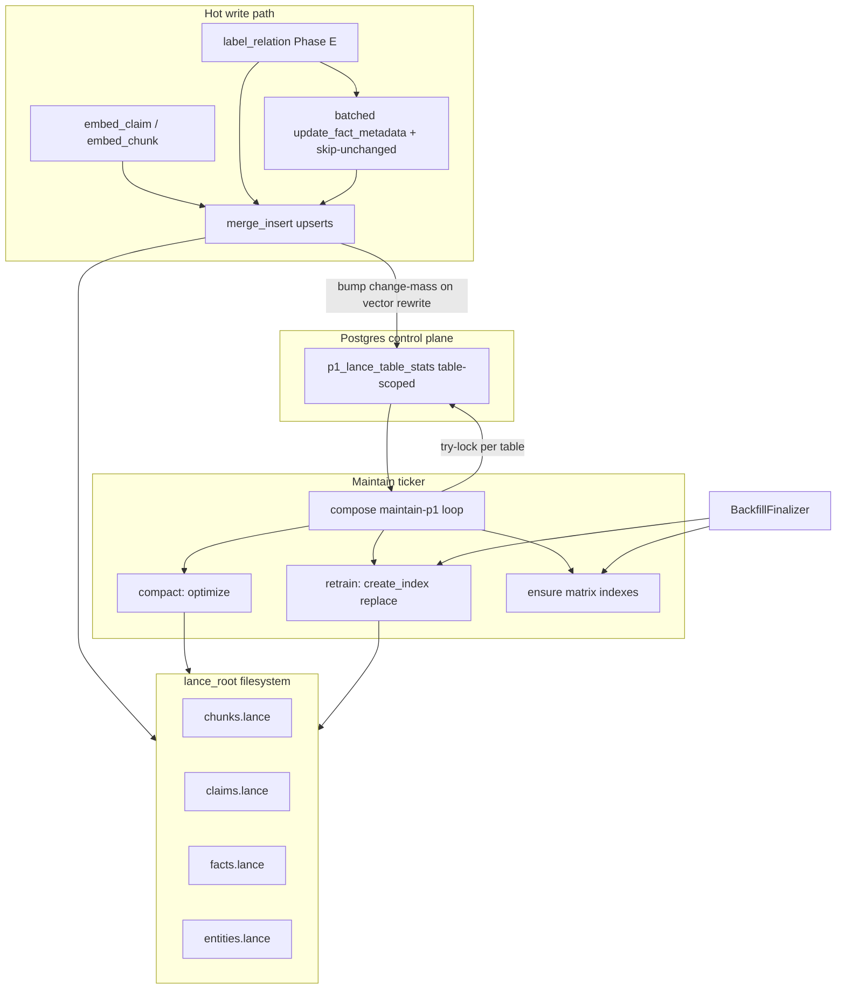

# Design: P1 Lance bulk writes and two-layer maintenance

**Status:** binding (D93 entered; ticker amendment 2026-08-14)  
**Date:** 2026-08-14  
**Decision log:** [D93](../../decisions.md#d91--p1-lance-bulk-writes-and-two-layer-index-maintenance)  
**Analysis:** [p1_lance_maintenance_analysis.md](../analysis/p1_lance_maintenance_analysis.md),
[p1_lance_maintain_ticker_analysis.md](../analysis/p1_lance_maintain_ticker_analysis.md)  
**Rejected alternative:** [p1_lance_maintain_ledger_units.md](../proposals/p1_lance_maintain_ledger_units.md)  
**Companion rulebook (non-binding):** [lance_indexing_maintenance.md](../analysis/lance_indexing_maintenance.md)  
**Reviews absorbed (r1):**
- [REVIEW_claude-opus_p1_lance_maintenance_design_2026-08-13.md](../../design/reviews/REVIEW_claude-opus_p1_lance_maintenance_design_2026-08-13.md)
- [REVIEW_codex-sol_p1_lance_maintenance_design_2026-08-13.md](../../design/reviews/REVIEW_codex-sol_p1_lance_maintenance_design_2026-08-13.md)  
**Reviews absorbed (r2):**
- [REVIEW_claude-opus_p1_lance_maintenance_design_r2_2026-08-13.md](../../design/reviews/REVIEW_claude-opus_p1_lance_maintenance_design_r2_2026-08-13.md)
- [REVIEW_codex-sol_p1_lance_maintenance_design_r2_2026-08-13.md](../../design/reviews/REVIEW_codex-sol_p1_lance_maintenance_design_r2_2026-08-13.md)  
**Reviews absorbed (r3):**
- [REVIEW_claude-opus_p1_lance_maintenance_design_r3_2026-08-13.md](../../design/reviews/REVIEW_claude-opus_p1_lance_maintenance_design_r3_2026-08-13.md)
- [REVIEW_codex-sol_p1_lance_maintenance_design_r3_2026-08-13.md](../../design/reviews/REVIEW_codex-sol_p1_lance_maintenance_design_r3_2026-08-13.md)  
**Reviews absorbed (r4 — dual APPROVE_WITH_NITS):**
- [REVIEW_claude-opus_p1_lance_maintenance_design_r4_2026-08-13.md](../../design/reviews/REVIEW_claude-opus_p1_lance_maintenance_design_r4_2026-08-13.md)
- [REVIEW_codex-sol_p1_lance_maintenance_design_r4_2026-08-13.md](../../design/reviews/REVIEW_codex-sol_p1_lance_maintenance_design_r4_2026-08-13.md)  

**Amends:** P1 write/maintenance contracts implied by D8 inline projection;
clarifies light vs heavy index work relative to `BackfillFinalizer` and
`workers.md` §6.3  
**Preserves:** D8 rebuildability from Postgres; D9 nomination-not-truth; D67
ledger as work truth; D87 eligibility scalars; IVF_FLAT + scalar/FTS index
choices already in `lance.py`  
**Pattern:** OSS-baked maintenance as a locked ticker (not Enterprise
auto-index, not a D67 claimed stage); bulk Lance writes aligned with public
LanceDB guidance

## 1. Decision

1. **Bulk metadata writes.** `FactIndexPort.update_fact_metadata` must not loop
   per-row `table.update`. It batches into `merge_insert` on the facts join key
   `["deployment_id", "kind", "fact_id"]` with **matched-only** column updates
   for eligibility scalars (status + time micros). Prefer also carrying those
   scalars on Phase E `upsert_facts` so a separate metadata pass is rare when
   the embed row is already current.
2. **Metadata skip-unchanged is binding.** Before merge, drop rows whose
   Postgres eligibility scalars already equal the Lance row (or skip the whole
   pass when the candidate set is empty after comparison). Merge updates are
   delete-and-reinsert; skipping is load-bearing for unindexed-tail growth, not
   polish.
3. **Two-layer maintenance is binding:**
   - **Light / frequent:** `table.optimize()` — compact fragments, prune old
     versions, **incrementally** fold unindexed tails into existing vector,
     scalar, and FTS indexes. On pinned `lancedb==0.34.0`,
     `optimize(retrain=True)` is a **deprecated no-op**; light **cannot**
     retrain IVF.
   - **Heavy / periodic:** full vector index rebuild via
     `create_index(..., replace=True)` / IVF_FLAT retrain
     (`num_partitions` from row count / `LANCE_TARGET_PARTITION_ROWS`), plus
     optional FTS rebuild when policy thresholds fire.
   - Light is **not** a substitute for heavy. Heavy is **not** run on the
     interactive read path or under `label_lock`.
4. **Physical grain is the Lance table under one `lance_root`.** Durable stats
   and advisory locks are **table-scoped** (identity:
   `(lance_root identity, table_name)`). Self-host is **single-deployment by
   construction** for continuous maintain. Multi-deployment cloud sharing one
   `lance_root` is an explicit **non-goal**.
5. **One ticker, three operations, not three jobs.** Continuous maintain is a
   compose process (not a `pipeline_stage`, not `processing_state` rows). After
   a **try-lock** on the table, the loop chooses at most one of: **ensure**
   missing/wrong-type indexes, **compact** (`optimize()`), **retrain**
   (`create_index(..., replace=True)`). Process death needs no reclaim: the
   session lock dies and the next tick retries the idempotent Lance op.
   Ledger units / reclaim / heartbeat are a [rejected alternative](../proposals/p1_lance_maintain_ledger_units.md).
6. **Unify maintenance API.** Expand `P1IndexMaintenancePort` beyond
   `build_search_indexes()` to expose light optimize, heavy rebuild, ensure
   indexes (with the **binding per-table index matrix** in §5.3), and stats.
   `BackfillFinalizer.build_search_indexes` becomes a caller of the same port
   (ensure + heavy), not a second private path. The port stays
   **deployment-free**; callers remain deployment-scoped for barriers only.
7. **Write-path never calls `optimize()` / `create_index`.** After a **vector
   rewrite**, writers bump `p1_lance_table_stats` (change-mass / changed-row
   counters). They do **not** enqueue ledger work and they do **not** take the
   maintain lock. There is no enforceable wall-clock budget on uninterruptible
   Lance calls.
8. **Distinguish three job families** (do not collapse):
   - light maintain (this design),
   - heavy reindex (this design),
   - content rebuild / embedding migration (`p1_batch_rebuild` family from
     `workers.md` §6.3 — re-project from Postgres; out of band of optimize).
9. **Physical port stays `lance_root`.** Default self-host is local filesystem
   under `/var/lib/rememberstack/lance` via compose volume `app-state`. Object
   storage for Lance is a non-goal here.
10. **Observability, enable gates, and failure contracts** in §5.5, §8–§9 are
    required for ship. Continuous auto-worker defaults **off** until soak
    (`maintenance_enabled` / `heavy_enabled`).
11. **Heavy IVF under sustained high write rate is best-effort** (§5.7 rule 3):
    skip retrain when write rate is high; on `create_index` commit conflict
    after a full train, do **not** re-train 8× with sub-second pauses — record
    the conflict on the stats row and try again on a later tick. Continuous
    writers above the defer threshold do **not** guarantee eventual heavy
    success without operator action; after a defined defer/conflict budget the
    table enters durable **`awaiting_operator`** (visible, not silent thrash).
    Operator may force a quiet window or accept stale IVF until natural quiet.
12. **Writers stay outside the maintain lock.** The lock serializes ticker vs
    ticker and ticker vs hard-forget `delete_unverified`. It does **not** pause
    `merge_insert`. Official OSS docs allow concurrent writes; collisions retry
    on the writer ([FAQ](https://docs.lancedb.com/faq/faq-oss),
    [reindexing](https://docs.lancedb.com/indexing/reindexing), retrieved
    2026-08-14).
13. **Heavy fires on durable amount of change, not calendar-only** (§5.4.1):
    writers increment table-scoped `changed_rows_since_heavy` and
    `change_mass_since_heavy` only when a **vector is actually rewritten**.
    Eligibility-only / skip-unchanged metadata must not increment heavy mass.
    Chunks are more sensitive than short-text tables (lower mass/row
    thresholds). The 24h floor is an anti-thrash cap, not the discovery
    signal.

## 2. Problem (why this exists)

BEAM-scale self-host (2026-08-13): after Phase E embeds finish quickly,
`LabelFactsHandler` refreshes fact eligibility via **thousands of per-row**
Lance `update` calls (~7.9k facts → thousands of ~19 KB fragments, multi-hour
wall clock, `facts.lance` multi-GB). Inline `_maintain_indexed_tail` only runs
`optimize()` after process-local 20 mutations / 100k unindexed rows and never
schedules full IVF retrain. Official LanceDB OSS docs: `optimize` = compaction +
prune + **incremental** index update — **not** full ANN retrain. Compose has no
maintenance worker; `workers.md` §6.3 named compaction/rebuild but it never
became a continuous stage.

A related ops hang (`embed_claim` mid-lease after hundreds of claims) is the
same *class* of long lease without durable sub-progress; **primary scope here
is Lance write/maintenance correctness**, not claim grain fan-out.

## 3. Rationale

- Public LanceDB performance guidance: each call commits a version/fragment;
  batch writes; use `merge_insert` for upserts with scalar indexes on join keys;
  run `optimize` after large writes
  ([performance](https://docs.lancedb.com/performance), retrieved 2026-08-13).
- `update` is correct for filter-based scalar edits but moves rows out of
  indexes; large update batches should trigger reindex hygiene
  ([tables/update](https://docs.lancedb.com/tables/update), retrieved
  2026-08-13). **Matched merge updates are also delete-and-reinsert** on the
  pinned engine (rows leave existing indexes and join the unindexed tail) —
  batching alone does not bound tail growth; skip-unchanged does.
- OSS does not auto-maintain indexes; `optimize` updates existing indexes
  incrementally; full retrain is a separate operation operators must schedule
  ([reindexing](https://docs.lancedb.com/indexing/reindexing), retrieved
  2026-08-13).
- P1 is a rebuildable projection (D8). Spending multi-hour work on the label
  lock for N single-row commits is pure waste; Postgres remains authority.
- In-process mutation counters cannot implement deployment policy across
  compose replicas and restarts.
- Physical maintain work is table-global under one `lance_root` (row counts,
  fragments, `create_index`, `optimize`). Ledger grain must match that, or
  growth policy and locks double-fire or under-serialize.

## 4. Goals and non-goals

### 4.1 Goals

- O(batches) Lance commits for metadata refresh at 10k–100k fact scale.
- Bound unindexed-tail growth by skipping unchanged eligibility scalars.
- Bounded fragment growth and unindexed tails under continuous ingest.
- Explicit heavy reindex when **durable change-mass / changed-row fraction**
  (and leftover unindexed ratio after light) require it, without thrashing
  multi-hour retrains under continuous writers; honest **best-effort** heavy
  progress under sustained high write rate (terminal `awaiting_operator`, not
  fake eventual-success while writers never quiet).
- Safe concurrent writers via existing commit-conflict retries. A **table-scoped
  maintain lock** serializes the ticker against other ticker ticks and against
  hard-forget `delete_unverified` only — writers stay outside it.
- Cold-reader contracts for storage location, backup, compose wiring, readiness
  exclusion, and lane.

### 4.2 Non-goals

- Claim-level or relation-level fan-out for `embed_claim` / `label_relation`
  (separate track; hang detection may share lease patterns later).
- LanceDB Enterprise / Geneva auto-index features.
- Moving default self-host Lance to object storage (S3/MinIO).
- Changing ANN type away from IVF_FLAT unless a later performance design
  revisits WP-5.6 choices.
- Making P1 authoritative or bypassing Postgres hydration.
- Multi-deployment continuous maintain against a **shared** `lance_root`
  (cloud multi-tenant layout is future work; self-host is one deployment per
  root by construction).
- A claimed `maintain_p1_index` stage, reclaim, or heartbeat (rejected
  alternative: `plan/proposals/p1_lance_maintain_ledger_units.md`).
- Expanding `label_lock` to wait on maintain workers (hot-path quiesce that
  blocks labeling). **Supported ops path** is a separate bounded
  `maintenance_writer_gate=hold` (or compose scale-down of label/embed for the
  deployment) that pauses **new** Lance-mutating batches for a table without
  holding `label_lock` across multi-hour `create_index` — see §5.7 rule 3.

## 5. Proposed design

### 5.1 Architecture



### 5.2 Writer path — bulk APIs

#### 5.2.1 `update_fact_metadata` (binding rewrite)

**Today (forbidden after this design lands):**

```text
for row in rows:
  table.update(where=..., values=...)
```

**Required:**

```text
update_fact_metadata(rows):
  if empty: return
  ensure_search_indexes for facts join keys if missing  # §15 PR1
  dedupe rows on (deployment_id, kind, fact_id)
    # last-write-wins within the caller's batch order
  filter skip-unchanged (§5.2.2): drop rows whose Lance scalars already match
  if empty after filter: return (metric metadata_skipped_unchanged)
  chunk rows into batches of META_BATCH_SIZE (default 500; settings knob)
  for each batch:
    payload = [{deployment_id, kind, fact_id, status, valid_*_us, ...}, ...]
    merge_insert(["deployment_id", "kind", "fact_id"])
      .when_matched_update_all()   # only keys present in payload columns
      # DO NOT when_not_matched_insert_all — unmatched would insert null vectors
      .execute(payload)
    metadata_miss += batch_len - MergeResult.num_updated_rows
    bounded commit-conflict retry (existing _LANCE_COMMIT_RETRIES pattern)
  record mutation stats on p1_lance_table_stats if a vector was rewritten
  # never call optimize() here
```

**Join keys:** must match `upsert_facts` key
`["deployment_id", "kind", "fact_id"]` so re-runs are idempotent.

**Matched-only rule (Option A only):** metadata batches must not insert skeleton
rows without vectors/labels. Use `when_matched_update_all()` only — no insert
clause. On pinned `lancedb==0.34.0`, a partial matched payload updates only the
supplied columns and **preserves `label` and `vector`**. An unmatched key is a
silent no-op (`num_updated_rows` does not count it); derive `metadata_miss`
from merge result counts, not a second id-lookup pass.

**Delete-and-reinsert property:** a matched merge update deletes the old row
and reinserts it with new values. Updated rows leave existing indexes and join
the unindexed tail until light `optimize()` folds them. This is why
skip-unchanged (§5.2.2) is mandatory.

**Duplicate join keys:** the engine rejects ambiguous merges (multiple source
rows matching one target) with a hard error for the whole batch. Batches **must
be deduplicated** on `(deployment_id, kind, fact_id)` before merge; tie-break is
last row in the input sequence wins.

**Scalar indexes before large merges (binding):** ensure BTREE/BITMAP on join
and filter columns **before** large merges (matrix §5.3). `fact_id` is
mandatory for this path. PR1 ensures join-key indexes then merges (§15) so
merge never falls back to a full-column scan at BEAM scale.

#### 5.2.2 Fold eligibility into Phase E upserts + skip-unchanged (binding)

`LabelFactsHandler` already builds `P1FactRow` with status/times before embed.
**Require** those fields remain on the merge payload (they already are in
`upsert_facts`). After this design:

1. Phase E upsert writes vector **and** eligibility scalars together.
2. Post-pass `update_fact_metadata` runs for facts whose Postgres eligibility
   may have changed without a re-embed in this job (supersession / invalidate /
   validity reconcile), **after** filtering:
   - Load current Lance scalars for candidate keys (bounded projection of join
     keys + mutable columns), or compare against values just written in this
     job's Phase E upsert set.
   - **Skip** any row where
     `(status, valid_from_us, valid_until_us, ingested_at_us, invalidated_at_us)`
     already equals Postgres intent.
   - If every candidate is skipped, do not open a merge at all.
3. Churn budget: only facts whose eligibility actually changed re-enter the
   unindexed tail. Thresholds in §5.4 assume that steady-state input, not
   "every fact of every document on every label job."

#### 5.2.3 Other writers

`upsert_chunks` / `upsert_claims` / `upsert_entities` already use `_upsert` →
`merge_insert`. Changes required:

- **Remove** synchronous write-path `optimize()` from
  `_maintain_indexed_tail`.
- After a **vector rewrite**, bump `p1_lance_table_stats` change-mass /
  changed-row counters (§5.4.1). Do not take the maintain lock.
- `upsert_entities` must call the same ensure-scalar path as other writers
  (today it ensures nothing — fixed by §5.3 matrix).

Do not introduce per-row `update` anywhere else in the adapter.

**Standing invariant:** fact writers for a deployment are serialized by
`label_lock` today; concurrent partial merges on the same fact from two label
workers are out of scope while that lock holds. Maintain runs outside
`label_lock`.

### 5.3 Two-layer maintenance contracts and index matrix

| Layer | API (port) | Lance operations | Cadence |
| --- | --- | --- | --- |
| Light | `optimize_tables(tables, cleanup_older_than=…)` | `table.optimize(...)` under table lock | Frequent; dual trigger on unindexed rows **or** small-fragment pressure **or** enqueue from writers |
| Heavy | `rebuild_vector_indexes(tables)` / `rebuild_text_indexes(tables)` | `create_index(..., replace=True)` IVF_FLAT (+ FTS) under table lock | Periodic / admin / growth policy; subject to write-rate defer (§5.7) |
| Ensure | `ensure_search_indexes()` | scalar + FTS + vector per matrix if missing; min-row gate re-eval | Deploy, backfill end, maintain tick, **and before large metadata merges** |
| Stats | `maintenance_stats(table) -> …` | `count_rows`, `list_indices`, `index_stats`, **`table.stats()`** fragment_stats | Every ticker tick; metrics export |

**Binding semantics of light:**

- Compacts small fragments.
- Prunes versions older than retention (`cleanup_older_than`; default keep
  LanceDB’s ~7d unless settings override).
- Incrementally updates existing indexes so `num_unindexed_rows` trends toward 0.
- Does **not** retrain IVF (`retrain` on optimize is a deprecated no-op on
  0.34.0).
- May retry commit conflicts with existing short `_LANCE_COMMIT_RETRIES`
  backoff (§5.7 rule 6).

**Binding semantics of heavy:**

- Retrains IVF_FLAT with
  `num_partitions = max(1, ceil(rows / LANCE_TARGET_PARTITION_ROWS))` and
  `target_partition_size = LANCE_TARGET_PARTITION_ROWS` (preserve
  `LANCE_NPROBES` query contract).
- Uses `create_index(..., replace=True)` so retrain replaces the existing
  vector index idempotently.
- Skips vector build when `rows < _MIN_VECTOR_INDEX_ROWS` (256 today); record
  skip reason in `MaintainReport`.
- May rebuild FTS when policy says (e.g. after massive text updates or admin)
  with replace semantics.
- **Does not** run inside `LabelFactsHandler` or search methods.
- Runs under the **same table-scoped exclusive maintain lock** as light
  (§5.7), so light and heavy never rewrite one table concurrently.
- **Does not** use short in-process commit retries for full retrain after
  conflict; see §5.7 rule 3 (defer / long `not_before`).

**Ensure vs replace:**

| Operation | Semantics |
| --- | --- |
| Ensure scalar/FTS/vector | List indices first; create only if missing (or wrong type for known misbuilds); **no** destructive replace of a healthy index |
| Heavy vector/FTS rebuild | `create_index(..., replace=True)` after ensure of scalar prerequisites |

`build_search_indexes()` remains a convenience that = ensure + heavy for **all
four** present tables (backfill/finalizer compatibility). Extending ensure/heavy
to `entities` is an intentional behaviour change at the backfill barrier
(entity ANN search stops being exhaustive once a vector index exists and the
min-row gate is met) — reviewed here, not discovered in implementation.

**As-built bug closed:** today `build_search_indexes()` is **not** re-runnable —
a second `create_index` without `replace=True` raises
`LanceError(Index): Index name '…' already exists`. Ensure(list-first) +
heavy(`replace=True`) makes a second call a no-op ensure then a clean retrain
(§16).

#### 5.3.1 Binding per-table index matrix

Aligned with companion rulebook R1/R2/R6, current filter/join usage in
`lance.py`, and **prefilter columns** from
`surfaces/query_sandbox/nomination.py` `LANCE_FILTER_COLUMNS` (equality filters
applied with `prefilter=True` before top-k). Types: BTREE high-cardinality;
BITMAP low-cardinality.

| Table | Column | Index | Role |
| --- | --- | --- | --- |
| **chunks** | `vector` | IVF_FLAT (L2, partitions from row count) | ANN |
| | `text` | FTS (`_TEXT_INDEX` defaults) | BM25 |
| | `deployment_id` | BTREE | tenant filter |
| | `chunk_id` | BTREE | merge key member |
| | `policy_generation` | BTREE | D80 generation filter + merge key |
| | `embedder_generation` | BTREE | D80 generation filter + merge key |
| | `doc_id` | BTREE | nominator prefilter (`LANCE_FILTER_COLUMNS`) |
| | `source_kind` | BITMAP | nominator prefilter (low-cardinality categorical) |
| | `source_shape` | BITMAP | nominator prefilter (projection-only filter) |
| | `section_role` | BITMAP | nominator prefilter |
| **claims** | `vector` | IVF_FLAT | ANN |
| | `text` | FTS | BM25 |
| | `deployment_id` | BTREE | tenant filter |
| | `claim_id` | BTREE | merge key / id lookup |
| | `doc_id` | BTREE | nominator prefilter (`LANCE_FILTER_COLUMNS`) |
| | `is_current_testimony` | BITMAP | default channel filter |
| **facts** | `vector` | IVF_FLAT | ANN on labels |
| | `deployment_id` | BTREE | tenant filter + merge key |
| | `kind` | BITMAP | filter + merge key (low cardinality) |
| | `fact_id` | BTREE | **merge join key** (required before large metadata merges) |
| | `status` | BITMAP | eligibility filter |
| | `valid_from_us` | BTREE | time membership |
| | `valid_until_us` | BTREE | time membership |
| | `ingested_at_us` | BTREE | time membership |
| | `invalidated_at_us` | BTREE | time membership |
| **entities** | `vector` | IVF_FLAT | ANN (today missing on ensure/build path — fix) |
| | `deployment_id` | BTREE | tenant filter |
| | `entity_id` | BTREE | merge key / id lookup |
| | `type` | BITMAP | `search_entities_scored` filter |

**As-built gaps this matrix closes:**

- `facts.fact_id` has no index today (merge join key and membership/purge
  filters).
- **Prefilter columns missing indexes today:** `chunks.doc_id`,
  `chunks.source_kind`, `chunks.source_shape`, `chunks.section_role`,
  `claims.doc_id` (used with `prefilter=True` in nominator search; unindexed
  prefilters force full scans before top-k).
- `entities`: write-path `upsert_entities` ensures nothing; `build_search_indexes`
  skips the table. (`search_entities_scored` may ensure `deployment_id` on the
  **read** path today — that becomes an upgraded-store fallback once
  `ensure_search_indexes()` owns the matrix, not the primary ensure path.)
- `facts.kind` is created as BTree on write-path ensure and Bitmap on
  `build_search_indexes`; **BITMAP is binding** (R2). Ensure must prefer Bitmap
  and not leave call-order-dependent types.

**Out of matrix (not Lance prefilter columns today):** claims `source_kind` /
entity id / asserted range filters that nomination confirms only in Postgres
after nomination (`FILTER_ALLOWLISTS` is wider than `LANCE_FILTER_COLUMNS`).
Only columns in `LANCE_FILTER_COLUMNS` + join/filter usage in `lance.py` are
binding here.

**Min-row gates:** vector IVF only when `count_rows() >= _MIN_VECTOR_INDEX_ROWS`
(256). Ensure re-evaluates the gate on every maintain tick (rulebook R5 /
archetype E). Scalar and FTS have no min-row gate.

**Fragment stats source:** public `Table.stats()` on 0.34.0 returns
`fragment_stats.num_fragments` / `num_small_fragments` — use these for metrics
and light triggers; prefer **`num_small_fragments`** for the fragment-pressure
trigger (rulebook R4).

### 5.4 Policy knobs (settings)

New settings group (implementation chooses one namespace under
`REMEMBERSTACK_…`, documents it in compose env and docs site):

| Knob | Starting point (measure; not sacred) | Role |
| --- | --- | --- |
| `metadata_merge_batch_size` | `500` | Rows per `merge_insert` in `update_fact_metadata` |
| `optimize_unindexed_rows` | `100_000` | Light maintain when any index reports ≥ this unindexed (**vendor rule of thumb** from LanceDB optimize guidance, same source as today's adapter constants — remeasure on BEAM) |
| `optimize_small_fragments` | `2_000` | Light maintain when `num_small_fragments` ≥ this |
| `heavy_rebuild_row_growth_pct` | `25` (facts/entities default; **chunks 5**, claims 15 — §5.4.1) | Heavy if `count_rows` grew ≥ this % since `last_heavy_row_count` (append proxy; not sufficient alone) |
| `heavy_changed_row_frac` | facts/entities `0.25`; claims `0.15`; **chunks `0.05`** | Heavy if `changed_rows_since_heavy / last_heavy_row_count` ≥ this (updates with **flat** row count) |
| `heavy_change_mass` | starting: chunks `2e6`; claims `5e6`; facts `8e6`; entities `2e6` (measure) | Heavy if durable `change_mass_since_heavy` ≥ this (char-capped mass of **vector rewrites only**) |
| `change_mass_char_cap` | chunks `4096`; claims `512`; facts `256`; entities `1024` | `change_mass += min(len(embedded_text), cap[table])` per **vector rewrite** |
| `heavy_rebuild_min_hours` | `24` | Anti-thrash **cap**: do not heavy more often than this unless admin / force. **Not** the discovery signal. |
| `heavy_rebuild_unindexed_ratio` | `0.15` | Heavy candidate if unindexed/total ≥ 15% **after** a successful light pass still leaves high ratio (train quality proxy — **not** raw fragment debt) |
| `heavy_defer_write_rate` | measure; start e.g. `N` merges/min or recent maintain-enqueue count | Defer heavy while write / maintain-enqueue rate exceeds this (§5.7 rule 3) |
| `heavy_conflict_not_before_s` | `900`–`3600` (15–60 min) | After `create_index` commit conflict: ledger fail retryable with this `not_before` floor (one attempt) |
| `heavy_rate_defer_escalate_n` | `12` | Consecutive pure rate-defers (no train) before unit enters `awaiting_operator` |
| `heavy_conflict_defer_escalate_m` | `3` | Consecutive post-train conflict_defers before `awaiting_operator` |
| `heavy_defer_age_escalate_h` | `24` | Wall-clock age of continuous heavy deferring (rate or conflict) before `awaiting_operator` if N/M not hit first |
| `maintenance_writer_gate` | `open` (default) \| `hold` | Ops quiet-window gate: when `hold`, P1 writers **enqueue but do not start new Lance-mutating batches** for the gated table/deployment for a bounded period (§5.7 rule 3). Does **not** expand `label_lock` |
| `maintain_poll_hours` | `1` | Self-seed light check cadence when idle |
| `maintain_probe_min_s` | `60` | Floor between Lance stats probes inside `ensure_maintain_due` (durable stats first) |
| `maintain_reclaim_min_s` | `60` | Floor between reclaim scans on the maintain tick |
| `maintain_running_stale_s` | light default `7200` (2h); **heavy must exceed measured p99 rebuild** (or use heartbeat) | Wall-clock floor when no fresh heartbeat (§5.5.2) |
| `maintain_heartbeat_s` | `60` | Side-thread liveness write interval during long Lance ops |
| `maintain_heartbeat_stale_mult` | `3` | Stale if last heartbeat older than `mult × maintain_heartbeat_s` |
| `maintain_max_attempts` | ledger default | Standard D67 attempts (conflict_defer / hard failures only — **not** pure rate-defer) |
| `cleanup_older_than_hours` | `168` (7d) | Passed to light optimize prune |
| `maintenance_enabled` | **`false`** | Master gate: worker self-seed + writer enqueue of maintain units |
| `heavy_enabled` | **`false`** | Gate heavy policy evaluation and continuous heavy enqueue; light may run when `maintenance_enabled`. **Does not** gate `BackfillFinalizer` / admin force / offline port tools (barrier exists to build indexes) |

**Removed / rejected knobs:**

- `write_path_optimize_max_s` — unenforceable on synchronous `optimize()`;
  write path is enqueue-only.
- Process-local `optimize_mutations=20` as policy — vendor thumb only; do not
  drive ledger policy. Optional process-local enqueue hint may remain but is not
  the control plane.

**Rules:**

- Never heavy-rebuild on read path.
- Never hold `label_lock` across light or heavy Lance maintenance.
- Never call synchronous `optimize()` / `create_index` from writers under lease.
- Admin/ops may enqueue `mode=heavy` regardless of hours floor when
  `heavy_enabled` (or via an explicit force path that bypasses the floor but
  still respects table lock). Force still respects write-rate defer unless
  ops has established a quiet window (`maintenance_writer_gate=hold` or
  compose scale-down) or explicitly accepts conflict risk with
  `force=true` after acknowledging possible `conflict_defer`.
- Threshold evaluation uses **durable table-scoped stats** (§5.6).
- **Baseline init:** if `last_heavy_row_count` is null and a vector index
  already exists, set baseline to current `count_rows()` **without** rebuilding
  (record-current). If no vector index and rows ≥ min gate, heavy/ensure builds
  now. If null and below min gate, wait.
- **Stale cutoff vs heavy duration:** operators set
  `maintain_running_stale_s` from `p1_lance_rebuild_duration_ms` p99 (must
  exceed expected heavy duration when not using heartbeat). With heartbeat
  enabled (binding for heavy, §5.5.2), reclaim uses heartbeat freshness and
  the wall-clock floor is a secondary safety net only.
- **`awaiting_operator`:** while set for a `(root, table, mode=heavy)`,
  continuous `ensure_maintain_due` must **not** auto-enqueue another heavy for
  that table (no silent thrash). Only admin clear / force-after-quiet / accept-
  stale clears the flag (§5.7 rule 3).

### 5.4.1 How each operation is chosen (binding)

There is no Lance callback and **no ledger enqueue**. The ticker reads
`p1_lance_table_stats` (and probes Lance only when that row is missing or
older than `maintain_probe_min_s`). Writers only bump counters.

| Observer | What it sees | What it does |
| --- | --- | --- |
| **P1 writer** | The batch it just committed: table, whether each row **rewrote a vector**, `len(embedded_text)` | Bump durable counters. Never call `optimize` / `create_index`. Never take the maintain lock. |
| **Maintain ticker** | Stats first; Lance probe if stale | Try-lock the table. Then at most one of ensure / compact / retrain. Skip the table if the lock is held (purge or another tick). |
| **Backfill finalizer / admin / CLI** | Drain barrier, missing indexes, operator intent | Same port under the same table lock. Finalizer is **not** gated by `heavy_enabled`. |

#### Operation trigger table

| Operation | Fires when | How the system finds out |
| --- | --- | --- |
| **ensure** | A contracted index is missing, or vector IVF min-row gate (256) is newly crossed and no vector index exists | Ticker `list_indices`; finalizer after drain; admin. |
| **compact** (`optimize`) | `num_unindexed_rows` ≥ `optimize_unindexed_rows` **or** `num_small_fragments` ≥ `optimize_small_fragments` | Ticker reads stats / Lance. |
| **retrain** (`create_index replace=True`) | Durable **amount of change** since last successful train (below) **and** `heavy_enabled` **and** not `awaiting_operator` **and** write-rate defer does not apply **and** `heavy_rebuild_min_hours` has elapsed (unless force) | Ticker only. Writers never trigger retrain. |

Priority on one locked tick: **ensure first**, then compact if still dirty, then retrain only if compact is not also due (do not start a multi-hour IVF train on a table that still needs a cheap compact — compact first, re-evaluate retrain on the next tick).

#### Heavy = change-mass (binding)

Calendar (`heavy_rebuild_min_hours`) is an **anti-thrash cap**, not discovery.
Row-count growth alone misses **updates that keep `count_rows` flat**.

On `p1_lance_table_stats` (table-scoped):

- `changed_rows_since_heavy` — count of rows whose **vector** was rewritten
  since the last successful heavy (or since baseline init).
- `change_mass_since_heavy` — `sum(min(len(embedded_text), cap[table]))` for
  those same vector rewrites only.

**Increment only when the Lance vector column is written.** Forbidden to
increment for skip-unchanged eligibility rows, metadata merge that does not
rewrite `vector` / `label`, or no-op upserts.

Reset both counters **only** after a successful retrain for that table.

**Retrain if any (per table, after min-hours / enable / not-awaiting / not-rate-deferred):**

1. `changed_rows_since_heavy / max(last_heavy_row_count, 1) ≥ heavy_changed_row_frac[table]`, or
2. `change_mass_since_heavy ≥ heavy_change_mass[table]`, or
3. `count_rows` grew ≥ `heavy_rebuild_row_growth_pct[table]` vs `last_heavy_row_count`, or
4. after a **successful compact**, `unindexed/total ≥ heavy_rebuild_unindexed_ratio`.

#### Per-table sensitivity (chunks more often than short text)

| Table | `change_mass_char_cap` | `heavy_changed_row_frac` | `heavy_change_mass` (start) | Why |
| --- | --- | --- | --- | --- |
| **chunks** | 4096 | **0.05** | **2e6** | Long embedding text; primary semantic mass |
| claims | 512 | 0.15 | 5e6 | Medium needles; many rows |
| facts | 256 | 0.25 | 8e6 | Short labels; eligibility churn must not look like retrain |
| entities | 1024 | 0.25 | 2e6 | Few rows; profile text |

Starting numbers are **to be measured** on BEAM; the **ordering** (chunks
strictest) is binding.

Writer hook (same batch that upserts):

```text
if vector_rewritten:
  stats.changed_rows_since_heavy += 1
  stats.change_mass_since_heavy += min(len(embedded_text), cap[table])
```

### 5.5 Ticker (not a pipeline stage)

Continuous maintain is `rememberstack self-host maintain-p1`: a loop, not
`worker --stage`. It is **absent** from `_expected_components` and from
`UNLANED_STAGES` because it never touches `processing_state`.

```text
loop:
  if not maintenance_enabled: sleep(poll); continue
  if ForgetInProgress for the deployment: sleep; continue
  for table in present_tables:
    if not try_lock(table): continue          # purge or another tick
    try:
      stats = read p1_lance_table_stats or probe Lance
      if missing/wrong index or IVF gate newly crossed:
        ensure_search_indexes(tables=(table,))
      elif light dirt:
        optimize_tables(tables=(table,))
      elif heavy_enabled and not awaiting_operator and not rate_defer and retrain due:
        try:
          rebuild_vector_indexes(tables=(table,))
          maybe rebuild_text_indexes
          clear defer counters; reset change-mass; stamp last_heavy_*
        except CommitConflict:
          bump conflict_defer_count; maybe awaiting_operator
          do not re-train in this tick
      write stats + metrics
    finally:
      unlock(table)
  sleep(maintain_poll) or wait on notify
```

**Try-lock, do not wait.** A held lock means purge or another maintain is in
the table. The ticker skips and comes back. Forget **does** wait (bounded)
because the user asked to erase now.

**No heartbeat, no reclaim.** Session advisory locks die with the process.
`optimize` and `create_index(..., replace=True)` are safe to run again.

**Admin force** is a flag on the stats row (or a CLI that takes the lock and
calls the port). It is not a ledger unit.

**Lane / backfill.** The ticker is not a ledger row, so it cannot deadlock
`BackfillFinalizer`'s "unresolved backfill rows" drain. Finalizer still
refuses to build indexes while backfill work is open, then takes the table
lock around ensure+retrain.

### 5.6 Durable maintenance stats

Table `p1_lance_table_stats` keyed by **`(lance_root_key, table_name)`**
(not deployment). There is **no** `p1_maintain_units` table.

Keep:

- `row_count`
- `last_light_at`, `last_heavy_at`
- `last_heavy_row_count` (train baseline; null handling in §5.4)
- `last_unindexed_rows`, `last_num_fragments`, `last_num_small_fragments`
- `recent_write_hint` / `last_maintain_enqueue_at` (optional; for heavy defer)
- `last_error`
- **Change since last heavy (authoritative, §5.4.1):**
  `changed_rows_since_heavy`, `change_mass_since_heavy`
- **Heavy escalation (authoritative):** `rate_defer_count`,
  `conflict_defer_count`, `first_defer_at`, `operator_state`
  (`null` \| `awaiting_operator`)
- **Runtime writer gate (authoritative for hold/run):**
  `writer_gate` (`run` \| `hold`) — set/cleared by admin/ops; live P1 writers
  that mutate this table must re-read the gate **each batch** (not only process
  start). Env/settings may supply the default on cold start; durable truth is
  this row (or a sibling control row with the same key).

Updated at end of each maintain unit; writers may bump a cheap enqueue/write
hint when `maintenance_enabled`. Optional `mutations_pending` counter is
nice-to-have, not required.

`deployment_id` may be stored as last-writer attribution but **must not** be
part of the growth-policy key.

### 5.7 Concurrency and locks

```mermaid
sequenceDiagram
  participant LR as label_relation worker
  participant L as Lance facts table
  participant M as maintain-p1 ticker
  participant PG as Postgres advisory lock

  LR->>L: merge_insert batch (metadata/upsert)
  Note over LR: label_lock held only for label+embed+meta batches
  LR-->>LR: bump stats if vector rewritten; release label_lock
  M->>PG: pg_try_advisory_lock(table_maintain_key)
  M->>L: ensure / optimize / create_index(replace=True)
  Note over M,L: writers may concurrent-merge; lock does not pause them
  M->>PG: unlock
```

**Lock owner (binding — one seam for all callers):**

Postgres **session** advisory locks (`pg_advisory_lock` /
`pg_advisory_unlock`), key = hash of `(lance_root_key, table_name)`, taken via
a **Postgres `Engine` held by the caller** — not inside the deployment-free
`LanceChunkIndex` adapter (which has no engine today).

| Caller | Who takes the lock |
| --- | --- |
| Maintain ticker | Ticker, try-lock around the one chosen op for that table |
| Hard-forget purge | Forget/profile path that has an engine (`selfhost_forget` composition); **must** hold the lock before calling into adapter purge/`delete_unverified`. `_purge_table_rows` must only be reachable under that held lock (adapter documents the precondition; optional assert via a lock-token parameter later) |
| `BackfillFinalizer.build_search_indexes` | **Takes the same lock per table** around ensure+heavy for each present table (**preferred and binding**). Do not run four-table rebuild unlocked while continuous maintain can run. |

Never invent three different lock key namespaces. Same hash function, same key
material, all three sites.

**Binding rules:**

1. **Table-scoped exclusive maintain lock** for both light and heavy on the
   same table. Light and heavy **cannot** run concurrently on one table.
2. **Writers stay outside the maintain lock.** They merge/upsert freely;
   commit conflicts use `_LANCE_COMMIT_RETRIES` + jitter on the **writer** side.
3. **Heavy progress under continuous writes (binding product contract):**

   **Honesty over fake guarantee:** heavy IVF rebuild under **sustained
   continuous write rate above the defer threshold** is **best-effort**, not
   guaranteed eventual success while writers never quiet. The continuous path
   may keep IVF training quality stale indefinitely until either a natural
   quiet window appears or an operator acts. The system **must not** claim
   automatic eventual progress in that regime; it **must** surface a durable
   terminal operator-visible state instead of infinite silent thrash.

   **Steady-state policy (while under budget):**
   - **Preferred:** **skip retrain** this tick while write rate exceeds
     `heavy_defer_write_rate` (durable stats, not a hot `label_lock` probe).
     Metric: `p1_lance_deferred_heavy`. Bump `rate_defer_count` /
     `first_defer_at`. Compact may still run.
   - On `create_index` **commit conflict after a full train:** do **not**
     re-train up to `_LANCE_COMMIT_RETRIES` (8) times in this tick. Record
     one conflict on the stats row and leave. Metric: `p1_lance_conflict_defer`.
   - Light `optimize` may still use existing short `_LANCE_COMMIT_RETRIES`
     backoff (conflicts cost milliseconds of lost work).

   **Terminal escalation:**
   - After **`heavy_rate_defer_escalate_n`** consecutive pure rate-defers
     (default **12**), **or** **`heavy_conflict_defer_escalate_m`** consecutive
     conflict_defers (default **3**), **or** continuous defer age >
     **`heavy_defer_age_escalate_h`** (default **24h**), the **stats row**
     enters durable **`operator_state = awaiting_operator`**. This state
     **does not** claim automatic eventual heavy progress.
   - Metrics + alert: `p1_lance_awaiting_operator{table}`. The ticker must
     **not** auto-retrain that table while the flag is set. Compact may run.
   - **Supported operator actions** (both documented in runbook / D66 docs):
     1. **Admin force quiet window then heavy:** set
        `maintenance_writer_gate=hold` for the table/deployment (P1 writers
        **enqueue but do not start new Lance-mutating batches** for a bounded
        period), **or** compose scale-down of label/embed for that
        deployment; then admin-force one heavy unit (`force=true`, clears
        `awaiting_operator` on success). Release the gate after success (or
        TTL). This is the path that actually creates the quiet window.
     2. **Accept stale IVF until natural quiet (default if ops does nothing):**
        leave `awaiting_operator`; IVF remains best-effort stale; light
        optimize may still run. Clear flag only when ops re-enables continuous
        heavy or a natural quiet window is observed and ops re-queues.
   - After ledger attempt exhaustion on **conflict / hard-fail** paths (not
     pure rate-defer): `dead_letter` via attempt-fenced `fail`; unit is not
     open. If not already `awaiting_operator`, escalate to that state rather
     than silent fresh-unit thrash under sustained high write rate.

   - **No** expansion of `label_lock` to wait on maintain. The quiet gate is a
     separate setting / compose action, not a label-path lock hold across
     multi-hour `create_index`.

4. **`label_lock` must not expand** to wait on maintain workers.
5. **Hard-forget purge vs maintain (corruption hazard):**
   `optimize(..., delete_unverified=True)` is only safe when no other process
   works the dataset (LanceDB 0.34 docstring). Binding interaction:
   - Purge path **acquires the same table maintain advisory lock** before
     `delete` + `optimize` on that table.
   - While holding the lock, purge may use `cleanup_older_than=timedelta(0)` and
     `delete_unverified=True`.
   - Maintain cannot hold the lock during purge; already-running maintain
     finishes its current table op then releases — purge waits on the lock
     (bounded wait; fail forget step with retry if lock wait exceeds policy).
   - Additionally, `ForgetInProgressError` makes the ticker **skip** the
     deployment while forget is open (it does not claim work).
6. **Retry policy by operation cost:**
   - Merge + light optimize: `_LANCE_COMMIT_RETRIES` + sub-second jitter.
   - Heavy `create_index`: **at most one** full train attempt per tick;
     conflict → record and leave, not short multi-retry.
   - Pure rate-defer: **zero** trains this tick.

### 5.8 Physical storage

| Item | Binding statement |
| --- | --- |
| Config port | `SelfHostSettings.lance_root` (default `/var/lib/rememberstack/lance`) |
| Compose | volume `app-state` → `/var/lib/rememberstack`; Lance at `$lance_root` |
| Host path (Docker named volume) | `/var/lib/docker/volumes/rememberstack_app-state/_data/lance` |
| Tables | `chunks`, `claims`, `facts`, `entities` under root |
| Object storage | **Not** default for P1 in self-host profile |
| Backup | (1) filesystem copy of `lance_root` only after **quiesce** (stop writers + maintain, or filesystem snapshot / volume snapshot that is crash-consistent), **or** (2) rebuild from Postgres via batch rebuild — (2) is authority-aligned |
| Restore | Prefer rebuild-from-Postgres after major corruption; FS restore OK if Postgres generation matches |
| Cloud | Network disk may back `lance_root`; design stays path-based; multi-tenant shared root not supported for continuous maintain |

## 6. API / interface changes

### 6.1 `ports/p1_index.py`

```text
P1IndexMaintenancePort:   # deployment-free; physical lance_root scope
  build_search_indexes() -> None
      # keep; = ensure + heavy all present tables (incl. entities)
      # callers that share the estate with continuous maintain MUST hold
      # table locks outside the port (BackfillFinalizer)
  ensure_search_indexes(*, tables: tuple[str, ...] | None = None) -> MaintainReport
  optimize_tables(*, tables: tuple[str, ...] | None,
                  cleanup_older_than: timedelta | None) -> MaintainReport
  rebuild_vector_indexes(*, tables: tuple[str, ...] | None) -> MaintainReport
  rebuild_text_indexes(*, tables: tuple[str, ...] | None) -> MaintainReport
  maintenance_stats(*, table: str) -> TableMaintainStats

FactIndexPort.update_fact_metadata:
  # semantic unchanged; implementation: ensure join keys, dedupe,
  # skip-unchanged, batch merge_insert
FactIndexPort.upsert_facts:
  # docstring must state join key (deployment_id, kind, fact_id) — fix stale "by fact_id"
```

`MaintainReport` / `TableMaintainStats` are frozen models including per-table
before/after row counts, unindexed, fragment stats, duration_ms,
conflicts_retried, skipped reason (e.g. `below_min_rows`, `deferred_heavy`,
`conflict_defer`, `awaiting_operator`, `heavy_needs_quiet_window`), and
operation completed.

### 6.2 Adapter `lance.py`

- Rewrite `update_fact_metadata` (ensure join-key indexes, dedupe,
  skip-unchanged, matched-only merge).
- Extract ensure/optimize/rebuild from private methods into port methods.
- Implement index matrix §5.3.1 (including entities, `fact_id`, kind BITMAP,
  prefilter columns).
- Remove synchronous write-path optimize; enqueue-only.
- Heavy `create_index` uses `replace=True`; **no** short multi-retry train loop.
- Purge path documents lock precondition; profile holds lock around
  delete+optimize.

### 6.3 Queue / migrations / catalog contract

- **Do not** add `maintain_p1_index` or `p1_maintain_unit` to enums.
- Table `p1_lance_table_stats` with `COMMENT ON TABLE` / column comments
- Update executable `catalog_contract.py`: `EXPECTED_TABLES`, per-contype
  `EXPECTED_CONSTRAINT_COUNTS`, named indexes, comment counts
- No `UNLANED_STAGES` change

### 6.4 Workers / compose / profile

- CLI `maintain-p1` + compose service `worker-maintain-p1` (not
  `worker --stage`)
- Ticker uses try-lock + `P1IndexMaintenancePort`
- enable gates default off; `maintenance_writer_gate` + admin force-quiet
  runbook surface
- `BackfillFinalizer` takes table locks around `build_search_indexes`

## 7. Data model changes

Postgres only (Lance schema columns unchanged):

- `p1_lance_table_stats` keyed by `(lance_root_key, table_name)`
- catalog_contract updates for that table

No `pipeline_stage` / `processing_target` additions. No `p1_maintain_units`.

## 8. Observability

| Signal | Kind | Notes |
| --- | --- | --- |
| `p1_lance_fragment_count{table}` | gauge | from `stats().fragment_stats.num_fragments` |
| `p1_lance_small_fragment_count{table}` | gauge | `num_small_fragments` |
| `p1_lance_unindexed_rows{table,index}` | gauge | `index_stats` |
| `p1_lance_row_count{table}` | gauge | |
| `p1_lance_optimize_duration_ms{table}` | histogram/timer | |
| `p1_lance_rebuild_duration_ms{table}` | histogram/timer | |
| `p1_lance_commit_conflicts{op}` | counter | writer / compact short retries |
| `p1_lance_deferred_heavy{table}` | counter | write-rate skip of retrain |
| `p1_lance_conflict_defer{table}` | counter | post-train commit conflict |
| `p1_lance_awaiting_operator{table}` | gauge | 1 while table is `awaiting_operator` |
| `p1_lance_writer_gate{table}` | gauge | 1 while `maintenance_writer_gate=hold` |
| `p1_lance_metadata_merge_rows` | counter | |
| `p1_lance_metadata_merge_batches` | counter | |
| `p1_lance_metadata_skipped_unchanged` | counter | |
| `p1_lance_metadata_miss` | counter | from merge result |
| `p1_lance_last_heavy_unixtime{table}` | gauge | |
| Structured logs | info | operation, table, durations, skip reason |

Alerts: unindexed_rows high for >N hours; optimize/rebuild failures; disk free
on the `lance_root` volume; **`awaiting_operator` transition**.

Ship metrics **before** enabling the ticker in production.

## 9. Failure / recovery

| Failure | Behavior |
| --- | --- |
| Crash mid-`merge_insert` metadata batch | Batch atomic per Lance commit; resume re-reads Postgres; skip-unchanged |
| Crash mid-optimize or mid-`create_index` | Session lock dies; next ticker tick retries the idempotent op |
| Concurrent writer during compact | Writer and/or compact use short `_LANCE_COMMIT_RETRIES` |
| Concurrent writer during retrain | Prefer skip retrain this tick; on post-train conflict record once and leave |
| Sustained high write rate, retrain due | Rate-defer streak → `awaiting_operator` on the stats row |
| Disk full | Fail the tick; log critical; do not spin |
| Purge vs ticker | Same table lock; ticker try-lock skips; forget bounded-waits |
| Finalizer vs ticker | Finalizer holds same table lock per table around ensure+retrain |
| `maintenance_enabled=false` | Ticker sleeps; admin / backfill finalizer / offline port still available |
| Rollback | Stop compose service or set the gate false; in-progress Lance op finishes or the process dies |

## 10. Security and privacy

- Maintenance handles only projection data already in Lance; no new PII channels.
- Filter strings must continue to use UUID validation / escaping; merge
  payloads use typed fields.
- Multi-tenant cloud with shared root is out of scope.

## 11. Rollout plan

1. Land this ticker amendment on design PR #270 and update D93.
2. Close ledger-units implementation PR #276 (superseded).
3. PR order in §15: bulk write (PR1) and port/locks (PR2) stay; PR3 becomes
   stats + ticker; PR4 change-mass writer hooks + heavy policy; PR5 soak.
4. Enable `maintenance_enabled=true` (compact/ensure only) after metrics;
   soak; then `heavy_enabled=true`.

## 12. Alternatives considered

| Alternative | Why not chosen |
| --- | --- |
| Only increase inline `optimize` frequency | Does not fix O(N) update commits; still steals label lock |
| Full reindex after every document label job | Multi-hour; thrash; commit conflicts |
| Enterprise auto-index | Not OSS default |
| **Ledger-backed `maintain_p1_index` units** | Lance does not require claims; reclaim/heartbeat/attempt fences are ledger self-talk. See proposal. |
| Process-local counters only | Multi-replica / restart blind spots |
| Calendar-only heavy | Misses flat `count_rows` updates |
| Stop writers during optimize/retrain | Not a Lance requirement; would recreate the stall |
| Drop `delete_unverified` lock | Corruption hazard on forget |
| Guaranteed eventual heavy under continuous high write | Dishonest without a quiet window |
| Gate `BackfillFinalizer` on `heavy_enabled` | Barrier exists to build indexes |

## 13. Open questions

1. Exact settings namespace (`P1Settings` vs `SelfHostSettings` vs dedicated).
2. Whether FTS rebuild shares heavy vector thresholds after first soak.
3. Exact `heavy_defer_write_rate` unit after first BEAM metrics.
4. Exact TTL for `maintenance_writer_gate=hold`.

**Not open:** physical table grain; ticker not a pipeline stage; writers
outside the maintain lock; bulk matched-only merge; skip-unchanged; two-layer
ops; index matrix; gates default off; change-mass; vectors Lance-only.

## 14. Key decisions

| ID | Decision |
| --- | --- |
| K1 | Replace per-row fact metadata `update` with batched matched-only `merge_insert` |
| K2 | Skip-unchanged eligibility scalars before metadata merge |
| K3 | Compact = `optimize` only; retrain = `create_index(..., replace=True)` |
| K4 | Grain = physical `(lance_root, table)`; stats and locks table-scoped |
| K5 | Continuous maintain is a **ticker process**, not a pipeline stage |
| K6 | No reclaim/heartbeat/attempt fence; process death releases the session lock |
| K7 | Expand `P1IndexMaintenancePort`; finalizer takes table locks |
| K8 | Writers bump stats after vector rewrite; never `optimize` under `label_lock` |
| K9 | Binding per-table index matrix (entities, `facts.fact_id`, kind=BITMAP, prefilters) |
| K10 | Table lock serializes ticker vs ticker and ticker vs forget purge **only** |
| K11 | `maintenance_enabled` / `heavy_enabled` default **false**; finalizer not gated |
| K12 | Self-host Lance stays on `lance_root` local FS |
| K13 | Embedding migration rebuild remains a separate family |
| K14 | Observability before auto activation |
| K15 | Decision log **D93** entered; ticker amendment 2026-08-14 |
| K16 | Heavy is **best-effort** under sustained high write rate → `awaiting_operator` |
| K17 | Heavy discovery is durable change-mass; chunks more sensitive than short text |
| K18 | PR1 ensures facts join-key indexes before large metadata merges |
| K19 | Ledger-units design is a proposal, not binding |

## 15. PR plan (ordered)

| PR | Scope | Validation |
| --- | --- | --- |
| **PR1** | Join-key ensure + batched matched-only metadata merge; remove write-path optimize | Vector/label preserved; skip-unchanged; 8k facts not multi-hour |
| **PR2** | Port: ensure/optimize/rebuild/stats + index matrix; purge lock; finalizer per-table locks | Adapter tests; ensure twice is non-destructive; IVF type match |
| **PR3** | `p1_lance_table_stats` + ticker loop + compose `maintain-p1` + gates default off | Catalog verify; try-lock skip; ensure/compact chosen; writers not locked |
| **PR4** | Writer change-mass bump + per-table heavy *triggers* (frac/mass/growth; unindexed ratio only after compact) | Flat row-count updates trip heavy via mass; eligibility and no-op upserts do not |
| **PR4b** | Rate-defer / conflict-defer / `awaiting_operator` / `writer_gate` quiet window | Sustained writes escalate instead of silent thrash; compact still allowed |
| **PR5** | BEAM soak | Sign-off |

PR4b is a later PR. The stats columns already exist; PR4 must not pretend the
escalation machine is live. Gates stay default-off until PR4b + metrics.

Do not block PR1 on the ticker. Close superseded ledger-units PR #276.

## 16. Tests (acceptance)

| Test | Expectation |
| --- | --- |
| Metadata 1k rows | ≤ ceil(1000/batch) merge commits; vectors/labels preserved |
| Skip-unchanged | Second identical refresh performs 0 merges |
| `build_search_indexes` twice | Ensure no-op + clean heavy retrain |
| Concurrent upsert + optimize | Eventually succeeds; writers not blocked by the maintain lock |
| Ticker try-lock | Held purge lock → ticker skips that table |
| Ticker choose | Missing index → ensure; small fragments → optimize; mass + `heavy_enabled` → retrain |
| Gates off | Ticker no-ops Lance ops |
| Crash mid-optimize | Next tick retries; no ledger row |
| Sustained high write + heavy | `awaiting_operator` on stats; compact still allowed |
| Backfill finalizer | Refuses when undrained; shared port under table locks |
| Catalog contract | `p1_lance_table_stats` comments/constraints pass verify |

## 17. References

### Local

- Analysis: `plan/analysis/p1_lance_maintenance_analysis.md`
- Ticker amendment analysis: `plan/analysis/p1_lance_maintain_ticker_analysis.md`
- Rejected ledger units: `plan/proposals/p1_lance_maintain_ledger_units.md`
- Rulebook: `plan/analysis/lance_indexing_maintenance.md`
- Workers map: `plan/analysis/workers.md` §6.3
- Code: `src/rememberstack/adapters/selfhost/lance.py`
- Code: `src/rememberstack/workers/p1.py`
- Code: `src/rememberstack/workers/base.py` (generic complete vs specialized barriers)
- Code: `src/rememberstack/spine/backfill.py`
- Code: `src/rememberstack/ports/p1_index.py`
- Code: `src/rememberstack/profiles/selfhost.py`
- Code: `src/rememberstack/spine/catalog_contract.py` (`UNLANED_STAGES`, readiness consumers)
- Code: `src/rememberstack/spine/work_ledger.py` (`claim_one`, `fail`, `complete`, specialized complete_*, `ForgetInProgressError`)
- Code: `src/rememberstack/spine/readiness.py`
- Code: `src/rememberstack/surfaces/query_sandbox/nomination.py` (`LANCE_FILTER_COLUMNS`)
- Code: `compose.yaml`
- Risk note: `design/benchmarks/review-pr193-risks.md` R3
- Pattern sibling: `plan/designs/e3_claim_level_normalize_fanout_design.md`
- Reviews r1: `design/reviews/REVIEW_claude-opus_p1_lance_maintenance_design_2026-08-13.md`
- Reviews r1: `design/reviews/REVIEW_codex-sol_p1_lance_maintenance_design_2026-08-13.md`
- Reviews r2: `design/reviews/REVIEW_claude-opus_p1_lance_maintenance_design_r2_2026-08-13.md`
- Reviews r2: `design/reviews/REVIEW_codex-sol_p1_lance_maintenance_design_r2_2026-08-13.md`

### Public (retrieved 2026-08-13)

- https://docs.lancedb.com/performance
- https://docs.lancedb.com/tables/update
- https://docs.lancedb.com/indexing/reindexing
- https://docs.lancedb.com/faq/faq-oss
- https://www.postgresql.org/docs/current/indexes-partial.html

---

*Revised r4 after dual re-review r3; dual APPROVE_WITH_NITS on r4 (Claude +
Codex). D93 entered. PR #270 dual-reviewed APPROVE_WITH_NITS.*
