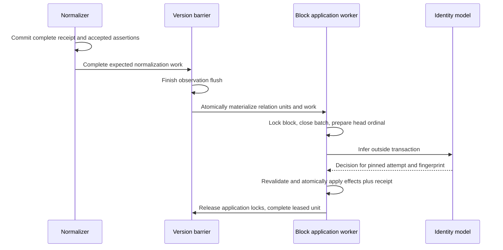

# Temporal fact writes, autonomous corrections, and cache lifecycle

**Status:** D110 amendment, binding when this change lands on main.
**Date:** 2026-09-07 (analysis and local probes began 2026-09-06).
**Scope:** the four D107 implementation gates #365–#368; amends D107, D108,
D88/D90, D55, D67 and D74. D107 continues to define the three clocks,
canonical arithmetic, fact matching and temporal consumer contracts except
where this amendment explicitly replaces a rule.

**Analysis:** [synthesis](../analysis/temporal_contract_synthesis.md),
[relation ordering](../analysis/temporal_relation_staging.md),
[autonomous corrections](../analysis/temporal_autonomous_corrections.md), and
[cache freshness and forget](../analysis/temporal_cache_and_forget.md).
**Schema:** `postgres_schema_design.md` incorporates the complete
[DDL appendix](temporal_write_and_lifecycle_schema.sql) as its D110 amendment.
**Build order:** `plan/plans/temporal_clocks.md`; design acceptance does not
claim implementation, conversion, or benchmark success.

## 1. Problem and decision

A claim is immutable testimony from one source. A fact is the engine's
adjudicated interpretation of testimony. Its **verdict window** records when
that fact held in the world; its **occurrence window** is a separately labelled
summary of the source windows attached as evidence. Source publication time
orders work and supplies provenance; it does not substitute for either window.

Four surrounding mechanisms must respect that distinction. Parallel
normalization must not pick an arbitrary seed claim or merge repeated events
before adjudication. A date correction must be an explicit, reversible
adjudication even though D108 removes human approval from truth maintenance.
Generated summaries must stop asserting current facts when time alone changes
their input set. Hard forget must remove derived dates and decision payloads
as well as the original source.

The decisions are: complete normalization receipts and ordered relation
application; one guarded temporal mutation history; autonomous, evidence-backed
corrections with explicit uncertainty; checked cache freshness plus scheduled
repair through the existing work ledger; and the existing D74 purge extended
to every new store. No mutation authority moves into the cloud product or
open SQL, and no public review queue is reintroduced.

## 2. Authority and the common write protocol

The fact row remains the only authority consulted for its current verdict
window. `relation_adjudications` and `observation_adjudications` retain the
recorded semantic decision, rationale, model, confidence and generation.
`temporal_operations` records the typed application of that decision: target,
expected/resulting revision, before/after endpoints and bases, effect on belief
time, changed components, endpoint ownership, consumed evidence and replay
predecessors. Its snapshots explain a committed effect; consumers must not
reduce this log to invent another current window.

Every relevant write increments the fact's `temporal_revision`, including
attachment, testimony currency, derived occurrence metadata and identity inputs
that can affect a prepared decision. Each changed endpoint also records the
operation that last changed its value **or basis**. A no-op does not replace
that owner. New fact insertion, seed operation, add adjudication, evidence and
revision one commit atomically; the intermediate revision-zero row is never
visible outside that transaction.

All writers use this lock order: deployment acceptance/forget fence; shared
identity epoch (exclusive for identity mutation); canonical logical blocks in
sorted order; fact rows sorted by `(fact_kind, fact_id)`; cache source keys in
sorted order. Relation blocks are `(deployment, canonical subject, predicate)`;
observation blocks are `(deployment, canonical entity)`, because nomination
and state-ending comparisons can cross observation keys. Block key encoding
is versioned, deployment-qualified and collision-checked against its canonical
identity. Materialize missing `temporal_blocks` rows with conflict-safe inserts
in that same sorted order, then acquire row locks by full primary key with
`SELECT ... FOR UPDATE`. The canonical key itself is authoritative; do not
substitute a lossy advisory-lock hash. A redirect detected after nomination causes release and retry with
the corrected block set. Version/representation barrier locks are acquired
only after releasing fact-application locks.

This order applies to relation and observation ingestion, evidence currency,
D55 reconciliation, corrections and compensation, migration, identity
merge/unmerge and hard forget. Updating only the new correction writer is not
sufficient. No worker may mutate an input without advancing its participating
fact/block revision.

Preparation reads a bounded candidate/evidence snapshot under those locks,
records the input fingerprint and proposed canonical endpoint candidates,
then releases locks for remote inference. The prepared row has a unique
attempt UUID and fingerprint with an immutable snapshot. Publishing a completed
output is a compare-and-swap against that exact attempt/fingerprint and an
empty output column; the first complete output wins and cannot be replaced.
A late helper whose token no longer matches cannot store or apply its answer
beside a newer snapshot. Retries reuse the stored pair. A replacement attempt
gets a new UUID only after recording the old completed pair's stale disposition
in the existing adjudication/operation log; an uncompleted old attempt is
retired without allowing its later output to bind to the new token. Source
forget/write fencing applies before archival too; forbidden payload is discarded,
not reintroduced by a late model reply. No extra attempt queue is introduced.
Apply reacquires the same locks and
checks the fact revision, values/bases, evidence eligibility, block/neighbour
revision, identity epoch and policy generation. Checking endpoint equality
alone is insufficient: intervening writes can return to the same values.
A stale result has no effect and creates reconsideration for the new input
fingerprint. Diagnostic non-applied operations are audit witnesses on replay;
they never force their stale expected revision onto the fact. The completed
prepared output is stored before apply, so a crash
between inference and application need not repeat a successful model call.
Provider failure before a durable output follows existing bounded retry/cost
rules; retries cannot be described as byte-identical model inference.

A `temporal_blocks` row supplies the sole committed operation sequence and
revision for its block. Each mutation records its position in every read or written
block, including empty candidate blocks, their observed heads/revisions, and
predecessor operations. `temporal_operation_blocks.writes_block` distinguishes
read witnesses from mutations: both receive a sequence position, only mutations
advance the block revision. Support metadata records expected block count and
complete read-footprint attestation. Live apply records its complete footprint;
historical unknown footprints trigger the conservative checkpoint rule.
Predecessors are already committed effects or earlier effects in this same
atomic assertion group. Multi-fact effects from one assertion commit together,
in stable fact order, using the existing receipt→adjudication→operation linkage
as group identity. Replay applies that group atomically, or reconstructs it only
while the serving/readiness fence is closed; it cannot expose half a group. Replay follows
these dependencies and exact stored decisions, not model-completion timestamps
or “all caps, then all corrections”. A missing predecessor or mismatching
revision is a replay conflict and blocks readiness, except for an explicit
D74 sanitized checkpoint. No replay uses `now()` to regenerate a world-time
boundary.

Occurrence metadata reduces only attached, non-forgotten canonical claim
windows, including withdrawn historical testimony: earliest known start and
latest end, with an unbounded end if any known open window participates. All
unknown inputs yield NULL fields. Precision reports the coarsest contributing
unit (year, quarter, month, day, instant), or open when the union is open; it
labels source granularity, not a promise that the union spans one unit.
Do not canonicalize these already half-open endpoints again. This reducer
never changes identity or verdict bounds.

PostgreSQL row constraints enforce local tuple shape and declared relationships.
The typed transaction writer enforces old/new authority and cross-row rules;
a CHECK constraint cannot compare an update with its previous row or verify
an adjudication history. The open-query login receives no write/execute grant
on these internal stores.

### 2.1 Observation application storage (D113)

[Observation temporal application](observation_temporal_application_design.md)
and its incorporated SQL complete this section's observation-ingestion storage
contract. D90 work units remain, with exact semantic/flush generations and retained
version membership. Closed observation admissions and durable prepared/original
application results use the common protocol above. Current assertion support is
separately owned so late-arrival re-split does not rewrite the original receipt.
D113 also defines preserved legacy support, refusal of unrecoverable legacy
re-splits, and linked/erased support checkpoint roots for D74; fact endpoint roots
alone cannot prove a support assignment.

## 3. Relation normalization, admission and ordered application (#365)

### 3.1 One complete normalization answer

The normalizer resolves entities and passes its ordinary deterministic gates,
then publishes one `normalize_claim_receipts` row and all accepted assertion
rows in one transaction. Uniqueness is claim plus normalizer generation;
concurrent attempts reuse the first complete accepted receipt. Store the typed
complete output, including accepted observations and an explicit empty or
soft-drop outcome. Absence of a receipt cannot mean successful empty output.
The receipt is source-bearing data and belongs in hard forget.

One claim may emit several distinct relation triples. Therefore idempotency
is **assertion plus adjudicator generation**, not claim plus generation.
Collapse duplicate equal resolved triples within one answer, retain the exact
canonical tuple and a stable assertion UUID, and retain the normalizer's
`state | occurrence | unknown` shape judgment. Array position is not semantic
identity. D41 dates are loaded from immutable claims at application; staging
does not hold another editable copy of source time.

No relation row or evidence link is inserted by normalization. In particular,
a same-triple occurrence must reach the identity ladder before anything attaches
it to an existing fact. D56 reused claims reuse their accepted normalization
receipt when a later version adds membership; they do not rerun the normalizer
or silently change a completed version's expected set.

### 3.2 Version barriers and closed input sets

Keep observation flush first. Its completed version barrier materializes the
complete relation-unit membership and corresponding work rows atomically.
A relation unit is `(deployment, version, normalizer generation, subject,
predicate)` with a durable unit UUID. The existing `adjudicate_supersession`
stage consumes that UUID under the established entity-unit target convention;
it no longer consumes prematurely inserted relation facts. Exact source,
representation, extractor, normalizer and adjudicator generations are retained
in the membership contract. Empty versions have an explicit durable empty
relation completion, never an inferred success from no rows.

Under the canonical block lock, freeze all currently eligible, materialized,
unapplied assertions into an immutable admitted batch. One active batch exists
per canonical block across generations. A generation roll drains or explicitly
retires the old active batch before admitting another generation; two generations
cannot race their own head ordinals. Distinct assertions are ordered by
`asserted_at NULLS LAST, claim_id, predicate COLLATE "C", object_entity_id,
assertion_id`. Multiple version memberships of the same assertion share its
single application. Newly eligible assertions enter the next batch, even when
their source timestamps are earlier.

Only the least unapplied ordinal of the active batch may commit a relation
identity decision. Preparation and inference use §2's short lock protocol;
a later ordinal cannot overtake a slow inference. Another worker may help
complete the same head, but the unique application receipt makes the effect
idempotent. Corrections or source-removal operations may interleave between
assertions and invalidate a prepared snapshot; their committed operation
sequence preserves that history. No session lock or database transaction is
held throughout remote inference.

**Guarantee:** ordering is deterministic within a closed admitted input set,
and recorded admission/application history replays exactly. A finite import
that requests schedule-independent application closes its declared input
membership before admission. Continuous ingestion cannot choose today's
immutable seed using an earlier source that arrives tomorrow; different
admission histories may choose different seeds. This explicitly qualifies
D90's “global order” wording. D107 world-time succession and late-arrival
re-splitting still apply independently of processing order.

The complete path is:

### 3.3 Atomic effects and completion

For a new identity, insert the fact, seed, add adjudication with both triggering
claim and assertion IDs, and evidence together. For evidence, attach to the
target set selected under §3.3.1. Caps, contradictions and historical
re-splitting produced by that decision belong to the same transaction. Write
all resulting temporal operations and adjudications, record the application
receipt, retire the matching eligible version memberships, and enqueue cache
invalidation/correction intent before commit.

The application receipt contains identity outcome, target count/digest, input digest
and admitted ordinal; it links all produced adjudications/effects. It does not
duplicate their rationale or before/after bounds. A crash after application but
before worker completion reuses the receipt. It cannot rerun an identity
verdict and create a second occurrence.

### 3.3.1 Complete state-support targets (D112)

A single state assertion can support several existing historical slices without
making them one identity. Suppose the same value has stored slices `[2010,2013)`
and `[2018,2020)`, and a new source asserts it over `[2010,2020)`. Choosing either
slice arbitrarily would discard support for the other; creating a broad new
state would violate the known-start exclusion. Attach the claim as evidence to
both slices. Preserve every fact ID, seed and authoritative verdict endpoint.
Neither this support nor its occurrence-metadata union establishes truth in
the intervening gap, merges identities, or proves one continuous episode.

For a dated state assertion, the deterministic support set is **every**
non-invalidated, non-erased state of the same canonical subject/predicate/object
whose known-start verdict window overlaps the assertion's canonical window.
D107's compatible-state rule applies to the complete set, even if additional
semantic candidates require model inference. Model omission, low confidence or
disagreement about another candidate cannot replace proven support with `new`.
Mixed datedness, erased bounds, different values and occurrence identity cannot
use this multi-target rule. An undated state retains the existing unique
compatible-state shortcut; other undated identity decisions follow D107's
permitted verdicts, including D111 coexistence. Occurrence evidence still selects
at most one identity; no temporal union merges occurrences.

`relation_application_targets` is the sole receipt-target authority. It contains
one logical relation handle per application and has a reverse fact index.
The parent receipt's `target_count` and `target_digest` certify the entire set:
sort distinct UUIDs by their UUID byte value, render lowercase hyphenated strings
as a compact JSON array without whitespace or trailing newline, then hash its
UTF-8 bytes with SHA-256. `new` has exactly one target. `evidence` has one or more,
and more than one is legal only under the deterministic dated-state rule above.
There is no arbitrary primary target. A fact merely capped or contradiction-
grouped by this application is an effect target, not automatically a support
target. Existing adjudication/effect linkage preserves that distinction.

Prepare the complete deterministic target set under D110's canonical block
stability. Its membership and consumed revisions are part of the exact prepared
fingerprint. Never truncate that set to top-k or model budget. Enumerate large
sets and write support/target rows in bounded batches within the one application
transaction, with complete sorted fact/source locks and revision revalidation.
Remote inference remains bounded and outside transactions. The transaction
commits all evidence links, narrative adjudications, temporal operations, target
rows, receipt, version retirement and cache/correction intents together. Verify
the count, digest and permitted cardinality before committing and whenever a
receipt certifies replay or version completion. A missing or substituted target
is corruption, not an empty successful application.

Additional semantic effects explicitly name the affected fact and its boundary
authority. When support has multiple state targets, a cap requires the exact
successor fact whose authoritative start supplies it; neither the raw assertion
start nor an arbitrary target's start substitutes. Apply the existing grounded
chronological guards and record a refused/no-boundary effect when authority is
missing or invalid, while retaining independently established evidence support.
Contradiction effects likewise name their actual participant facts. All effects
still commit in the single assertion group; none may silently change the verdict
of an unrelated support target.

Replay consumes the certified recorded target set and effects without model
inference or current-candidate renomination. D56 reuse and crash recovery use
that same receipt. Historical relation handles have D110's existing logical
reference status: a missing fact cannot be resurrected or replaced by a new
candidate. Hard forget includes this table in D74's inventory; deleting an
assertion/receipt cascades its targets, and reverse lookup includes targets in
the existing deletion closure. Retained structural handles and sanitized replay
roots obey §6, without retaining forbidden source-bearing snapshots or digests.

Reads, counts, labels and generated text distinguish support of multiple fact
identities from continuous world-time truth. Evidence counts remain independent
document-lineage counts per fact. This introduces one internal table and two
receipt certificate fields, no new public grant or scheduler. Work scales with
the complete matching slice set; silent truncation is not a scaling strategy.
An uncertain-identity attempt lifecycle is more machinery for this proven-support
case, while arbitrary selection or interval merging invents authority. The
[analysis](../analysis/temporal_state_evidence_targets.md) records that comparison.

Acceptance covers broad support of disjoint slices, unchanged gaps/verdicts/seeds,
explicit additional-effect authority, low-confidence/omitted model decisions,
rollback after the second target, concurrent helpers, exact replay, D56 barriers,
source erasure, missing/substituted target rejection and unchanged single-target
occurrence behavior. This contract does not certify those implementation gates.

After releasing application locks, complete only the currently leased work
row and evaluate its version barrier. Other workers self-complete from durable
receipts; one worker must not mark a peer's running row successful. Missing,
failed or dead-letter expected units block the barrier. Fact labels,
embeddings and dependent profiles follow the completed fact writes. Claim-only
embedding may remain independent, but fact readiness waits for both planes.

Undated relation claims follow their normalized shape. An undated occurrence
can attach to an undated occurrence only by an identity verdict; it is not
forced into a state. The single unknown-bounds-state shortcut applies only
to a state-shaped claim. `unknown` is the uncertain shape; `undated` is never
a fourth temporal enum. Relations' exclusion remains partial on state kind,
non-invalidated belief and no contradiction group, preserving the existing
contradiction exception. D111 (`temporal_clocks_design.md` §4.2.1) additionally
requires a known verdict start for exclusion eligibility; ordinary unknown-start
coexistence and start acquisition follow that contract. Overlapping occurrences
remain legal.

## 4. Autonomous corrections and compensation (#366)

A new discrepancy fingerprint is created when attached evidence, testimony
currency, identity reconciliation or policy generation changes the inputs to
a potentially useful correction. A timer with unchanged evidence does not
repeatedly buy the same model judgment. The fingerprint includes consumed
revisions, not only dates. `temporal_discrepancies` is a durable domain target;
`processing_state` alone owns its lease, attempts, retry delay and completion.
Work identity is `target_kind=temporal_correction`, the discrepancy UUID,
`stage=correct_temporal`, `lane=NULL`, and the registered
`temporal_adjudicator` policy generation, with `content_hash=input_fingerprint`.
`correct_temporal` joins `UNLANED_STAGES`; the generation is registered in the
existing component-version catalog and changes when the correction policy
changes. Enqueue it atomically with the input change. There is no separate
discrepancy poller or custom lease system. Discrepancies are live domain work:
exclusive fact deletion cascades to its discrepancies and clears only the
optional discrepancy ID on retained operations. A leased worker finding a
missing discrepancy after acquiring the deployment fence completes as obsolete;
it cannot reconstruct the deleted target from its old prepared payload.

The model chooses from canonical endpoints computed from eligible supporting
claims already linked to this fact by an identity verdict. It returns candidate
IDs, supporting/contrary claim IDs, confidence and rationale, never arbitrary
timestamp strings. Source publication time, ingestion time and model world
knowledge cannot supply a candidate. A current correction needs current,
non-forgotten testimony; old snapshot testimony can still be current.
Withdrawn living-source testimony remains historical context and contributes
to occurrence metadata, but cannot alone authorize a new current correction.
Duplicate/re-extracted versions are not independent votes.

Provide neighbouring slices and contrary evidence. Bound inference input by
the existing adjudication budget; record omitted counts and decline a change
if required conflicts cannot be assessed within it. The cheap-first ladder
handles the semantic question of whether this evidence justifies this boundary
for this fact. Only an already-proven identity/implication rule may bypass
semantic inference; there is no generic earliest-date rule.

Use the existing observation supersession application margin as the initial
correction application margin on both planes, combined conservatively with
the configured escalation floor. The relation confidence floor alone currently
triggers escalation; it is not an acceptance test for a frontier answer.
Application requires confidence at least the greater of those configured
thresholds after any escalation. The resolved thresholds, models and prompt
are pinned in the correction policy generation and validated with adversarial
cases; their numeric starting values are calibration parameters, not proof
of correctness. A small-model result below the application margin may escalate
within existing budget even if it cleared the escalation floor.

Ordinary corrections may move a known start earlier, date an unknown start,
and acquire or shorten a finite state end. They cannot reopen a closed end,
cross a neighbouring state slice, produce an empty state, cap an occurrence,
or change fact identity or temporal kind. Changed endpoint bases become
`verdict`; untouched bases and owners remain. A source saying an original
seed start was too early produces a dispute under this contract rather than
an unconstrained move to a later start.

Results are explicit: applied, no-op, uncertain, refused or stale. Invalid
model output, exhausted budget or insufficient evidence leaves existing
endpoints unchanged. Operational retry is distinct from completed uncertainty.
Read/explain envelopes expose a discrepancy reason and evidence references
beside the authoritative and occurrence windows. They do not instruct a user
to approve a queue.

Compensation is a new evidence-backed adjudication referencing an identified
previous correction. For each component that correction changed, restore the
original value **and basis** only if that correction still owns the component.
A later cap owns the end and is preserved. For example, undoing a start change
2020→2019 can restore 2020 while retaining a subsequent end cap at 2025.
Record restored and skipped components and validate the resulting combined
window/neighbours before changing anything. An invalid combined result changes
no endpoint. Never restore `invalidated_at` through compensation. Reversing a
compensation follows the same ownership and evidence checks; it is not a toggle.
This is the narrow recorded exception to ordinary monotonic endpoint moves,
explicitly replacing D107's human-over-human reversal rule.

D55 remains separate: ordinary existing-fact source withdrawal closes belief
time at the persisted reconciliation instant. New historical identities use
the empty-interval creation qualification in
[D107 §4.4](temporal_clocks_design.md#44-closing-temporal-succession-separate-from-processing-order): they retain
the original withdrawal event while never claiming a live belief before their
recorded creation. A valid world-time cap may shorten a state under the
chronological guard. If that guard refuses it, preserve the existing window,
including any finite end; do not replace it with NULL. Occurrences remain
uncapped and keep historical occurrence metadata. No source-removed bound is
filled from a database clock.

## 5. Checked freshness and scheduled repair (#367)

A **profile** is the generated description of an entity and its embedding,
used by T3/T4 identity resolution and retrieval. A **K page** is a generated
knowledge artifact, possibly assembled from facts and child pages. These are
caches of input truth, not a fourth authority. Fact activation or expiry can
make their current wording wrong even when no new document arrives.

At one evaluation instant E, a fact is world-current only when it is eligible
under belief/support rules and `(valid_from IS NULL OR valid_from <= E) AND
(valid_until IS NULL OR E < valid_until)`. Use this full containment condition
before candidate limits for every current read, including aggregates, absence,
graph neighbours and cache inputs. An occurrence's uncapped verdict window and
separate occurrence span retain D107's semantics.

Each generated profile/page has a certificate naming generation, exact input
hash, evaluation instant, freshness deadline and dependency revisions. Read
acceptance requires the expected generation and cached-content/embedding
attestation, E within the certificate interval, all observed revisions equal,
and no dependency whose next boundary is already due. Missing certificates or
incomplete dependency sets cannot certify freshness.

Dependencies include **candidates before filtering or top-k**, not only facts
quoted in the old summary. Entity, predicate, document/source, scope, rule owner
and structural routing keys cover additions and future activations. Empty
candidate sets retain their rule sentinel keys. Future `part_of` boundaries
invalidate structural routing before newly eligible page memberships exist.
A parent page includes the flattened union of consumed children's source keys
and page-publication keys, so an unchanged old child hash cannot keep it fresh.
Authored K content is not rewritten as a generated summary.

`temporal_sources` stores revision/deadline certificates for those keys.
Every fact insertion and every converted existing fact creates its fact leaf
in the same transaction: source kind is `relation` or `observation`, source ID
is the fact UUID, source key is its canonical UUID text, and revision equals
the fact's `temporal_revision`. This applies even when no future boundary
exists; `next_boundary_at` is then NULL. Fact updates advance the leaf revision
atomically with the fact. Create routing/sentinel source rows before inserting
their memberships or certificate dependencies; an empty candidate set retains
its sentinel. Exclusive deletion first invalidates dependent certificates and
then removes the fact leaf/memberships in the same fenced transaction.
For a fact/entity/document/scope/artifact, source_id is its actual UUID and
source_key is its canonical UUID text. Predicate and document-source rule keys
use UUIDv5 over a versioned, length-delimited UTF-8 encoding of deployment,
source kind and the exact normalized registry/rule key; source_key retains that
canonical registry key. Unique key mapping and equality checks reject a UUID
collision rather than conflating two sources. Normalization follows the existing
predicate/rule registry, not case folding invented by the cache. Key rename
invalidates both mappings. Keys contain registry identifiers, never extracted
claim prose or credentials, and source-derived key material joins D74 cleanup.

`temporal_source_members` supplies indexed activation/expiry membership for
finding the next future boundary after a correction/deletion. These timestamps
are disposable projections, included in forget. A fact leaf's revision mirrors
its `temporal_revision`; a clock tick does not independently increment an
evidence revision. Routing/publication keys have their own revision because
their membership or certification can change without changing fact evidence.

Authority writes update old/new memberships, invalidate relevant certificates,
recompute touched-key next boundaries and nominate durable event work in the
same transaction. A source event identity includes source revision, boundary,
generator and continuation sequence; an artifact refresh includes certificate
revision. `fact_expiry_schedule` owns inspectable event identity and bounded
routing cursor, while the existing work ledger owns `not_before`, retries,
leases and terminal status. New `temporal_event` targets use unlaned
`refresh_temporal` work. Completed entity/generator work cannot be reused merely
by changing content_hash: that field is absent from work uniqueness.

At wake-up, verify revision, evaluate at current E, coalesce missed due
boundaries, update routing/deadlines and nominate affected profile/K work.
An obsolete event skips without model work. Refresh calls the existing profile
refresher or K compiler/commit driver; no second publisher is introduced.
Large routing walks use durable keyset cursors and a continuation sequence,
retain the stale fence until complete, and never truncate affected membership.
A crash uses ordinary ledger recovery. Finishing one event cannot complete
another worker's running row.

Prepare cache content from one fixed snapshot. Before publishing, recheck
input/dependency revisions and deadline under the shared write order. Publish
bytes/vector attestation, certificate and dependencies atomically with the
existing artifact publication pointer. A deadline crossed during inference
rejects the stale result. K's Git commit recovery must preserve that exact
pointer/hash contract. A rebuild with identical text but new certification
still advances the publication revision.

If refresh is late or fails, exclude stale generated text/vector from current
reasoning and T3 identity nomination. Read current facts as fallback and disclose
cache freshness where an artifact was requested. The checked predicate applies
to P1 profile nomination, resolver/convergence, `memory_v1`/live-graph profile
properties, K planner/writer/parent inputs, envelope/open-SQL hydration, P3 and
real mounted knowledge roots. Previously downloaded bytes cannot be recalled;
generated artifacts carry their evaluation/deadline metadata. These checks
protect correctness while the timer provides eventual availability.

## 6. Hard-forget integration (#368)

The existing D74 accepted manifest, intake fence, work drain, source scrub,
projection repair and residual verification remain the mechanism. New temporal
fields are covered in the same implementation that writes them. Nulling a
seed pointer does not remove a date that survived in a verdict, correction
snapshot or routing membership.

Inventory includes normalization output/receipts/assertions and membership;
seed/triggering references; occurrence windows; every operation's before/after
bounds, evidence, prepared output, fingerprints and narrative; discrepancy
payloads; migration shadows; scheduling/dependency membership; cache text,
labels, vectors and publication intermediates. Pending/running work cannot
republish an erased snapshot after the drain. Content-free ordinary cost/work
audit follows D74's existing retention policy.

Discover the full affected evidence/operation/dependency closure before
scrubbing. Exclusive facts are deleted. Shared surviving facts keep their IDs,
recompute occurrence metadata from surviving attached testimony, and receive
a sanitized recorded reconciliation of any endpoint whose authority was erased.
Independent later caps and belief-time invalidations survive. No recomputation
promotes min/max source dates into verdict authority. The sanitized replay
checkpoint contract supplies the complete baseline and dependency repair for
survivors; ordinary replay must never silently skip an unknown missing row.

Portable manifest version 2 adds separate sorted sets of affected surviving
relation and observation IDs, temporal operation/event/certificate IDs. Existing
`fact_ids` retains its meaning of exclusive facts to delete. Version 1 parsing
and canonical serialization preserve accepted bytes/hash exactly; adding empty
new defaults during reserialization would corrupt that identity. Replaying a
v1 entry against a temporal store discovers the new closure from its existing
claim/document identities before deleting them. No second append log is added.

Invalidate and remove dependent certificates before deleting restrictive
source references; scrub decisions and prepared payloads before claims; repair
surviving verdict authority, then recompute membership/minima, labels and safe
refresh events. Residual verification includes duplicated dates in source
membership, migration/replay checkpoints, restored backups, and a stale publisher
that resumes after the accepted forget. Failure holds the existing forget fence;
it does not certify partial deletion.

### 6.1 Independent support and erased endpoints

Reuse the complete consumed claim set in `temporal_operation_evidence` and
operation predecessors, with a support-completeness attestation. Distinguish
semantic premises from mere causal/precondition ordering through a typed
`required_for_semantics` dependency flag; unclassified historical edges default
to required. Truncated/uninstrumented input is `unproven`, never complete.
Every new temporal operation, including conversion and checkpoint roots, writes
its `temporal_operation_support` row atomically. Conversion can attest complete
support only for the input and footprint it actually recovered. Before staging
a checkpoint, create any missing historical support row as `unproven` with
`footprint_complete=false`; never label it complete to satisfy a foreign key.
Such a row cannot authorize retention of an endpoint or kind. Component
attestations are emitted only for complete surviving authority; erased/unknown
components have no invented supporting-operation reference. Checkpoint roots
record the clean retained support and closure, without upgrading a predecessor's
unproven authority merely because a checkpoint now exists.
Deleting a required input first marks support `erased`; removing a member
cannot turn an incomplete proof into a smaller apparently complete proof.

Preserve an endpoint only through an already accepted operation that established
that exact value and basis, with complete surviving claim support and recursively
independent semantic premises. A before/after snapshot that merely copied an
inherited endpoint is not proof for it. Whole-operation support is conservative:
if a decision changed both endpoints and loses a required premise, neither is
independently proved by that decision. An independently justified later cap
survives its own proof even when its causal predecessor was the erased seed.
There is no new inference during erasure. Preserve belief-time invalidation.

Extend the endpoint basis enum to
`world_time | verdict | source_removed | legacy | unknown | erased`.
A formerly known endpoint lacking retained authority becomes `NULL/erased`;
a previously unknown endpoint stays `NULL/unknown`. Erased implies NULL by
CHECK. This uses the existing provenance fields instead of a separate bitmask.
Keep a supported temporal kind; if its authority was erased too, record kind
`unknown` in the clean root, without changing identity or inventing a new fact.

Clearing a boundary can make a state overlap a neighbour. Preserve both fact
IDs and do not invent a contradiction group. The state exclusion applies only
when neither endpoint is erased, in addition to the existing belief and
contradiction predicates. An accepted correction can date an erased endpoint
like an unknown endpoint and must validate neighbours before restoring its
ordinary exclusion eligibility.

Temporal membership is three-valued for erased bounds. Retained bounds or
belief closure can prove a row is outside E. Otherwise an erased boundary that
could change membership makes it uncertain, not confidently current. Fact
retrieval may return it with explicit uncertainty/bases. Current profiles, T3
vectors and K prose exclude that uncertain membership. Aggregate and absence
answers disclose the uncertain population; omission cannot certify zero or a
complete count. `memory_v1` exposes the same basis and uncertainty contract,
and T.3/T.5 consumers must understand `erased`. Ordinary missing source dates
retain D107's existing unknown-bound semantics; erasure is explicitly different.

### 6.2 A sanitized replay root for a closed set of blocks

Start with blocks owning affected facts or contaminated operation payloads.
Expand through every multi-block operation and dependency/read-footprint that
crosses the cut until the set is closed. Include every pre-cut operation in
those blocks, even clean ones, and snapshot every surviving fact there. A missing
historical read-footprint requires the whole recorded block; an unknowable block
requires a deployment-wide temporal checkpoint. This can be expensive on a
connected history, but avoids guessing predecessor revisions. Enumerate with
bounded durable IDs-only cursors under the existing forget fence.

Capture support classifications and stage clean outcomes before destructive
scrub. Derive checkpoint/root IDs from forget ID and fact identity. The root
is a `forget_recompute` operation with `replay_class=checkpoint_root`, clean
old/new endpoint tuples, the next fact revision and a fixed erasure adjudication
in the existing plane log. `temporal_checkpoint_facts` stores the extra kind,
occurrence, seed and belief-ingestion fields using the same nullable precision
enum as fact rows (unknown is NULL, with both occurrence endpoints NULL); its root supplies the window
and invalidation tuple. Component attestations identify surviving support.
No extra copy of forbidden pre-erasure dates is staged. Both endpoint owners
become the clean root, which cannot be targeted by compensation.

Mark all pre-cut effects in the closure `covered`. Clean covered records can
remain audit evidence; contaminated records become content-free tombstones
with original IDs/order/revision classification, equal NULL before/after values,
erased bases, false changed flags and the fixed erasure reason. Scrub linked
narratives, fingerprints, prepared outputs and source references too. Preserve
only D74-permitted structural handles. Historical operation targets are logical
so a tombstone cannot prevent exclusive fact deletion; every ordinary write
still validates actual target existence/tenant under locks. Live endpoint
owners physically reference existing clean operation rows.

Block checkpoint records capture covered and resume sequence/revision, including
root effects. Verify complete closure and root counts; no pre-cut ordinary
operation may straddle a covered/uncovered block; component fingerprints and
support attestations must match the root; all source/cache/pointer repairs and
shape constraints must hold. Then mark the set verified atomically. Ordinary
D74 object/P3/K purge and residual verification still must finish before opening
the deployment. A verified database checkpoint alone does not complete forget.

Replay starts from the newest applicable verified roots and block frontiers,
skips covered prefixes and applies only later ordinary effects in dependency
order. Missing roots, unverified coverage, unsupported component attestations
or ordinary revision gaps fail readiness. Roots reconstruct temporal fields
for surviving facts under the existing fact/evidence rebuild contract; they
cannot fabricate a fact whose remaining statement support was deleted.
Application receipts retain their already-applied identity result but cannot
reapply a covered effect. Their relation ID is a historical logical handle,
validated for tenant and existence on ordinary apply; it is not a foreign key
that could block exclusive fact deletion. A receipt whose assertion lineage is
itself forgotten is removed by the assertion cascade. A surviving receipt can
name a deleted, non-readable handle but cannot recreate that fact. When existing
D74 scrub deletes an adjudication whose target or related fact is exclusive,
its application-receipt junction cascades away while the surviving identity
receipt remains. Covered operation/checkpoint metadata supplies replay history;
a deleted adjudication link cannot authorize replay of a scrubbed effect.
No global ignore-missing-dependencies switch exists.

Repeated forget rechecks historical snapshots and their support, including old
roots containing a newly forbidden date. A `checkpoint_root` is a projection
boundary, not a new judgment that couples formerly independent components.
When an endpoint owner is a checkpoint root, resolve that endpoint's authority
through its `temporal_checkpoint_components` entry to the original independent
supporting operation and attestation, recursively through older roots if needed.
The root-wide support row attests checkpoint closure; its union cannot replace
component authority or make both endpoints depend on every retained source.
For example, erasing the source for a retained start must preserve a separately
supported later cap. Carry that cap's verified component proof into the replacement
root if it still survives. Missing or erased component proof remains uncertainty;
no new proof is inferred from the old root's copied value. Replacement is per covered block;
untouched blocks keep valid prior roots. Supersede a checkpoint set only when
none of its block roots remains active. Retain/scrub covered metadata according
to the same inventory. A restored v1 manifest derives this checkpoint closure
from its original identities without changing its accepted bytes. Retries reuse
the deterministic clean roots after scrub; they must not depend on erased data
to reconstruct an unfinished outcome. The existing processing ledger remains
the sole executor of checkpoint/recovery work.

## 7. Conversion, readiness and consumer generations

D107 in-place conversion preserves every fact ID and D55 historical fact.
Adding columns with default `unknown` is not conversion. Stop intake, drain the
old generation, close serving of mixed fact semantics, stage complete converted
tuples with pinned policy/input revisions, remove the legacy exclusion under
the closed fence before any converted row can require occurrence overlap,
validate and swap bounded batches
with migration adjudications and temporal operations. Resume from durable
validated progress, then install and validate the final partial exclusion.

The schema file is an ordered specification, not a retryable whole-file script.
Startup/upgrade orchestration explicitly upgrades **to the step C Alembic
revision and commits**, runs/resumes the data converter, then upgrades through
step D to head. Merely creating separate revision files is insufficient: the
existing migration environment wraps `run_migrations()` in a transaction, and
the current self-host bootstrap unconditionally upgrades to head. T.1 changes
that caller to honor the conversion boundary. Step C's legacy-exclusion drop
and its Alembic version marker commit atomically. A crash before commit rolls
both back; a crash after commit resumes conversion rows without rerunning C.
The strict one-legacy-exclusion check rejects unexpected schema drift; zero
constraints alone is not proof of a completed C revision. Blindly rerunning C
after D could otherwise drop the new state-only constraint. Step D verifies
completed conversion before installing and validating the final constraints,
and commits its marker atomically with them. An interrupted D transaction
rolls back and retries normally. Readiness checks the expected revision,
constraint shape and completed generation, not merely whether an exclusion
exists. Empty deployments record their explicit zero-row conversion between
C and D through the same orchestrator.

`temporal_conversion_runs` records the pinned campaign, fenced input counts and
semantic state; `temporal_conversion_rows` records prepared/applied/verified
rows and their migration operation. The JSON shadow is a strict typed tuple of
kind, endpoint values/bases, occurrence bounds/precision, seed, belief-time
invalidation and revision—not arbitrary model output. Its input fingerprint
includes original fact, evidence/creator and successor identities/revisions.
The final verifier compares exact expected counts with all current fact IDs,
checks each migration receipt and constraint, and publishes
`temporal_fact_generations` only after completion. Existing worker execution
owns retries; these tables have no independent leases. All shadow content and
input fingerprints join the forget inventory. New/empty stores explicitly
establish a completed zero-row conversion and their fact
layer generation.

Recover a seed only from a recorded creator; never substitute minimum evidence
ID or date. A legacy relation whose creator was not recorded keeps a missing
seed and explicit legacy start basis. Agreed attached shape can classify it;
mixed/uncertain shape becomes `unknown`, never `undated`. Recoverable caps use
the recorded successor's world-time boundary under the chronological guard.
Converted occurrences lose legacy world-time caps while retaining belief-time
withdrawal. Unrecoverable legacy boundaries become explicit uncertainty under
D107's conversion rule; ordinary live cap refusal preserves independent bounds
as §4 requires. Every exceptional conversion is recorded.

Readiness blocks missing/incomplete conversion, invalid constraints,
unconverted version work, unresolved replay conflicts and incomplete required
projection certification. It reports completed legacy/unknown discrepancies
as uncertainty; it does not require a human to resolve or accept a queue.
The serving fact-generation gate covers library, HTTP/CLI/MCP, open SQL and
mounts, not only a readiness command. Restore rollback must reapply all accepted
forget manifests before serving. Conversion does not split identities already
collapsed by an old adjudicator; re-ingest under a new generation remains the
explicit identity-rebuild operation.

Roll the normalizer, both adjudicators/flush components, correction/refresher
policy, fact generation, cache generators and affected surface manifests.
T.2 supplies both clocks to prompts; T.3 preserves full temporal testimony keys
and envelopes; T.5 labels world time explicitly. Their D107 contracts remain
binding. Each released observable semantic change rolls LoCoMo and ships
truthful same-PR documentation; an extraction smoke is not a benchmark score.

## 8. Costs, alternatives and acceptance

Durable normalization answers and typed effect receipts cost storage
proportional to accepted assertions/decisions. Dependency membership and cache
certificates cost storage proportional to actual routing keys, with indexed
minima and keyset enumeration required at millions-of-documents scale. A broad
rule can have broad invalidation; instrumentation must expose fanout, overdue
boundaries, stale publication rejections, correction uncertainty and replay
conflicts. No silent cap on dependency enumeration is permitted.

The rejected alternatives are direct relation upsert before identity
(collapses events), earliest-evidence window reduction (creates another
validity authority), human correction approval (conflicts with D108), locks
held across all provider calls (unnecessary connection contention with a durable
frontier and complete revalidation), timer-only freshness (late timers lie),
whole-corpus polling per deadline (avoidable scale work), and postponing new
field deletion (leaves forgotten material). Global seed invariance across
unseen future sources would require revisable identity authority and is outside
this contract. The alternatives and costs are reconstructed in the linked
independent analyses rather than left in conversation history.

Acceptance requires PostgreSQL-backed races and crash recovery, not mocks
alone: multi-assertion retry; D56 reused membership; ordered closed batches;
source disappearance between inference/apply; neighbour insertion and ABA;
correction→cap→compensation with preserved cap/invalidation; recorded replay
on another wall-clock date; repeated events; finite and undated state ending;
future activation/expiry with no ingest and restart downtime; future facts
outside top-k and future structural routing; stale text/vector rejection in
all named consumers; shared-source forget with safe checkpoint replay; v1
manifest restore; ID-preserving interrupted conversion and readiness refusal.
Local syntax or partial PostgreSQL15 DDL probes do not replace full structural
head and supported PostgreSQL CI execution.
